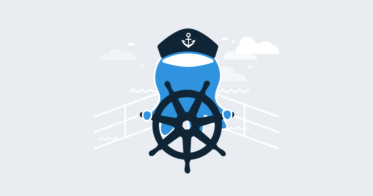

One of the benefits Kubernetes provides administrators and developers is the ability to intelligently manage deployments of new software or configuration.

Kubernetes includes two built-in deployment strategies called *recreate* and *rolling update*, which are configured directly on the deployment resources. Octopus offers a third Kubernetes deployment strategy called *blue green*, which is managed through the *Deploy Kubernetes containers* step.

But what do these strategies actually do? In this blog post, we’ll visualize these deployment strategies to highlight their differences and note why you would choose one strategy over another.

## The test deployment

For the videos below, we will watch a deployment as it is updated on a multi-node Kubernetes cluster. Each node in the cluster has a unique label, and the deployment is updated to place the new pods on a specific node.

The end result is that the new deployment shifts pods from one node to the other. We can then watch how the pods are moved between nodes to see the effect of the different deployment strategies.

## Kubernetes deployment recreate strategy

<iframe src="https://fast.wistia.net/embed/iframe/1naw15ylem" title="recreate Video" allowtransparency="true" frameborder="0" scrolling="no" class="wistia_embed" name="wistia_embed" allowfullscreen mozallowfullscreen webkitallowfullscreen oallowfullscreen msallowfullscreen width="640" height="344" qualityMin="720"></iframe>

The Kubernetes deployment *recreate* strategy is the simplest of the three. When a deployment configured with the *recreate* strategy is updated, Kubernetes will first delete the pods from the existing deployment, and once those pods are removed, the new pods are created.

In the above video, you can see all the pods on node 1 are deleted, and only after they are removed are the new pods on the second node created.

The *recreate* strategy ensures that the old and new pods do not run concurrently. This can be beneficial when synchronizing changes to a backend datastore that does not support access from two different client versions. However, there is a period of downtime before the new pods start accepting traffic.

## Kubernetes rolling update

<iframe src="https://fast.wistia.net/embed/iframe/5p253x9845" title="rollingupdate Video" allowtransparency="true" frameborder="0" scrolling="no" class="wistia_embed" name="wistia_embed" allowfullscreen mozallowfullscreen webkitallowfullscreen oallowfullscreen msallowfullscreen width="640" height="344" qualityMin="720"></iframe>

As its name suggests, the Kubernetes *rolling update* strategy incrementally deploys new pods as the old pods are removed. You can see this in the above video, where a number of the pods on the first node are deleted at the same time as new pods are created on the second node. Eventually, the pods on the first node are all removed, and all the new pods are created on the second node.

The *rolling update* strategy ensures there are some pods available to continue serving traffic during the update, so there is no downtime. However, both the old and new pods run side by side while the update is taking place, meaning any datastores or clients must be able to interact with both versions.

## Kubernetes blue green deployment

<iframe src="https://fast.wistia.net/embed/iframe/445p3d8nyb" title="bluegreen Video" allowtransparency="true" frameborder="0" scrolling="no" class="wistia_embed" name="wistia_embed" allowfullscreen mozallowfullscreen webkitallowfullscreen oallowfullscreen msallowfullscreen width="640" height="342" qualityMin="720"></iframe>

Unlike the other deployment strategies, the Kubernetes *blue green* deployment strategy is not something natively implemented by Kubernetes. It involves creating an entirely new deployment resource (i.e., a deployment resource with a new name), waiting for the new deployment to become ready, switching traffic from the old deployment to the new deployment, and finally deleting the old deployment. This process is implemented in Octopus via the *Deploy Kubernetes containers* step.

In the above video, you can see during a blue/green deployment, the pods on the second node are deployed and initialized, and when they are ready, the pods on the first node are deleted.

The *blue/green* strategy ensures the new deployment is fully initialized and healthy before any traffic is sent to it. Should the new deployment fail, the old deployment continues to serve traffic.

Like the *rolling update* strategy, the *blue/green* strategy deploys two versions side by side for a period of time, so any backing datastores need to support two different clients. However, by cutting all traffic over to the new deployment when it’s ready, only one version of the deployment will be accessible at any time.

## Conclusion

Selecting the correct deployment strategy is crucial to ensuring that your Kubernetes updates are reliable and remove or minimize downtime. Visualizing the available update strategies is helpful in understanding the differences between them, and in this post, we saw how pods were created and destroyed with the Kubernetes native strategies of *recreate* and *rolling updates*, and then with the *blue/green* strategy implemented by Octopus.
