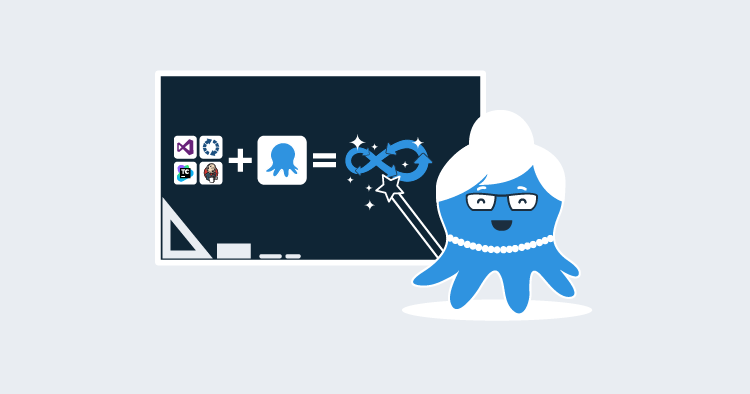

Octopus Deploy integrates with popular build servers such as Azure DevOps, Jenkins, and TeamCity, and the available plugins make it easy to package artifacts and push those artifacts to Octopus, create releases, and initiate deployments.  You can also include release notes and commit information with the build, referred to as `build information`.

Unfortunately, there aren’t plugins for every type of build technology, but because Octopus is built API-first, we can use the API to submit build information programmatically.

## GitHub

Let’s use GitHub as an example of using the API to submit build information when there isn’t a build server in the mix.  My [`xCertificatePermission`](https://github.com/twerthi/xCertificatePermission) repo has a release created with a version of 1.0.0.  Since there wasn’t a build server involved in creating this release, there isn’t a plugin for me to use to push the build information from GitHub to Octopus Deploy for this release.

### Use the API

As previously mentioned, Octopus Deploy is written API-first, so I can use the `/api/build-information` API to push the build information into Octopus Deploy.  On the System Variables documentation page, there is a [section specifically for Build Information](https://octopus.com/docs/projects/variables/system-variables#release-package-build-information) which shows the basic information that can be included with the API call.  Additionally, the Swagger documentation shows us a little more information as to what the payload should look like:

```
{
  "Id": "string",
  "PackageId": "string",
  "Version": "string",
  "BuildEnvironment": "string",
  "BuildNumber": "string",
  "BuildUrl": "string",
  "Branch": "string",
  "VcsType": "string",
  "VcsRoot": "string",
  "VcsCommitNumber": "string",
  "VcsCommitUrl": "string",
  "IssueTrackerName": "string",
  "WorkItems": [
    {
      "Id": "string",
      "LinkUrl": "string",
      "Source": "string",
      "Description": "string"
    }
  ],
  "Commits": [
    {
      "Id": "string",
      "LinkUrl": "string",
      "Comment": "string"
    }
  ],
  "IncompleteDataWarning": "string",
  "Created": "2020-02-20T05:28:07.028Z",
  "LastModifiedOn": "2020-02-20T05:28:07.028Z",
  "LastModifiedBy": "string",
  "Links": {
    "additionalProp1": "string",
    "additionalProp2": "string",
    "additionalProp3": "string"
  }
}
```

Unfortunately, both of these resources do not paint a complete picture as to how to set up the payload for the API call.

### Example JSON
What’s missing from the examples is the `OctopusBuildInformation` hash table that encapsulates some of the other properties for the payload.  For my `xCertificatePermission` example, here’s what the payload looks like:

```PS
$jsonBody = @{
    PackageId = "twerthi/xCertificatePermission"
    Version = "1.0.0"
    OctopusBuildInformation =
        @{
            BuildEnvironment = "Jenkins"
            VcsCommitNumber = "2350881a389517288b31432d469c5c4199a1fba9"
            VcsType = "Git"
            VcsRoot = "https://github.com/twerthi/xCertificatePermission.git"
        }


   } | ConvertTo-Json -Depth 10
```

As you can see, the BuildEnvironment, VcsCommitNumber, VcsType, and VcsRoot elements are actually embedded within OctopusBuildInformation.  With the well-formed JSON, we can invoke the API:

```PS
$OctopusServerUrl = "https://YourServerUrl"
$ApiKey = "API-XXXXXXXXXXXXXXXXXXXXXXXXXX"

$Headers = @{"X-Octopus-ApiKey"="$ApiKey"}

Invoke-RestMethod -Method Post -Uri "$OctopusServerUrl/api/build-information" -Headers $Headers -Body $jsonBody
```

With the build information pushed to Octopus Deploy, it now shows up in the release along with the commit hash.


## Conclusion
In this post, I showed you how to use the API to submit Build Information to Octopus Deploy.
