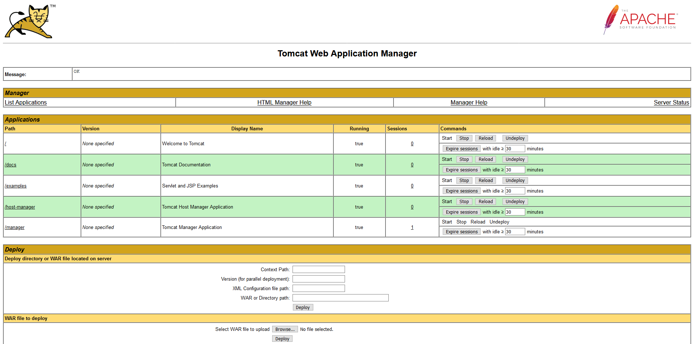

When testing Java deployments with Tomcat, the official Tomcat Docker image provides a convenient way to get a server up and running. However, there are a few tricks to getting the manager application loaded and 
accessible.

In this blog post, we look at how to boot a Tomcat Docker image ready to accept new deployments.

## Define a user

First we need to define a Tomcat user that has access to the manager application. This user is defined in a file called `tomcat-users.xml` and will be assigned both the `manager-gui` and `manager-script` roles, which grant access to the manager HTML interface as well as the API:

```xml
<tomcat-users>
  <role rolename="manager-gui"/>
  <role rolename="manager-script"/>
  <user username="tomcat" password="s3cret" roles="manager-gui,manager-script"/>
</tomcat-users>
```

## Expose the manager

By default, the manager application will only accept traffic from `localhost`. Keep in mind that from the context of a Docker image, `localhost` means the container's loop-back interface, not that of the host. With port forwarding enabled, traffic to an exposed port enters the Docker container via the container's external interface, and will be blocked by default. Here we have a copy of the manager applications `context.xml` file with the network filtering disabled:

```xml
<Context antiResourceLocking="false" privileged="true" >
  <!--
  	<Valve className="org.apache.catalina.valves.RemoteAddrValve"
         allow="127\.\d+\.\d+\.\d+|::1|0:0:0:0:0:0:0:1" />
  -->
  <Manager sessionAttributeValueClassNameFilter="java\.lang\.(?:Boolean|Integer|Long|Number|String)|org\.apache\.catalina\.filters\.CsrfPreventionFilter\$LruCache(?:\$1)?|java\.util\.(?:Linked)?HashMap"/>     
</Context>
```

[This blog post](https://pythonspeed.com/articles/docker-connection-refused/) provides some more detail about Docker networking with forwarded ports.

## Run the container

The final hurdle to jump is the fact that the Tomcat Docker image does not load any applications by default. The default applications, such as the manager application, are saved in a directory called `/usr/local/tomcat/webapps.dist`. We need to move this directory to `/usr/local/tomcat/webapps`. This is achieved by overriding the command used when launching the container.

The command below maps the two custom XML files we created above (saved to `/tmp` in this example), moves `/usr/local/tomcat/webapps.dist` to `/usr/local/tomcat/webapps`, and finally launches Tomcat:

```
docker run \
  --name tomcat \
  -it \
  -p 8080:8080 \
  -v /tmp/tomcat-users.xml:/usr/local/tomcat/conf/tomcat-users.xml \
  -v /tmp/context.xml:/usr/local/tomcat/webapps.dist/manager/META-INF/context.xml \
  tomcat:9.0 \
  /bin/bash -c "mv /usr/local/tomcat/webapps /usr/local/tomcat/webapps2; mv /usr/local/tomcat/webapps.dist /usr/local/tomcat/webapps; catalina.sh run"
```

## Access the manager application

To open the manager application, open the URL http://localhost:8080/manager/html. Enter `tomcat` for the username, and `s3cret` for the password:



## Conclusion

The Tomcat image maintainers have chosen not to enable the default applications as a [security precaution](https://tomcat.apache.org/tomcat-9.0-doc/security-howto.html#Default_web_applications), but with two custom configuration files and overriding the Docker command it is possible to boot Tomcat with a fully functional manager application.

In this post we provided example configuration files and the Docker command to restore the default applications before running Tomcat.
