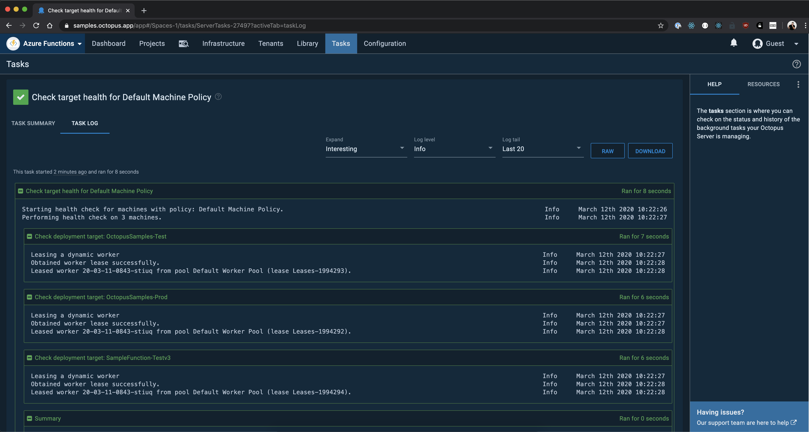
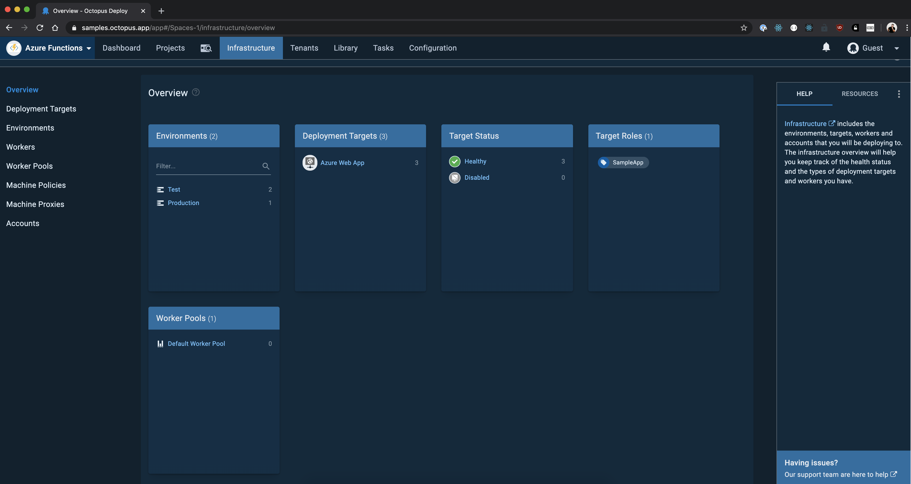

Octopus 2020.1 takes Octopus over to the dark side, and in this post, we look at why we added dark mode, how it looks, how we implemented it, and some lessons learned along the way.

According to research firm Nielsen, in 2018, adults spent eleven hours a day interacting with a screened device. We think that number could be much higher for developers.

We created Octopus Deploy so our customers can deploy anywhere, anytime, including 5 pm on Fridays or even later in the dark of night. From Octopus 2020.1, you can switch to dark mode by clicking the Profile menu in the top right corner of your screen and flipping the toggle to on. Alternatively, if you are already a fan of dark mode and have a dark theme or night mode enabled on your OS, Octopus will load the dark theme automatically when you log in.

## Why we built it

Octopus is heavily used by developers and operations folks around the world, and they tend to love dark mode. Most of our team uses dark mode on their laptops and phones.

Beyond that, one of the things that sets Octopus Deploy apart from its competitors is having a user interface. Keeping the interface up to date, responsive, and modern is why we invested in UI specialists over the past year. We want our users to love the Octopus UI. We don’t want deploying your app to be a chore but a task you look forward to. Dark mode is easier on the eyes, and developers love it, so it was natural for us to build it into Octopus.

## Visual tour

Developing a dark theme was a good opportunity for us to review how we approach design at Octopus. We want Octopus to be a world-class product, and we think a world-class product should be beautiful and designed with care. While developing the dark theme, we started adding improvements to cater for accessibility. Although care was taken to make sure most colors meet AA standards, this isn’t an accessibility theme, but it gives us a strong foundation to build on.

Toggling dark mode on/off is seamless from the profile menu:

If your OS has dark mode, Octopus will automatically detect this and set your theme:

The code editor in Octopus has been updated to look stunning in dark mode whether you use PowerShell, Bash, Python, F#, or C#:

The task log page has been updated to look striking in dark theme:

Check out the new infrastructure overview page:

## How we built it

We made use of CSS custom properties to make theming happen in Octopus. CSS variables is a widely supported feature that makes CSS variables available at runtime. We didn’t use Material UI’s built-in theming as some of our components use older versions of Material UI. We used React Context to pass color variables as props to components and CSS variables in SVG images to toggle the colors without having to maintain multiple sets of images. We also make use of a CSS media feature, `prefers-color-scheme` to detect if the system uses a dark or light theme.

We did run into issues with IE11, which is the only browser that doesn’t support CSS variables. In November 2019, our head of Engineering, Michael Noonan, wrote about [deprecating support for IE11 from 2020.1](https://octopus.com/blog/raising-minimum-requirements-for-octopus-server). Even though we’re removing support for IE11, we didn’t want to completely break Octopus on IE11, so we made use of a [ponyfill](https://jhildenbiddle.github.io/css-vars-ponyfill/#/) ([ponyfill vs. pollyfill](https://ponyfoo.com/articles/polyfills-or-ponyfills)) to enable CSS variables on IE11 and make sure that at least the light theme works on IE11.

## Conclusion

Through dark mode, we would like to bring Octopus into a new world, one where you can deploy day and night without straining your eyes! We hope you love dark mode, and if you have any feedback, please fill in the [feedback form](https://octopusdeploy.typeform.com/to/jVl7gN)!
