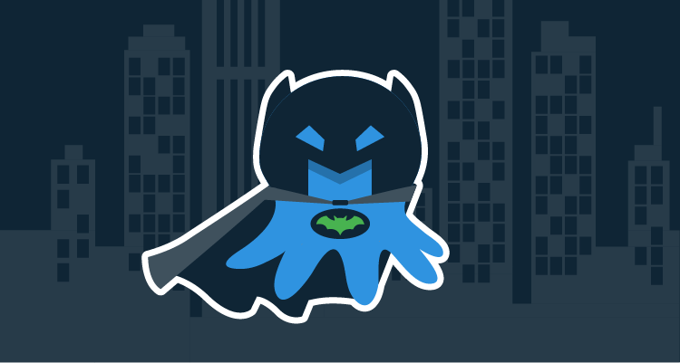
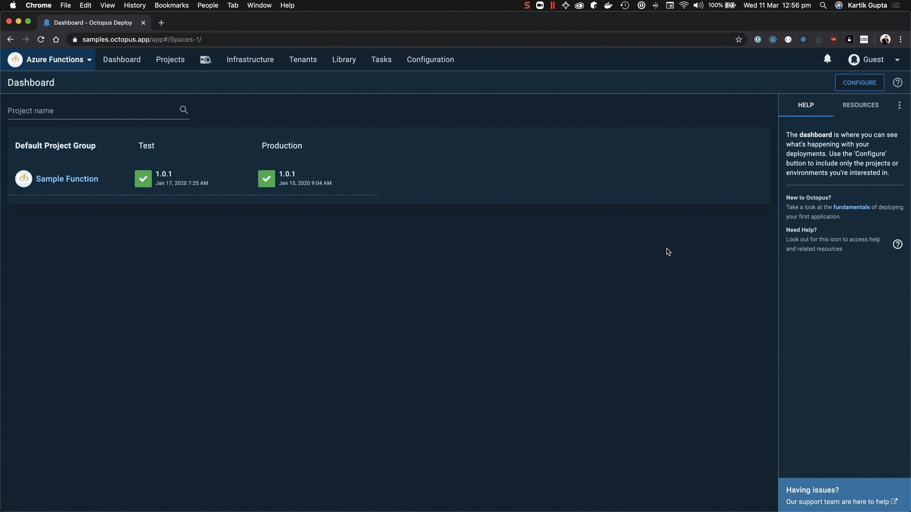
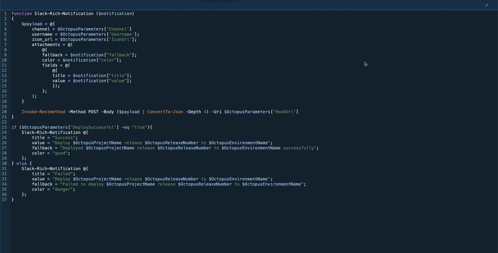

Octopus 2020.1 introduces Octopus to the dark side and in this post we look at why we added a dark theme, how it looks, how we implemented it and some lessons learnt.

According to the research firm Nielsen, in 2018, adults spent 11 hours per day interacting with a screened device. We think that number could be much higher for Developers. We created Octopus Deploy so our customers can deploy anywhere, anytime even including 5pm on Fridays and late night deployments. So in 2020.1 we are adding dark theme to Octopus Deploy! You can switch to Dark Mode by flipping the toggle on, in the Profile menu on the top right corner of your screen. Alternatively, if you are already a fan of dark mode and have dark theme or night mode enabled on your OS, Octopus will load the dark theme automatically on login!

We made use of CSS custom properties to make theming happen in Octopus. CSS variables is a widely supported feature and is available at runtime unlike LESS variables which become unavailable at compile time. We didn't use Material UI's in built theming as some of our components make use of older versions of Material UI. We used React Context to pass color variables as props to components and made use of CSS variables in SVG Images to toggle the colors without having to maintain multiple sets of images. We also make use of a CSS media feature, `prefers-color-scheme` to detect if the system uses a dark or light theme.

We ran into issues with IE11, as it was the only browser that does not support CSS Variables. In November 2019 our head of Engineering Michael Noonan wrote [this](https://octopus.com/blog/raising-minimum-requirements-for-octopus-server) blog post on deprecating suport for IE11 from 2020.1. Even though we are removing support for IE11 in this release we did not want to completely break Octopus on IE11. We made use of a [ponyfill](https://jhildenbiddle.github.io/css-vars-ponyfill/#/) ([ponyfill vs pollyfill](https://ponyfoo.com/articles/polyfills-or-ponyfills)) to enable CSS Variables to work on IE11 and make sure at least light-theme works on IE11.

## Why we built it

One of the things that sets Octopus Deploy apart from it's competitors is having a User Interface. Keeping the interface upto date and bleeding edge is why we have invested in UI specialists over the past year. We wanted Octopus' UI to be something that it's users love to use. We don't want deploying your app to be a chore but a task you eagerly look forward to. Dark Mode is easier on the eyes, it consumes less power and developers love it so it was natural for us to build it into Octopus!

## Visual tour

Toggling dark mode on/off should be pretty seamless from the profile menu.

If your OS has dark mode, Octopus will automatically detect this and set your theme.

The Code editor in Octopus has been updated to look stunning in dark mode whether you use PowerShell, Bash, Python, F# or C#.

The Diff tool has been updated to look striking on the dark theme.

Developing a Dark Theme was a good opportunity for us to review how we approach Design at Octopus. We want Octopus to be a world class product and we think a world class product should be beautifully and carefully designed. While developing the dark theme we started adding improvements to cater to accessibility (a11y). Although care was taken to make sure most colors meet AA standards, this isn't an accessibility theme but serves as a strong foundation to build upon.

# Conclusion

Through Dark Mode we would like to bring Octopus into a new world, one where you can deploy day and night without straining your eyes! We hope you love Dark Mode and if you have any feedback you'd like to give us please fill in the [feedback form](https://octopusdeploy.typeform.com/to/jVl7gN)!