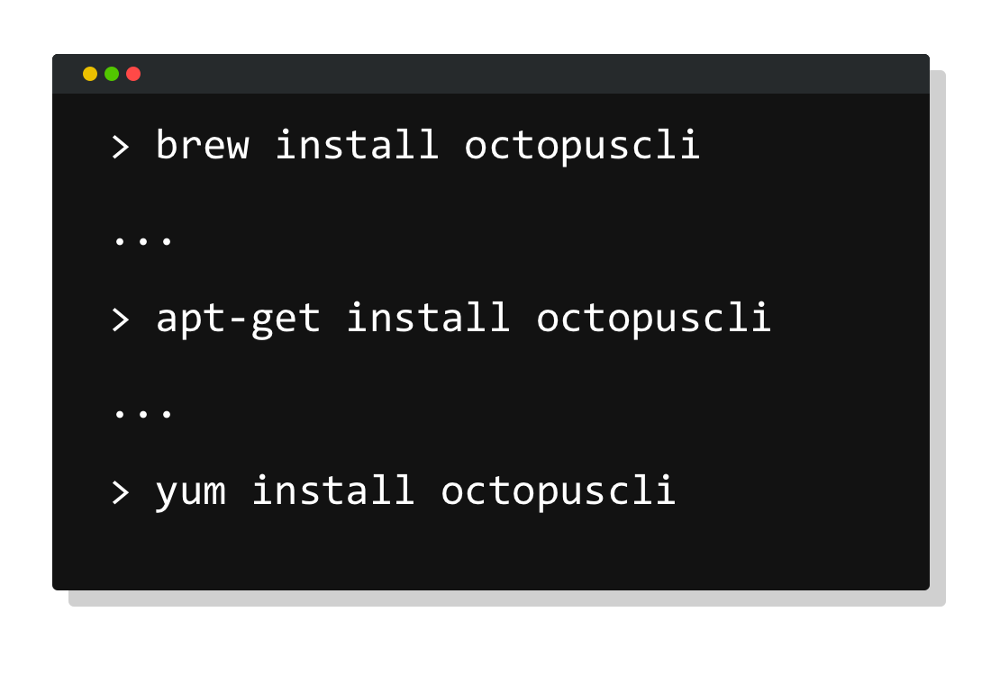
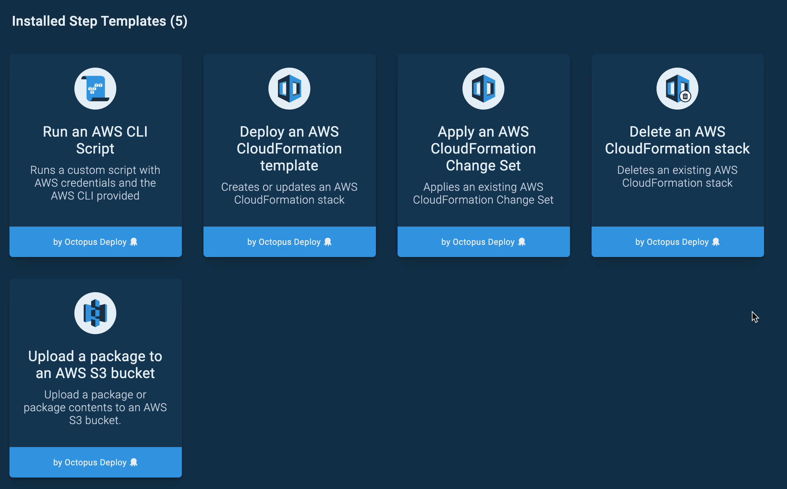
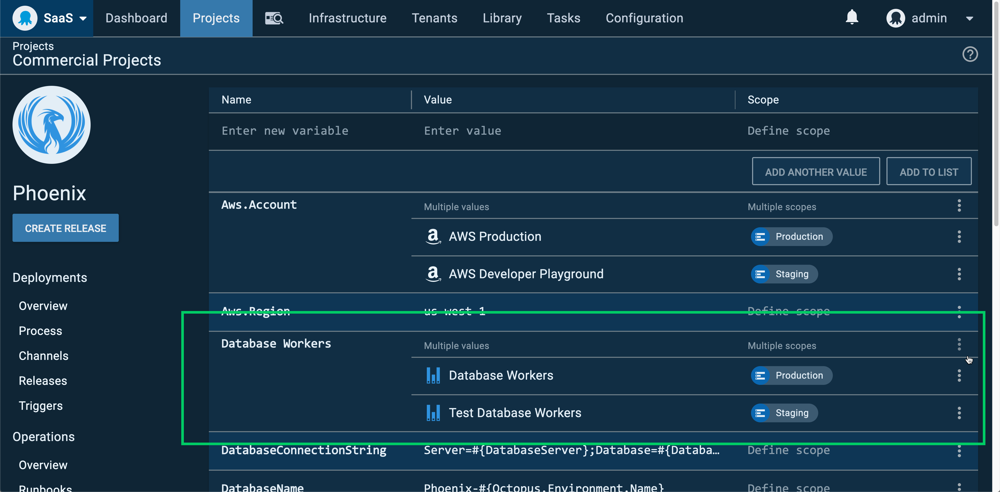

<iframe width="560" height="315" src="https://www.youtube.com/embed/TODO" frameborder="0" allowfullscreen></iframe>

---

We're proud to ship Octopus 2020.1, our first release of the year with some great updates and benefits. 

* [Dark Mode 😎](blog/2020-03/octopus-release-2020-1/index.md#dark-mode) is cool and it's easier on your eyes.
* [Octopus and Octopus CLI are more at home on Linux and macOS](blog/2020-03/octopus-release-2020-1/index.md#octopus-and-octopus-cli-are-now-more-at-home-on-linux-and-macos) - AWS and Azure built-in steps are cross platform and you can now install and use the Octopus CLI via HomeBrew, Yum and APT. 
* [Worker pools can now scoped to environments or tenant tags](blog/2020-03/octopus-release-2020-1/index.md#worker-pools-can-be-scoped-by-environment-or-tenants) - New worker pool variables unlock the ability to have dedicated worker pools for different environments or tenant tags.

This is the [first of six releases in 2020](/blog/2020-03/releases-and-lts/index.md) and we're excited to share it with the world. Keep reading to learn more about the updates. 

## Dark Mode

<iframe width="560" height="315" src="https://www.youtube.com/embed/TODO" frameborder="0" allowfullscreen></iframe>

Developers and operations folks love dark mode and I'm thrilled to share that Octopus now supports dark mode. It's a cool feature but it also easier on eyes, helps reduce eye strain and looks amazing. 😎

Octopus includes support to detect if your OS is running dark mode and can switch automatically. I highly recommend turning it on and giving it a test drive.

## Octopus and Octopus CLI are now more at home on Linux and macOS

Octopus aims to have world-class support for multiple platforms including Windows machines, Linux machines and popular cloud services. This release includes two changes to make Octopus feel more at home on Linux and macOS.

### Octopus CLI available via HomeBrew, APT and YUM 

The Octopus CLI, formerly known as `octo.exe`, is a handy and powerful tool that enables teams to interact with Octopus from the command line. It's now available to install quickly and easily via the following platforms and package repostitories. 

* Chocolatey
* HomeBrew 
* APT
* YUM 

The new additions are HomeBrew, APT and YUM so teams using macOS and Linux can take advantage of this in an easier way.

[Check it out](https://octopus.com/downloads/octopuscli)

### AWS and Azure deployments work on Windows and Linux machines

Octopus includes numerous popular step templates to deploy to AWS and Azure cloud infrastructure. These steps can now be executed seamlessly on Windows and Linux targets/workers. Further, our Kubernetes steps can now authenticate with AWS and Azure accounts in Octopus on both Windows and Linux targets/workers as well. 

This is a small but significant improvement to ensure teams can execute their cloud deployments and runbooks on the the platform of their choice.

Learn more: 
* [Azure deployments](https://octopus.com/docs/deployment-examples/azure-deployments)
* [AWS deployments](https://octopus.com/docs/deployment-examples/aws-deployments)
* [Kubernetes](https://octopus.com/docs/deployment-examples/kubernetes-deployments)

## Worker Pools can be scoped by environment or tenants

Workers enable teams to move deployment work onto other machines running in pools. You can create a pool of dedicated workers that can be utilized for specific deployment work by multiple projects and teams. Common examples are database deployments or deployments to cloud services.

In Octopus 2020.1, we have added support for worker pool variables unlocking the ability to scope worker pools by environment or tenants. For example, you could have a database deployment worker pool dedicated to deployments to your dev and test environments and a larger pool dedicated to deployments to production. 

This was a popular customer request and we're please to ship this update.

[Learn more](https://octopus.com/docs/projects/variables/worker-pool-variables)

## Breaking Changes

The only breaking change in this release is that we're raising the minimum requiremetns for running Octopus Server to Windows Server 2012 R2 and SQL Server 2017. This change was [announced](https://octopus.com/blog/raising-minimum-requirements-for-octopus-server) in November 2019.

## Upgrading

Octopus Cloud users are already running this release and self-hosted Octopus customers can [download](https://octopus.com/downloads/2020.1.0) the latest release now.  

As usual, the [steps for upgrading Octopus Deploy](https://octopus.com/docs/administration/upgrading) apply. Please see the [release notes](https://octopus.com/downloads/compare?to=2020.1.0) for further information. 

## What's coming in Octopus 2020.2?

Check out our [public roadmap](https://octopus.com/roadmap) to see what's coming next. We're about to start work on some incredible new features including deep git integration unlocking pipeline as code.

## Conclusion

Octopus 2020.1 includes Dark Mode, cross platform Azure and AWS step templates, Octopus CLI on HomeBrew, APT and YUM package repositories, and new worker pool variables. This is a great start to the year and we're working hard to keep shipping a great product.

Feel free to leave us a comment, and let us know what you think! Happy deployments!