Many years prior to joining Octopus Deploy, I worked on a .NET application with Oracle as its database for about 3 years.  I started working there a couple of years before Octopus Deploy version 1.0 was released.  Those were tough deployments.  Everything was manual.  And we could only deploy on Saturday mornings at 2 AM.  Which led the never ending debate, should I go to sleep before the deployment, or should I stay up.  The deployments took anywhere from 2 to 4 hours.  The answer, go to sleep.  And set 3 alarms.

Thankfully, those days are over.  The tooling available today is light-years ahead of where it was.  Today we’re going to cover deploying changes to Oracle databases.  The goal of this article is to build up entire CI/CD pipeline using TeamCity as the build server, Octopus Deploy as the deployment tool (of course), with the Redgate Oracle toolset doing the heavy lifting on the database side.  

_Disclaimer:_ I used Oracle between 2010 and 2013.  The Oracle instance was 10g and I used Benthic and SQL Developer to query Oracle.  A lot has changed since that time.  I’m a SQL Server guy.  Without question I did some goofy things in this article which are no longer best practice.  

**Side Note:** I chose TeamCity for no other reason other than I like it and I had the build server already running.  The core concepts from this article will transfer over to Jenkins, Bamboo, TFS/VSTS/Azure DevOps.  

!toc

## Getting started

If you wish to follow along, you will need to download and install the following tools.

- [Oracle 12g Personal Edition](https://www.oracle.com/technetwork/database/enterprise-edition/downloads/index.html)
- [TeamCity](https://www.jetbrains.com/teamcity/download/)
- [Redgate Oracle Toolset](https://www.red-gate.com/dynamic/products/oracle-development/deployment-suite-for-oracle/download)
- [Octopus Deploy](https://octopus.com/downloads)

In order to download anything from Oracle you have to create an account.  The form to do that...requires a lot of information.  Prepare yourself for that.  I opted for personal edition because just like SQL Server Developer Edition, it is fully featured, just limited in what you can do with the license.  I am not using this for anything production related, just demos.  

For the purposes of this article, I am going to be deploying to the same Oracle database running on a Windows machine.  Yes...this is cheating.  In a real-world environment, you should follow a setup similar to this.

With this setup, you would install a tentacle on a [worker](https://octopus.com/docs/infrastructure/workers) or a [jumpbox running tentacle](https://octopus.com/docs/infrastructure/windows-targets) which sits between Octopus Deploy and the VIP in front of the Oracle Database.  

## Creating a source database

Redgate’s Oracle Toolset is a state-based tool.  For those of you who haven’t read my previous articles, a state-based tool is one where you save the desired state of the database into source control.  During the deployment, a unique delta script is generated to run against the Oracle database.  That delta script will be only used for that database for that environment.  The next environment will get a new delta script.

I am starting this all from scratch.  I set up a VM and installed Oracle.  I am now going to create a source database.  This database will represent the desired state I want all the other databases to be in.  I am going to set up my database and then check that into source control using [Redgate’s Source Control for Oracle](https://www.red-gate.com/products/oracle-development/source-control-for-oracle/).  

It’s been a while since I had to create a database in Oracle.  I’m using the [database creation assistant](https://docs.oracle.com/cd/B16254_01/doc/server.102/b14196/install003.htm) provided by Oracle.  I know it is possible to script all this out.  But I’d rather focus on deployments than setting this all up.

I have an empty source database setup.  

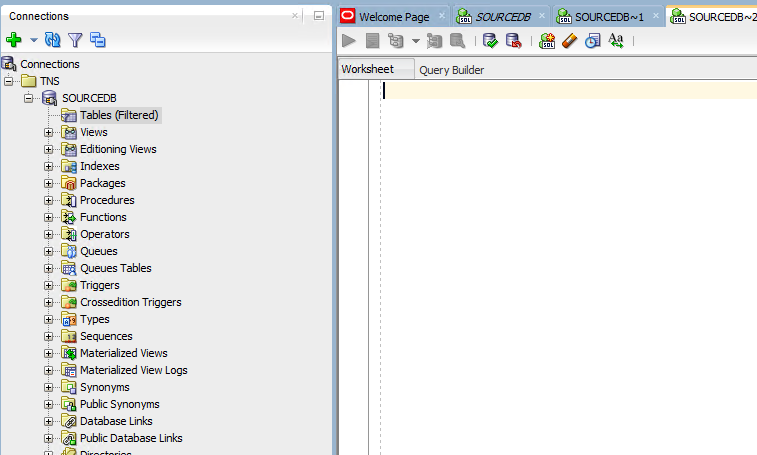

I am going to add a new table to it.  Nothing super fancy.  Just a small table with two columns.

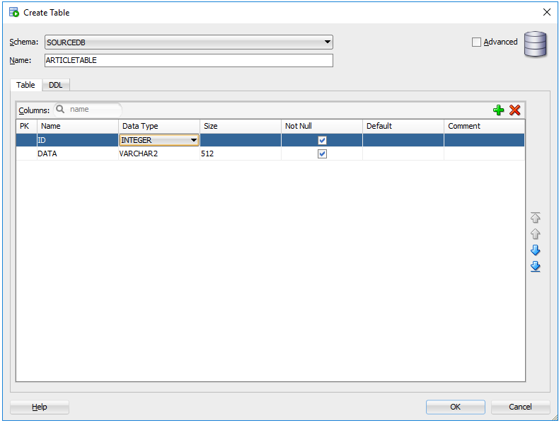

I’m also going to add in a sequence.  For those of you not familiar with Oracle, a sequence is needed when you want to use an auto-incrementing number for your ID field.  Well, in old-school Oracle anyway.  It looks like things have changed a bit.  But I’m still going to create one...just because.

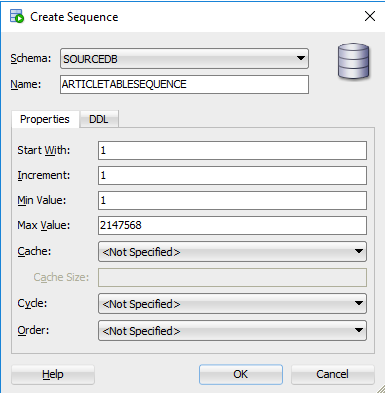

Finally, I am going to tie the sequence and the id field together.  The purpose behind this is to have a couple of schema changes ready to deploy to a blank database.  Your changes will most likely be much more complex.

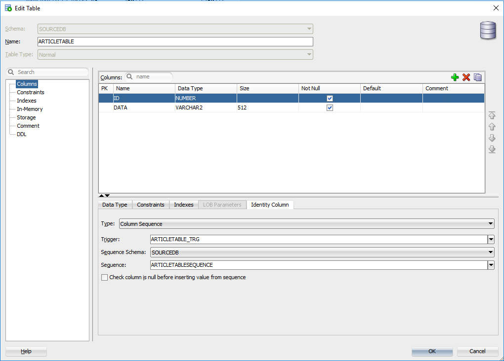

## Tying Oracle to source control

The table we want to create is in place.  It is time to put that table and sequence definition into source control.  For this, I will be using [Redgate’s Source Control for Oracle](https://www.red-gate.com/products/oracle-development/source-control-for-oracle/).  One thing you will notice is that application isn’t a plug-in like [Redgate’s SQL Source Control](https://www.red-gate.com/products/sql-development/sql-source-control/).  If I had to venture a guess, it is because unlike SQL Server with its SQL Server Management Studio, there isn’t one main UI to access an Oracle database.  There is SQL Developer, Benthic, Toad, etc.

When we first launch the application we are presented with a single option, “Create a new source control project…”

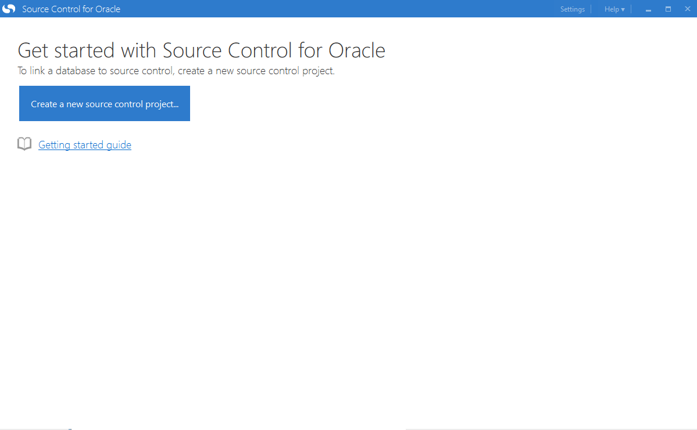

After hitting that massive button you will be sent to a wizard.  First, you will need to configure the database connection.  Don’t forget to test your connection so you know that it works!

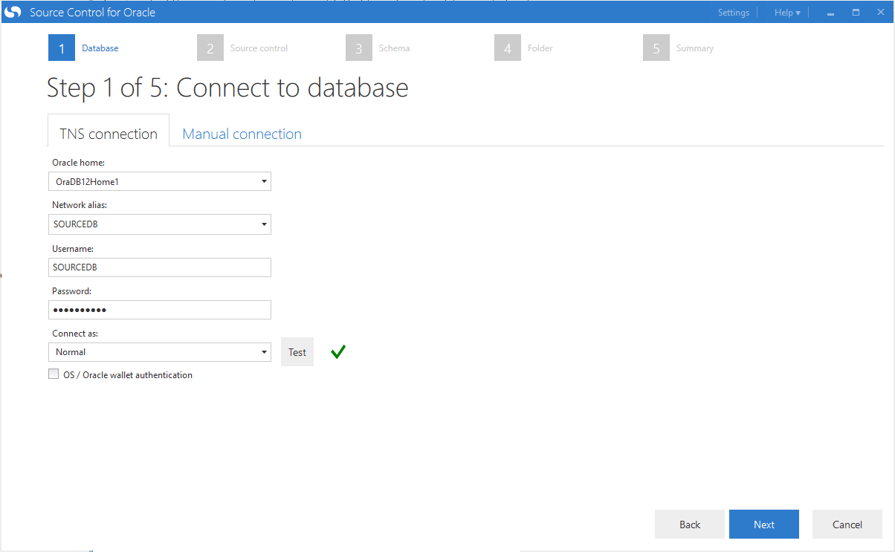

The database connection is good to go.  Next up is configuring the source control system to use.  This repository will be a git repository.  But rather than using the built-in git functionality, I prefer to use a working folder.  This is so I can use my git GUI of choice and get the full functionality of git, specifically branching.  Once you get this process working a great next step is to setup Oracle on each developer’s machine.  With a dedicated instance a developer can check in their source code and database changes at the same time.  Rather than make a database change on a shared server and then wait for the code to be checked in to make use of that change.

As you can see I have an empty working folder.

I can now enter the directory of that working folder into Redgate’s Source Control for Oracle.  

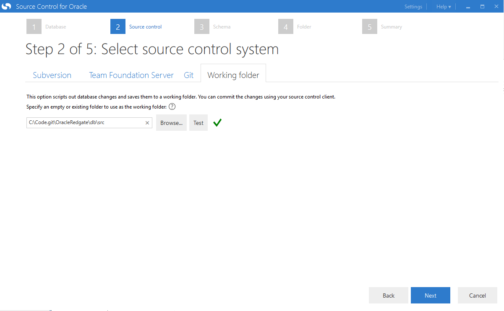

Now I need to choose the schema I wish to use.  I put the tables in the SourceDB schema so that is the one I will be selecting.

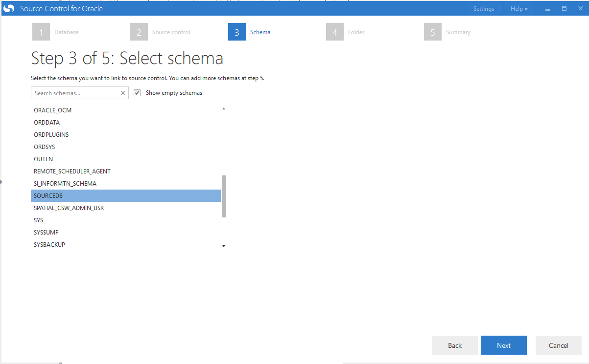

What’s really nice is it will show all the folders it is about to create and the directory it will create them in.  Helpful to see I didn’t screw anything up.

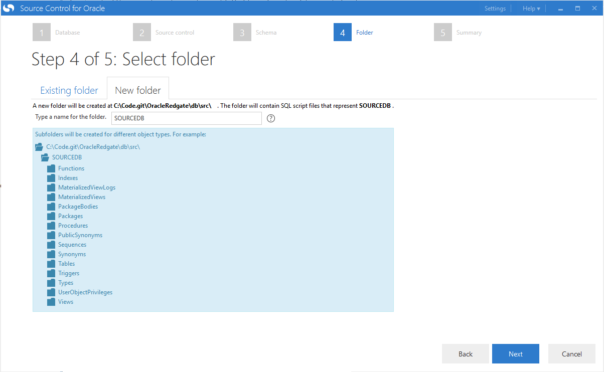

Finally, we reach the end.  This tool will monitor this database and schema for any changes.  I’m going to keep the name as is so I don’t get confused later on.

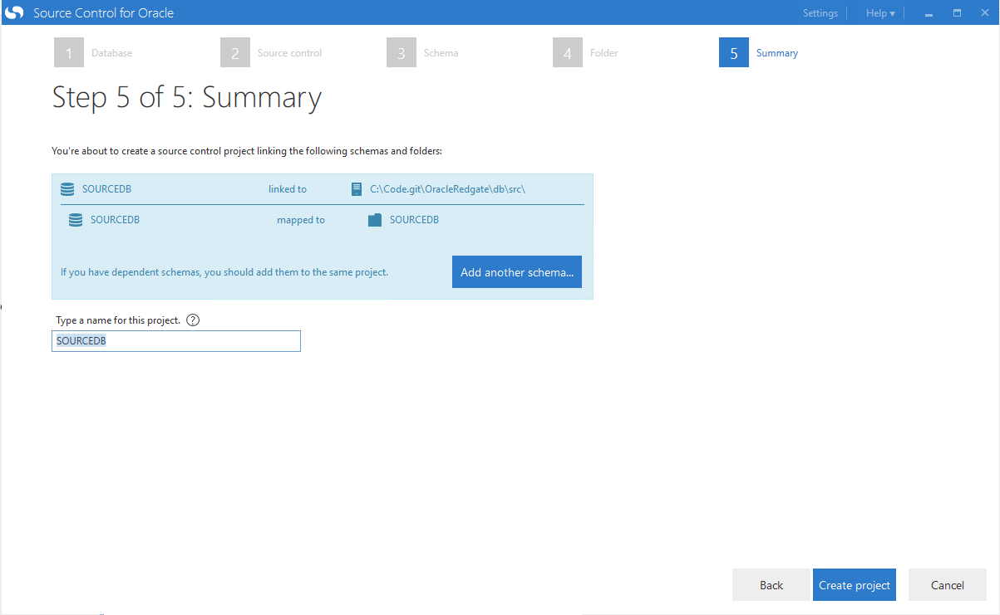

When it is finished hooking up all the bail and twine behind the scenes we can see there are four changes to check in.

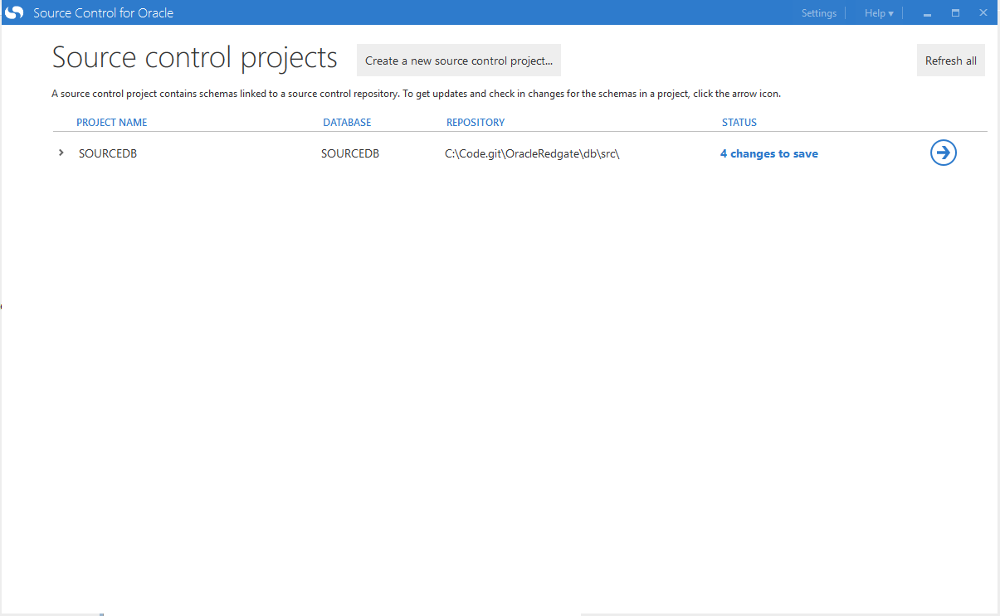

When I click on the big arrow I am presented with a summary screen.  For those of you who have used Redgate’s SQL Source Control, this should look very familiar.

Clicking on the save button will show you everything has been saved successfully.

Cracking open Git Extensions and you can see all those files which have been created.

I’m going to go ahead and commit those changes.  Now it is time to set up a build and bundle those changes into a zip file for Octopus Deploy to use.

## Setting up a build server

In my TeamCity instance, I have created a new project.  The project is going to be very simple, package up the database, publish the package to Octopus Deploy, create a new release in Octopus Deploy.  First up is the package database.  For this build step, I will package up the entire db/src folder (which includes any additional schemas).  Right now it only contains the _SourceDB_ schema.

Pushing the package should be pretty straight-forward.  

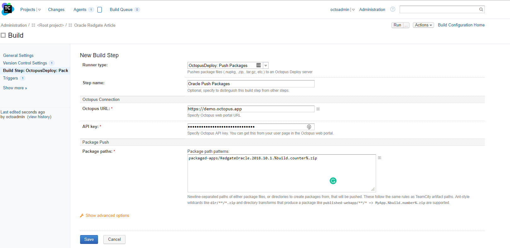

In Octopus Deploy I’ve set up a very simple deployment process.  The goal at this point is to just make sure everything packages, pushes and deploys successfully.  I’m not too worried at this stage about the deployment process (that will come in a couple of minutes).

Back in TeamCity, I will use that new project in my create a release step.

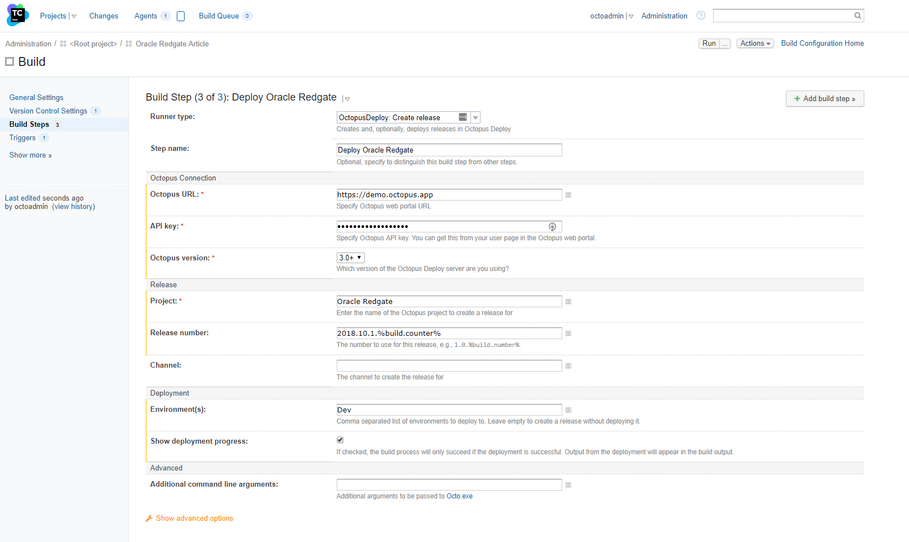

Now the moment of truth, running the build for the first time.  And...I messed it up.  Of course, I did.  Nothing works perfectly the first time.

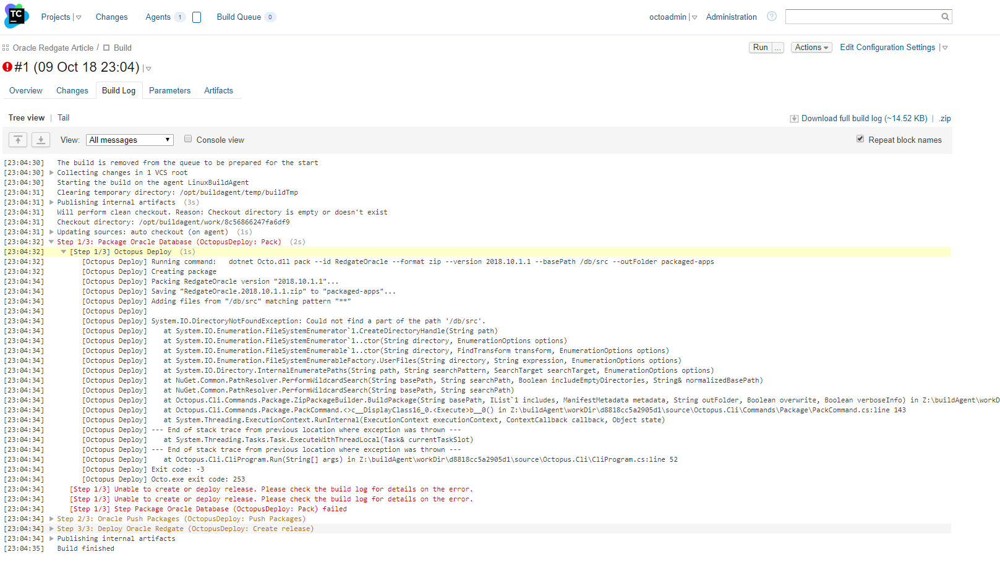

It took a couple of tries but I got the build working.

The issue was I put a / at the start of the packaging path.  It should’ve been db/src, like so.

If I download the package from Octopus and examine it, I can see all the files that were created are there.

We have the build server packaging, publishing, and triggering a deployment.  Now it is time to go to Octopus and get that process built out.

## Configure destination database

If you are doing what I did, which is setting everything up for the first time, then you will need to configure a destination database.  I configured a new one, named "DestDB" using the database creation assistant.  The username for this database is also "DestDB."  I am very creative and original.

As you can see I do not have anything set up on this database.

## Setup Octopus Deploy

As shown in an earlier screenshot, you should set up a jump box which sits between Octopus Deploy and your Oracle Database.  This machine will need to have Redgate’s Oracle Tool-belt, SQL*Plus, and the standard `tnsnames.ora` file installed. The `tnsnames.ora` file will need to contain all the hosts (aka database servers) you need to connect to from this jump box.

**Important:** Due to a quirk in the Redgate’s Oracle Tool-belt, you will need to run the tentacle as an account rather than as the local system account.  You will get errors saying the tool isn’t activated even though it is.  And then you will curse at the screen as I did.  Please follow [these instructions](https://octopus.com/docs/infrastructure/windows-targets/running-tentacle-under-a-specific-user-account) on how to do that.

I have added two new step-templates to the community library.  [Redgate - Create Oracle Release](https://library.octopus.com/step-templates/0aa40fba-949c-4065-a438-010349c3fd0c/actiontemplate-redgate-create-oracle-release) and [Run Oracle SQLPlus Script](https://library.octopus.com/step-templates/c7cd3ab4-5dfb-4f8d-957e-1940ed30359c/actiontemplate-run-oracle-sqlplus-script).  Please download them and install them on your Octopus Deploy instance.

The process I have put together is very simple.  The first step generates a report and a delta script, in pre-prod and prod a DBA approves the changes, and then the delta script is run against the database.

**Please note** I intentionally made this step only generate a delta script and a report file.  It is possible to make Redgate’s Oracle tools do the deployment for you by including the `/deploy` command line switch.  I omitted that command line switch because I feel it is important to build trust in the process first and have a human approve the changes.  The community library is open source, you are free to clone that step and adjust to meet your needs.

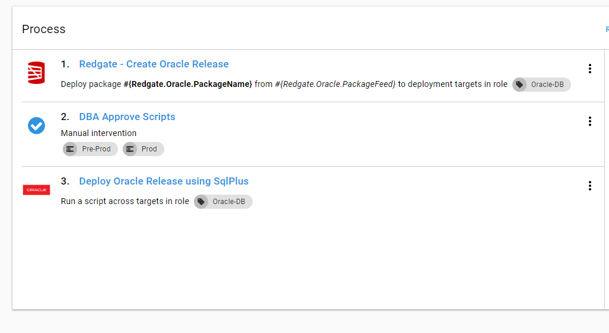

Diving into the first step and there a few options to fill out.  I’ve tried to include as much help text as possible.  If something isn’t super clear please let us know by emailing [support@octopus.com](mailto:support@octopus.com) and we will get that fixed up.

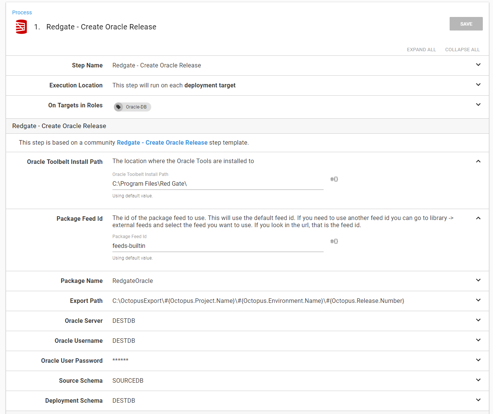

At the end of the step, you are asked to provide the source schema and the destination schema.  This is due to a setting Redgate’s tooling.  The step-template wraps the command-line.  It offers the schema name as an option so the step template has to offer it as an option.

The second step template will take any script and run it against an Oracle database using SQL*Plus.  This step only requires the path of the script to run and the necessary credentials to access the Oracle database.  

**Please note**: The Redgate - Create Oracle Release step will generate a file in the export directory called "Delta.sql."  I wanted to make this script as generic as possible, which is why you have to supply the full path.

One nice thing I like about the Oracle tools is the report it generates to show the delta between the scripts stored in the package and the destination database.  The Redgate - Create Oracle Release will make this an artifact for you to download and review.

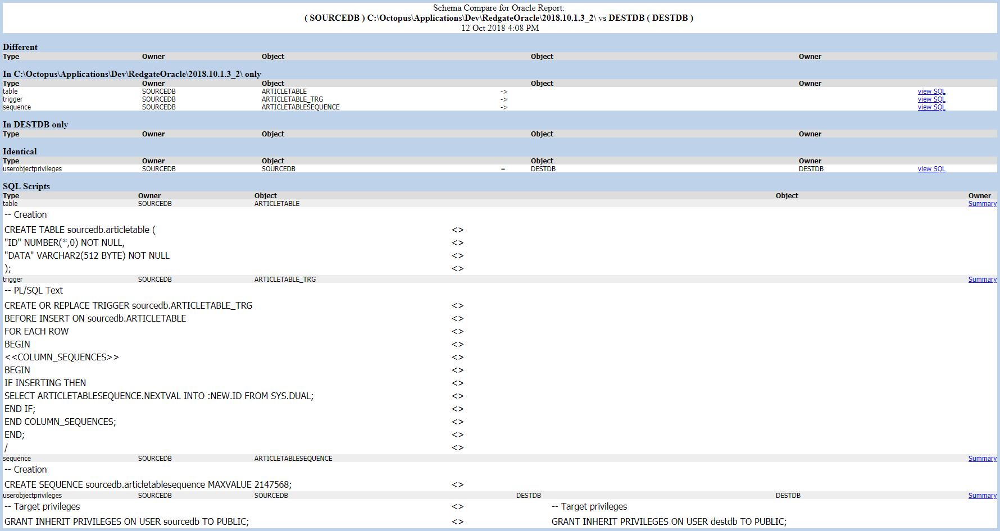

In addition, it also makes the delta script an artifact to download.

## Running the first deployment

Octopus is configured and ready to go.  It is finally time for the first test run.  Or...in my case what feels like the 50th test run as I worked through all the various permissions and other issues for this post.  I’m only going to deploy to dev.  And it is successful!

Let’s check the database to make sure.  Yup, everything is there.

## Conclusion

The days of manually writing deployment scripts for each environment are rapidly drawing to a close.  In this article, we created an entire CI/CD pipeline for an Oracle database.  It is still lacking a couple of key features, such as handling any sort of initialization data as well as static data.  But it is a good start.  I encourage you to take this basic process and start adding on to it.  

Until next time, happy deployments!

---

Posts in the automated database deployments series:

- [Why consider database deployment automation](/blog/2020-02/automated-database-deployments-series-kick-off.md)
- [Iteration Zero](/blog/2018-06/automated-database-deployments-iteration-zero.md)
- [Automated database deployments using state-based Redgate SQL change automation](blog/2018-07/automated-database-deployments-redgate-sql-change-automation-state-based.md)
- [Using ad-hoc scripts in your automated database deployment pipeline](/blog/2018-08/automated-database-deployments-adhoc-scripts.md)
- **Deploy to Oracle Database using Octopus Deploy and Redgate**
-  [Add post deployment scripts to Oracle database deployments using Octopus Deploy, Jenkins, and Redgate](/blog/2018-11/oracle-database-using-redgate-part-2/index.md)
- [Using DbUp and workers to automate database deployments](/blog/2019-02/dbup-database-deployments/index.md)
- [Automatic approvals in your automated database deployment process](/blog/2019-03/autoapprove-database-deployments/index.md)
