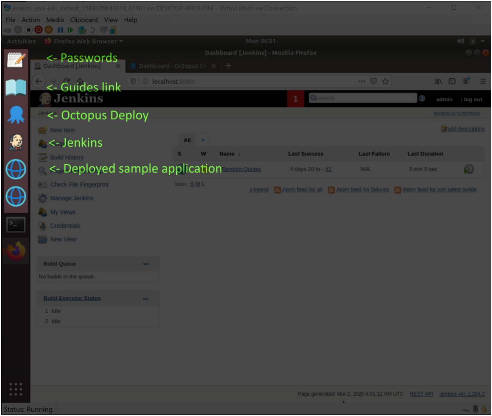

---
title: Introducing project TestDrive
description: We are proud to announce the release of several VMs for customers to test CI/CD workflows with Jenkins, Octopus, and a variety of other platforms.
author: matthew.casperson@octopus.com
visibility: private
published: 2999-01-01
metaImage:
bannerImage:
tags:
 - Octopus
---

Starting a new IT project is a daunting prospect. It often feels like you need a deep understanding of half a dozen tools and platforms, any one of which is sufficiently complex that you could build an entire career around it, let alone integrating them together in any meaningful way.

If you have ever stared down the barrel of a proof-of-concept project and wondered where to even begin, you are not alone. I’ve heard more than one resigned sigh around the office from fellow developers (myself included) tasked with debugging a Kubernetes, NGINX, WildFly, or Tomcat deployment, and we work in an environment where such deployments are commonplace.

However, it is incredibly satisfying reaching a point where you can see a deployment roll out from a build initiated in a CI server to its destination via Octopus because, from that baseline, changes are quickly and iteratively implemented.

One of our goals at Octopus is to get you there faster and with less frustration. To that end, we just launched the [TestDrive](https://octopus.com/testdrive) project to publish several virtual machines to [Vagrant Cloud](https://app.vagrantup.com/octopusdeploy) that capture a variety of self-contained CI/CD workflows utilizing free and open source platforms like Jenkins, Docker, Kubernetes, Tomcat, and NGINX.

## Getting the VMs

The Hyper-V and VirtualBox virtual machines have been built and packaged using [vagrant](https://www.vagrantup.com/) and are distributed through [Vagrant Cloud](https://app.vagrantup.com/octopusdeploy).  

If you’ve never used vagrant, it’s easiest to think of it as a common CLI tool for hypervisors. Vagrant makes consuming and creating virtual machines easy, and you only need to execute two commands to get a virtual machine downloaded and installed locally. For example, installing the Octopus, Jenkins, and Kubernetes virtual machine is done with these two commands for VirtualBox users:

```
vagrant init octopusdeploy/jenkins-java-k8s
vagrant up --provider=virtualbox
```

Or these two commands for Hyper-V users:

```
vagrant init octopusdeploy/jenkins-java-k8s
vagrant up --provider=hyperv
```

You can find the full range of virtual machines from the [Octopus TestDrive page](https://octopus.com/testdrive).

After the virtual machine has booted, you are logged into the Ubuntu desktop. Shortcuts to the installed applications have been added to the dock on the left. The screenshot below shows the various icons in the Kubernetes VM:



You now have a complete CI/CD pipeline to experiment with. By taking advantage of your hypervisor’s snapshot functionality, you can quickly roll back any changes, making this virtual machine the ideal environment to explore Octopus.

## Conclusion

If you have ever been curious about what Octopus can do for you, or you want to explore Octopus as part of a complete CI/CD pipeline, the TestDrive VMs are a quick and secure way to experiment with Octopus, Jenkins, and other platforms like Kubernetes, NGINX, Tomcat, and WildFly.
