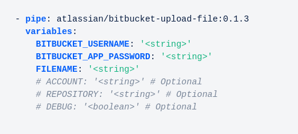
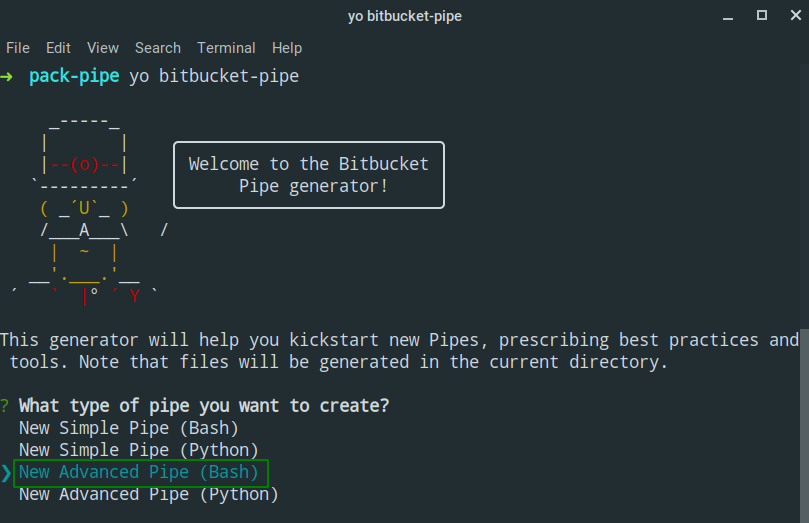
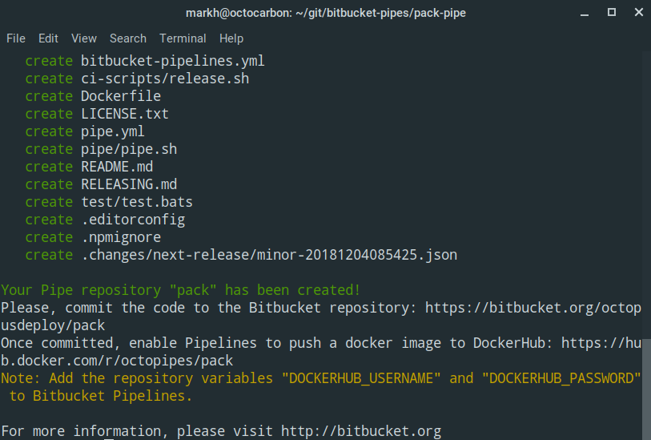
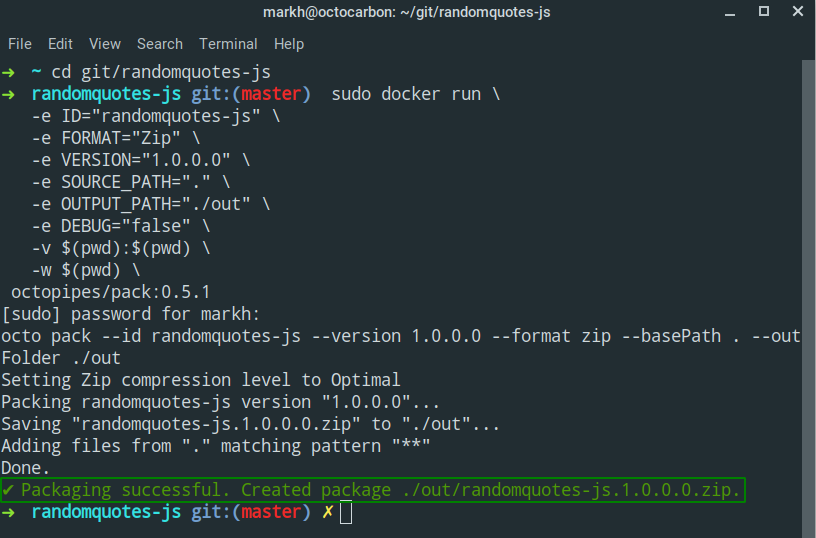
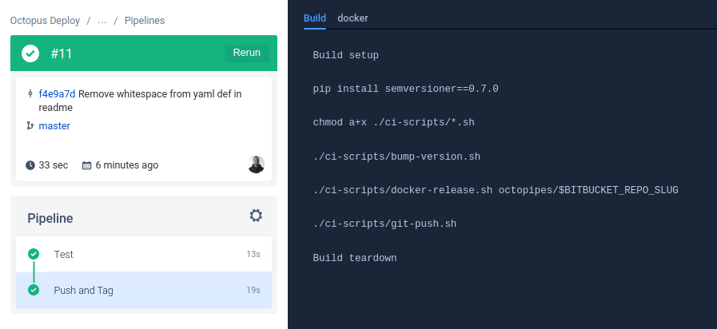
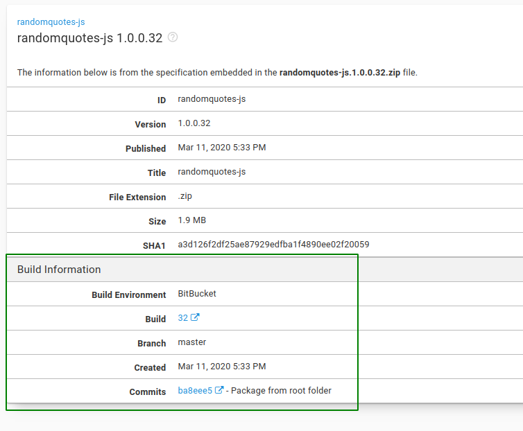

When I first started at Octopus Deploy, I never really knew much about [Bitbucket](https://bitbucket.org/product). I naively assumed it was just Atlassian's version of Source control. As I found out recently, it's much more than that, and offers (amongst other things) a cloud-based continuous integration solution - [Bitbucket Pipelines](https://bitbucket.org/product/features/pipelines). 

We've written previously about Bitbucket pipelines and how they can help streamline your continous delivery process through the use of [containers](https://confluence.atlassian.com/bitbucket/use-docker-images-as-build-environments-792298897.html). If you aren't familiar with Bitbucket pipelines, I'd recommend having a read of the posts:

 - How to guide - [Setting up a CI/CD pipeline with Bitbucket and Octopus](https://octopus.com/blog/continuous-delivery-bitbucket-pipelines)
 - Container redux - [Using the Octopus CLI containers in your pipeline](https://octopus.com/blog/bitbucket-pipelines-redux)
 
 As part of the Customer Success team, we get to talk to our customers and understand how they are using Octopus. Over time, that experience has taught us that when someone has a particular problem to solve, providing a solution that includes a concrete sample to show is helpful for everyone. 
 
 In this post, I'll describe my journey to do just that, with the next evolution in Bitbucket pipelines; [Pipes](https://bitbucket.org/product/features/pipelines/integrations). I will create a Pipe for an [Octopus CLI](https://g.octopushq.com/OctopusCLI) command, use it in a Bitbucket pipeline for our Sample node.js application - [RandomQuotes-Js](https://bitbucket.org/octopussamples/randomquotes-js), and finally, integrate the pipeline with Octopus.

<h2>In this post</h2>

!toc

## What are Bitbucket Pipes?

Before we dive right in, it's essential to understand what pipes are, and how they fit into a Bitbucket pipeline. 

Atlassian [says](https://confluence.atlassian.com/bitbucket/learn-about-pipes-978200267.html):

> Pipes provide a simple way to configure a pipeline. They are especially powerful when you want to work with third-party tools. Just paste the pipe into the yaml file, supply a few key pieces of information, and the rest is done for you. You can add as many pipes as you like to your steps, so the possibilities are endless!

Pipes build on the core concept of pipelines, containers. A Pipe makes use of a script that lives inside of a [Docker](https://www.docker.com/) container. It typically has the commands that you'd have written in your pipeline yaml file before you used a Pipe.

### Example Pipe usage

This is what the Atlassian [bitbucket-upload-file](https://bitbucket.org/product/features/pipelines/integrations?p=atlassian/bitbucket-upload-file) Pipe would look like in your pipeline yaml file:



where: 
 - `atlassian/bitbucket-upload-file:0.1.3` is the name of the Docker [image](https://hub.docker.com/r/bitbucketpipelines/bitbucket-upload-file) containing the Pipe to run.
 - `BITBUCKET_USERNAME` is an example of a variable that you would to provide a value for the Pipe to use when executing inside of the container.

 :::hint
**Referring to a Pipe in a pipeline step:** 

There are 2 ways you can refer to a Pipe in a step within a pipeline:

1. Refer to the Docker image directly:
```yaml
pipe: docker://<Docker_Account_Name>/<Image_Name>:<tag>
```

2. Refer to a Pipe repository hosted on Bitbucket:
```yaml
pipe: <Bitbucket_account>/<Bitbucket_repo>:<tag>
```

This method looks for the location of the Docker image from the `pipe.yml` file within the referenced `<Bitbucket_account>/<Bitbucket_repo>` Pipe repository.
 :::

### Why are they useful?

So why go to the trouble of writing a Pipe at all? 

Well, Pipes are all about **re-use**. They allow you to repeat the same action in multiple steps of your pipeline.  By centralising the core of your action into a Pipe, you end up with a simpler pipeline configuration. Another key feature of a Pipe versus directly scripting in your pipeline is the ability to include dependencies that your main pipeline doesn't require.

## Creating a Bitbucket Pipe

 A Pipe consists of a bunch of files which make up a Docker image. The Pipe I created has it's image based on the pre-existing [octopusdeploy/octo](https://hub.docker.com/r/octopusdeploy/octo) image. The finished Pipe has been published as [octopipes/pack](https://hub.docker.com/r/octopipes/pack/) on Docker Hub.

 Firstly, a quick word of warning, creating a Pipe can be quite involved. Thankfully though, Atlassian provides a step-by-step [guide](https://confluence.atlassian.com/bitbucket/how-to-write-a-pipe-for-bitbucket-pipelines-966051288.html) on their website. 
  
:::warning
I created this Pipe on an Ubuntu machine using a Bash terminal. If you are using a different platform, you may need to tweak the commands used here.
:::

### Choosing a candidate for a Pipe

I've often heard people say that naming something is the hardest thing when it comes to Software, and the same was true for choosing a command to wrap up in a Pipe. However in most CI/CD pipelines, once you have built and run any tests on your code, you probably want to package up your applications. So it felt pretty natural to choose the Octopus CLI [pack](https://octopus.com/docs/octopus-rest-api/octopus-cli/pack) command to create a Pipe for.

The added bonus was that the `pack` command only has a few required parameters, and the optional ones could be tackled with some pipeline magic (more on that [later](#optional-pipe-variables)).

There are 2 types of Pipe that you can author:
 - Simple
 - Complete

I opted for a **Complete** Pipe so that I could publish it and make use of it in other repositories.
 
### Creating the Pipe repository

Next up, I needed to create a new [octopusdeploy/pack](https://bitbucket.org/octopusdeploy/pack) Git repository in Bitbucket, and clone it locally.

:::hint
For further information on creating a new Git repository, please see the Atlassian [documentation](https://confluence.atlassian.com/bitbucket/create-a-git-repository-759857290.html).
:::

### Create Pipe skeleton

Atlassian provides a method to generate a skeleton of a Pipe repository using [Yeoman](http://yeoman.io/). Once you have all the pre-requisites (`nodejs` and `npm`) installed, you can run the generator using the `yo` command from a terminal window:

```bash
yo bitbucket-pipe
```
This will prompt you to select which Pipe you want to create. I chose the **New Advanced Pipe (Bash)** option.



You will be prompted with some questions to help fill in the metadata and other useful information for consumers of the Pipe. Once complete, it will generate the required files you need to get started:



As a minimum, you'll likely want to edit the following files to suit your Pipe requirements:

 - [pipe.yml](#creating-the-pipes-metadata)
 - [pipe/pipe.sh](#creating-the-pipe-script)
 - [Dockerfile](#creating-the-pipe-Dockerfile)
 - [bitbucket-pipelines.yml](#creating-the-pipes-own-pipeline)
 - [README.md](#creating-the-pipe-readme)

:::hint
**Tip:** Check other repositories to see how they have written their Pipe!

One of the great things about every Bitbucket Pipe is that the code is public, so you can browse it. For example you can view the source code for the `bitbucket-upload-file` Pipe on [Bitbucket](https://bitbucket.org/atlassian/bitbucket-upload-file/).

This is a really great way to see how other authors have structured their Pipe.
:::

### Creating the Pipe's metadata

When creating a **Complete** Pipe, Atlassian requires you to create a `pipe.yml` file. This document contains metadata about your Pipe. It includes things like:
 - A friendly name of the Pipe.
 - The Docker Hub image for your Pipe in the format: `account/repo:tag`.
 - A list of Pipe variables where you can specify default values.

If you chose one of the **Advanced** pipes using the Pipe generator, then the `pipe.yml` file will be created for you with all of the relevant information already supplied. Here are the contents of my auto-generated [pipe.yml](https://bitbucket.org/octopusdeploy/pack/src/master/pipe.yml) file:

```yaml
name: Octo Pack
image: octopipes/pack:0.0.0
description: Creates a package (.nupkg or .zip) from files on disk, without needing a .nuspec or .csproj
repository: https://bitbucket.org/octopusdeploy/pack
maintainer: support@octopus.com
tags:
    - octopus
    - package
    - deployment
```

### Creating the Pipe script

The main part of your Pipe is the script or binary which will run when it's executed within a container. It will include all of the logic needed to execute the Pipe task. You can choose any language you are familiar with. When I created our [skeleton](#create-pipe-skeleton) of our Pipe earlier, I chose to use [Bash](https://en.wikipedia.org/wiki/Bash_(Unix_shell)), and a sample `pipe/pipe.sh` file was created for me to finish.

Now I should point out that Bash is not *usually* my first choice when faced with a programming challenge. With that being said, I've recently switched my work laptop to [Ubuntu 18.04.4](http://releases.ubuntu.com/18.04.4/) so I felt comfortable writing a Pipe with it. 

:::hint
If you aren't familiar with Bash, there are some great resources online:
 - GNU Manual - [Bash Reference Guide](https://www.gnu.org/software/bash/manual/bash.html)
 - Bash scripting - [A cheatsheet](https://devhints.io/bash)
 - Bash tips and tricks - [Bash one-liners](http://www.bashoneliners.com/)
:::

**TL;DR**

If you want to see the complete Pipe script, skip straight to the [end](#complete-pipe-script) or view the [source code](https://bitbucket.org/octopusdeploy/pack/src/master/pipe/pipe.sh). If not, read on!

The general structure to a Pipe script file tends to follow this convention:


#### Mandatory Pipe variables

For the `pack` command there are 5 parameters I wanted the Pipe to handle:

1. The `--id` of the package to create.
1. The `--format` for the package; e.g. `NuPkg` or `Zip`.
1. The `--version` for the package (SemVer).
1. The `--basePath` to specify the root folder containing files and folders to pack.
1. The `--outFolder` to specify the folder where the generated package would be written.

To cater for each of these, I mapped each one to a Bitbucket pipeline [variable](https://confluence.atlassian.com/bitbucket/variables-in-pipelines-794502608.html).

I also followed the validation of variables, shown in the Atlassian [demo-pipe-bash](https://bitbucket.org/atlassian/demo-pipe-bash/src/master/pipe/pipe.sh) script:

```bash
NAME=${NAME:?'NAME variable missing.'}
```
This simply checks for a `$NAME` variable value, and errors with a message when the variable isn't present.

Therefore, for the 5 variables I created, my variable validation looked like this:

```bash
# mandatory parameters
ID=${ID:?'ID variable missing.'}
FORMAT=${FORMAT:?'FORMAT variable missing.'} 
VERSION=${VERSION:?'VERSION variable missing.'}
SOURCE_PATH=${SOURCE_PATH:?'SOURCE_PATH variable missing.'}
OUTPUT_PATH=${OUTPUT_PATH:?'OUTPUT_PATH variable missing.'}
```

#### Optional Pipe variables

Next up were some optional variables consumers of the Pipe could choose to supply if they wished:

I included an `EXTRA_ARGS` array variable to include multiple additional arguments for the `pack` command. You can specify this variable by using a special Bitbucket Array type in your pipeline:

```yaml
variables:
  EXTRA_ARGS: ['--description', 'text containing spaces', '--verbose']
```

The Array type is really useful, as it allows an easy way to supply any other arguments to the Pipe. In my case, this allowed consumers of the `pack` Pipe the ability to provide any of the additional argument options that I hadn't explicitly handled.

:::hint
**Advanced Pipe Writing Techniques:** To learn about more the Array type and how its values are passed to the Docker container, please see Atlassian's [documentation](https://confluence.atlassian.com/bitbucket/advanced-techniques-for-writing-pipes-969511009.html).
:::

Lastly, I included a boolean `DEBUG` variable to include additional debugging information. You would specify it's value in your Pipe like this:

```yaml
variables:
  DEBUG: 'true'
```

#### Running Octo Pack

The `pack` Pipe's sole purpose is to package up a set of files, so it will come as no surprise the next part is to do just that. 

To achieve it, we make use of our reference to the [octopusdeploy/octo](https://hub.docker.com/r/octopusdeploy/octo) Docker image which I am using as a base for our Pipe Docker image.

By using this, we have access to the full [Octopus CLI](https://octopus.com/docs/octopus-rest-api/octopus-cli/) in our Pipe.

To package up the files in the Bitbucket pipeline, in our script all we need to do is run the `pack` command, passing in our variables:

```bash
run octo pack --id "$ID" --version "$VERSION" --format "$FORMAT" --basePath "$SOURCE_PATH" --outFolder "$OUTPUT_PATH" "${EXTRA_ARGS[@]}"
```

Lastly, we check if the command was successful. If it was, we display a success message and set a variable with the resultant packaged filename. If not, we display an error message and halt execution.

:::hint
The `run` command is a helper function specified in a separate `common.sh` file. It looks like this:

```bash
run() {
  output_file="/var/tmp/pipe-$(date +%s)-$RANDOM"

  echo "$@"
  set +e
  "$@" | tee "$output_file"
  status=$?
  set -e
}
```
The function wraps the call to the supplied command, in this case `octo pack`, logs the output to a temporary file and captures the exit status.
:::

#### Complete Pipe script

And that's all there is to our script. Here is the finished `pipe.sh` file:

```bash
#!/usr/bin/env bash

# Creates a package (.nupkg or .zip) from files on disk, without needing a .nuspec or .csproj
#
# Required globals:
#   ID
#   FORMAT
#   VERSION
#   SOURCE_PATH
#   OUTPUT_PATH
#
# Optional globals:
#   EXTRA_ARGS
#   DEBUG

source "$(dirname "$0")/common.sh"

# mandatory parameters
ID=${ID:?'ID variable missing.'}
FORMAT=${FORMAT:?'FORMAT variable missing.'} 
VERSION=${VERSION:?'VERSION variable missing.'}
SOURCE_PATH=${SOURCE_PATH:?'SOURCE_PATH variable missing.'}
OUTPUT_PATH=${OUTPUT_PATH:?'OUTPUT_PATH variable missing.'}

FORMAT=$(echo "$FORMAT" | tr '[:upper:]' '[:lower:]')

# Default parameters
EXTRA_ARGS_COUNT=${EXTRA_ARGS_COUNT:="0"}
DEBUG=${DEBUG:="false"}

enable_debug

if [ "${EXTRA_ARGS_COUNT}" -eq 0 ]; then
  # Flatten array of extra args
  debug "Setting EXTRA_ARGS to empty array"
  EXTRA_ARGS=
fi

debug "Flattening EXTRA_ARGS"
init_array_var 'EXTRA_ARGS'

debug ID: "${ID}"
debug FORMAT: "${FORMAT}"
debug VERSION: "${VERSION}"
debug SOURCE_PATH: "${SOURCE_PATH}"
debug OUTPUT_PATH: "${OUTPUT_PATH}"
debug EXTRA_ARGS_COUNT: "${EXTRA_ARGS_COUNT}"
debug EXTRA_ARGS: "${EXTRA_ARGS}"

run octo pack --id "$ID" --version "$VERSION" --format "$FORMAT" --basePath "$SOURCE_PATH" --outFolder "$OUTPUT_PATH" "${EXTRA_ARGS[@]}"

if [ "${status}" -eq 0 ]; then
  OCTO_PACK_FILENAME="$ID.$VERSION.$FORMAT"
  success "Packaging successful. Created package $OUTPUT_PATH/$OCTO_PACK_FILENAME."

else
  fail "Packaging failed."
fi
```

### Creating the Pipe Dockerfile

Now we have our main script to run, we need to create our image using a Dockerfile.
If you ran the Pipe generator, then you will already have a file that you need to edit to suit your Pipe.

For the `pack` Pipe, the Dockerfile looks like this:

```docker
FROM octopusdeploy/octo:7.1.3

RUN apk add --update --no-cache bash

COPY pipe /
RUN chmod a+x /*.sh

ENTRYPOINT ["/pipe.sh"]
```

The Dockerfile takes the `octopusdeploy/octo` as it's base, and then adds `bash` to the image. It then copies the contents of the `pipe` folder and sets permissions for all users to be able to execute the `.sh` files present. Lastly it sets the `ENTRYPOINT` for the container to our [pipe.sh](#complete-pipe-script) file we created earlier.

### Creating the Pipe's own pipeline

When you have completed your Pipe, you could deploy your docker image manually to Docker Hub. However, it's also possible to get Bitbucket pipelines to do the heavy lifting for you automatically when you push changes to your Bitbucket repository with your own `bitbucket-pipelines.yml` file.

As we saw earlier, running the Pipe generator will create a file for you.

For the `pack` Pipe, I only modified the push step:

```yaml

push: &push
  step:
    name: Push and Tag
    image: python:3.7
    script:
    - pip install semversioner==0.7.0
    - chmod a+x ./ci-scripts/*.sh
    - ./ci-scripts/bump-version.sh
    - ./ci-scripts/docker-release.sh octopipes/$BITBUCKET_REPO_SLUG
    - ./ci-scripts/git-push.sh
    services:
    - docker
```

The step installs [semversioner](https://pypi.org/project/semversioner/), which is a python tool to help automatically generate release notes and version your Pipe according to [SemVer](https://semver.org/). After this, it increments the version of the Pipe, creates a new Docker image and pushes it to Docker Hub. Finally it tags the new version, and pushes that back to the Bitbucket repository. 

You can view the complete `bitbucket-pipelines.yml` file for the `pack` Pipe on [Bitbucket](https://bitbucket.org/octopusdeploy/pack/src/master/bitbucket-pipelines.yml).

:::hint
**No double docker push:** 
The `push` step doesn't trigger two Docker images to be pushed to Docker Hub when the step is doing it's own commit and push back to the Bitbucket repository. The reason for this is that Bitbucket pipelines support the option to skip a pipeline run if `[skip ci]` or `[ci skip]` is included anywhere in the commit message.
:::

### Creating the Pipe README

You might be thinking, "why spend time creating a readme file?". Well Atlassian themselves recommend it, stating:

> Your readme is how your users know how to use your pipe. We can display this in Bitbucket, so it needs to be written with markdown, in a specific format.

If you want users to be successful when using your Pipe, the better the `README` is, the higher the liklihood is of your users doing just that.

One of the more important parts of it will be the **YAML Definition**. This tells users what to add to their `bitbucket-pipeline.yml` file. 

Here's what the `pack` one looks like:

```yaml
script:
  - pipe: octopipes/pack:0.4.0
    variables:
      ID: "<string>"
      FORMAT: "<string>"
      VERSION: "<string>"
      SOURCE_PATH: "<string>"
      OUTPUT_PATH: "<string>"
      # EXTRA_ARGS: "['<string>','<string>' ..]" # Optional
      # DEBUG: "<boolean>" # Optional
```

You can view the `README` for the `octopipes/pack` in full [here](https://bitbucket.org/octopusdeploy/pack/src/master/README.md).

## Running the Pipe

Since the Pipe is just a Docker image, once you have built the image - you can execute the Pipe using `docker run`, passing in any required parameters as Environment variables. 

Here's what the command looks like to run the `pack` Pipe to package up the `source` directory from our `RandomQuotes-JS` application:

```bash
sudo docker run \
   -e ID="randomquotes-js" \
   -e FORMAT="Zip" \
   -e VERSION="1.0.0.0" \
   -e SOURCE_PATH="source" \
   -e OUTPUT_PATH="./out" \
   -e DEBUG="false" \
   -v $(pwd):$(pwd) \
   -w $(pwd) \
 octopipes/pack:0.4.0
```

The resultant output shows the successful packaging of the `randomquotes-js.1.0.0.0.zip` file:



## Testing the Pipe

To make sure your Pipe does what you expect it to, it's a good idea to write tests for it. Following Atlassian's lead, I also opted to use [BATS](https://www.systutorials.com/docs/linux/man/1-bats/) (Bash Automated Testing System).

Just like a lot of testing frameworks, a test file (which typically ends in `.bats`) contains the following constructs:
 - A `setup()` method to set up any required variables or shared resources for your tests.
 - A number of individual `@test` declarations - these are your test cases.
 - A `teardown` method to clean up any resources used.

Here is what my [test.bats](https://bitbucket.org/octopusdeploy/pack/src/master/test/test.bats) file looks like:

```bash
#!/usr/bin/env bats

setup() {
  DOCKER_IMAGE=${DOCKER_IMAGE:="test/pack"}

  echo "Building image..."
  run docker build -t ${DOCKER_IMAGE}:test .

  # generated
  RANDOM_NUMBER=$RANDOM

  # locals
  ID="MyCompany.MyApp"
  FORMAT="zip"
  VERSION="1.0.0.0"
  SOURCE_PATH="test/code"
  OUTPUT_PATH="test/out"

  echo "$FORMAT" 

  EXPECTED_FILE="$ID.$VERSION.$FORMAT"

  # Create test output dir
  rm -rf test/out
  mkdir test/out/extract -p
  
  echo "Create file with random content"
  echo $RANDOM_NUMBER > test/code/test-content.txt
}

teardown() {
  echo "Cleaning up files"
  chmod -R a+rwx test/out/
  rm -rf test/out
}

@test "Create Zip package using Octo pack command" {
    
    echo "Run test"
    run docker run \
        -e ID="${ID}" \
        -e FORMAT="${FORMAT}" \
        -e VERSION="${VERSION}" \
        -e SOURCE_PATH="${SOURCE_PATH}" \
        -e OUTPUT_PATH="${OUTPUT_PATH}" \
        -e DEBUG="false" \
        -v $(pwd):$(pwd) \
        -w $(pwd) \
        ${DOCKER_IMAGE}:test

    echo "Status: $status"
    echo "Output: $output"
    [ "$status" -eq 0 ]

    # Verify
    unzip "test/out/$EXPECTED_FILE" -d test/out/extract
    run cat "test/out/extract/test-content.txt"
    echo "Output: $output"
    [[ "${status}" -eq 0 ]]
    [[ "${output}" == *"$RANDOM_NUMBER"* ]]

}
```

In my `test.bats` file, in the `setup` I build a local docker image of the Pipe called `test/pack`. Next it creates a file with a random number for its contents. 

My `test` then executes `docker run` (like I did earlier in my local testing) and verifies that the container ran to completion, and finally extracts the files from the package, and checks that the content matches the random number I generated in the `setup`.

The tests run as part of my automated CI/CD pipeline configured in my `bitbucket-pipeline.yml`. You can also run the tests locally if you have `bats` installed.

Here is the output from a test run of my `test.bats` file:


And that's all there is to it when it comes to testing your Pipe!

## Publishing the Pipe

Once you are happy your Pipe is working, you can publish your Docker image directly by running `docker push`.

If you have set up an automated [pipeline](#creating-the-pipes-own-pipeline) like we did earlier, then you can make use of `semversioner` to create a changeset:

```bash
semversioner add-change --type patch --description "Initial Docker release"
```

Once you have committed your changeset, push them to Bitbucket and your pipeline should handle the rest. It will also automatically update the version number in:

 - the `CHANGELOG.md` file
 - the `README.md` file
 - the metadata `pipe.yml`

You can see an example of the `pack` Bitbucket pipeline running the `0.4.0` release here:



## Integrating the Pipe into a pipeline

If you've got this far, you'll have your Pipe published to Docker Hub. But how do you integrate that Pipe in another repository's pipeline?

To find out, I imported one of our existing node.js samples `RandomQuotes-JS`, which is hosted on [GitHub](https://github.com/OctopusSamples/RandomQuotes-js) into a new Bitbucket Repository with the same [name](https://bitbucket.org/octopussamples/randomquotes-js/).

### Utilising the Pipe

Next, I created a `bitbucket-pipelines.yml` file and set up my pipeline. After the build and testing step, I inserted a package step like this:

```yaml
- step:
    name: Pack for Octopus
    script:
      - export VERSION=1.0.0.$BITBUCKET_BUILD_NUMBER
      - pipe: octopusdeploy/pack:0.4.0
        variables:
          ID: ${BITBUCKET_REPO_SLUG}
          FORMAT: 'Zip'
          VERSION: ${VERSION}
          SOURCE_PATH: '.'
          OUTPUT_PATH: './out'
          DEBUG: 'false'
    artifacts:
      - out/*.zip
```

The step looks similar to my examples shown in the Pipe's `README` file. I've added a line just before the `pipe` instruction to set a variable:

```yaml
- export VERSION=1.0.0.$BITBUCKET_BUILD_NUMBER
```

The `export` command tells Bitbucket to create the `VERSION` variable and allow it to be used in the Pipe.

I also make use of Bitbucket [artifacts](https://confluence.atlassian.com/bitbucket/using-artifacts-in-steps-935389074.html), where I specify a globbing pattern to choose any zip files present in the `out` folder:

```yaml
artifacts:
    - out/*.zip
```

This will allow the package created by the Pipe to be used by any future steps in the pipeline.

## Integrating the pipeline with Octopus

Once I had created a package, I wanted to complete the Bitbucket pipeline by integrating Bitbucket with Octopus; specifically I wanted to push the package I'd created and the related commit information to Octopus.

### Push package to Octopus

After the packaging step I'd created earlier, I added another step to push the package to the Octopus [built-in repository](https://octopus.com/docs/packaging-applications/package-repositories/built-in-repository).

This step makes use of a feature in Bitbucket which allows you to specify a container image, which can be different to the default image used elsewhere in the pipeline. In this case I chose the `octopusdeploy/octo:latest` Docker image. 

This means I am able to run the `octo push` command, and specify the package I created in the previous `Pack for Octopus` step like so:

```yaml
octo push --package ./out/$BITBUCKET_REPO_SLUG.$VERSION.zip  --server $OCTOPUS_SERVER --space $OCTOPUS_SPACE --apiKey $OCTOPUS_APIKEY
```
You can see the minimum yaml required to achieve the push to Octopus below:

```yaml
- step:
    name: Push to Octopus
    image: octopusdeploy/octo:latest
    script:
      - export VERSION=1.0.0.$BITBUCKET_BUILD_NUMBER
      - octo push --package ./out/$BITBUCKET_REPO_SLUG.$VERSION.zip  --server $OCTOPUS_SERVER --space $OCTOPUS_SPACE --apiKey $OCTOPUS_APIKEY 
```

### Push Build Information to Octopus

To round off the integration, I wanted to have the [build information](https://octopus.com/docs/packaging-applications/build-servers#build-information) available within Octopus.

For me, one of the best things about Octopus is that it's built [API-first](https://octopus.com/docs/octopus-concepts/rest-api). This allows us to build a first class CLI on top of it. So pushing build information turned out to be pretty easy. Once you know the format of the json payload, I was able to create a [Bash script](https://bitbucket.org/octopussamples/randomquotes-js/src/master/create-build-info.sh) to do just that using the [build-information](https://octopus.com/docs/octopus-rest-api/octopus-cli/build-information) command.

:::hint
**Tip: Build Information payload**
To help demystify some of the complexities of the Build Information payload, I followed my colleague Shawn's excellent [piece](https://octopus.com/blog/manually-push-build-information-to-octopus) on it's structure.
:::

To add to our previous `Push to Octopus` step, we can plug that script in to push build information as well, so the complete step looks like this:

```yaml
- step:
    name: Push to Octopus
    image: octopusdeploy/octo:latest
    script:
      - apk update && apk upgrade && apk add --no-cache git curl jq
      - export VERSION=1.0.0.$BITBUCKET_BUILD_NUMBER
      - octo push --package ./out/$BITBUCKET_REPO_SLUG.$VERSION.zip  --server $OCTOPUS_SERVER --space $OCTOPUS_SPACE --apiKey $OCTOPUS_APIKEY 
      - /bin/sh create-build-info.sh $BITBUCKET_REPO_OWNER $BITBUCKET_REPO_SLUG $BITBUCKET_BUILD_NUMBER $BITBUCKET_COMMIT $BITBUCKET_BRANCH $BITBUCKET_GIT_HTTP_ORIGIN
      - octo build-information --package-id $BITBUCKET_REPO_SLUG --version $VERSION --file=octopus.buildinfo --server $OCTOPUS_SERVER --space $OCTOPUS_SPACE --apiKey $OCTOPUS_APIKEY 
```

The `create-build-info.sh` script creates a json payload output file called `octopus.buildinfo` and then we use that in the `build-information` command to push commit information.

Once the commits have been pushed to Octopus, you can see them in the Packages section of the Library:



And that's it!

You can view the complete `bitbucket-pipelines.yml` file on [Bitbucket](https://bitbucket.org/octopussamples/randomquotes-js/src/master/bitbucket-pipelines.yml).

:::success
**Sample Octopus project**
You can view the RandomQuotes-JS Octopus project setup in our [samples](https://samples.octopus.app/app#/Spaces-104/projects/randomquotes-js/) instance.
:::

## Conclusion

Once I'd got to grips with writing Bash, creating my first Bitbucket Pipe was pretty straightforward. I can definitely see the advantages of creating a Pipe in Bitbucket. That being said, it's important to point out that your Pipe shouldnt try to do too much. It's tempting to try to cram as much as you can into a Pipe. By doing this you end up fighting against the single biggest advantage that pipes offer; re-use. Integrating a Bitbucket pipeline with Octopus is a breeze with the Octopus CLI, and for anything more complex, you always have the API at your disposal too.

## Learn more
 - Take a peek at the *experimental* Pipe - [pack](https://bitbucket.org/octopusdeploy/pack/src/master/README.md)
 - Guides - [Octopus CI/CD pipeline Guides](https://octopus.com/docs/guides)

Feel free to leave a comment, and let us know what you think about Bitbucket pipes, pipelines or container-based build chains!