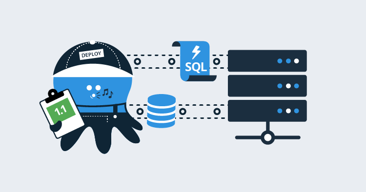
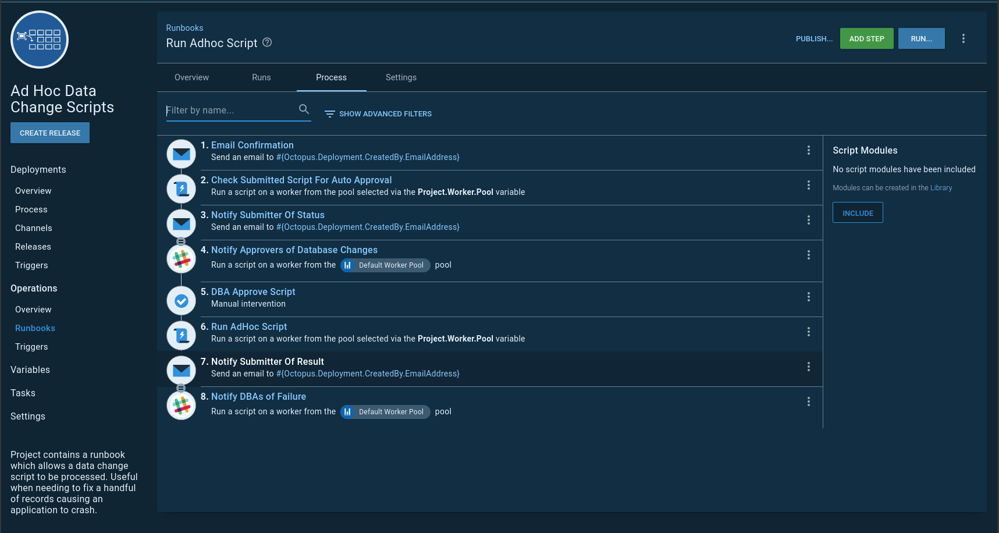
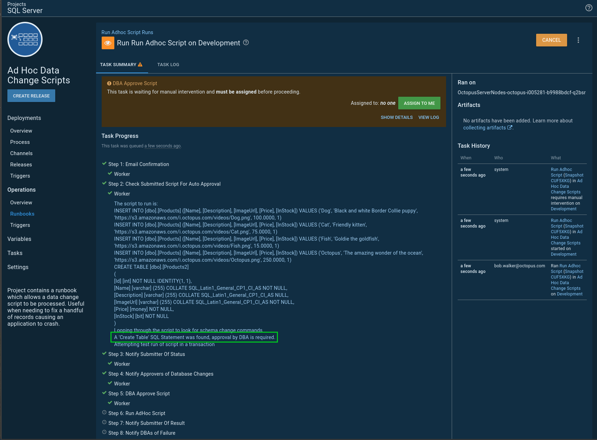
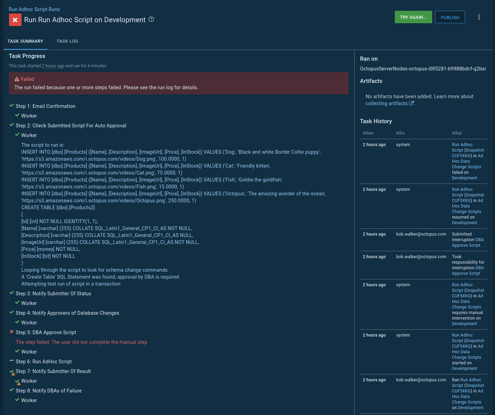
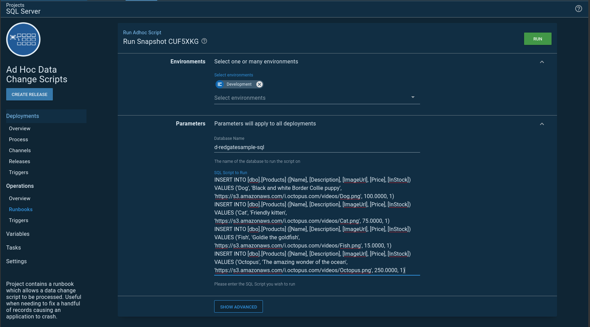
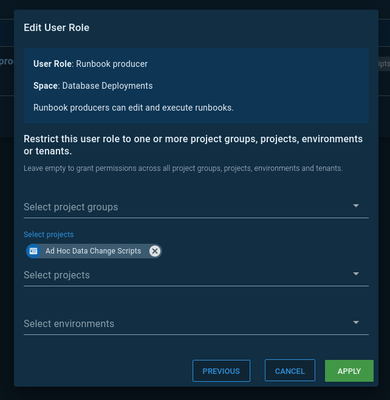
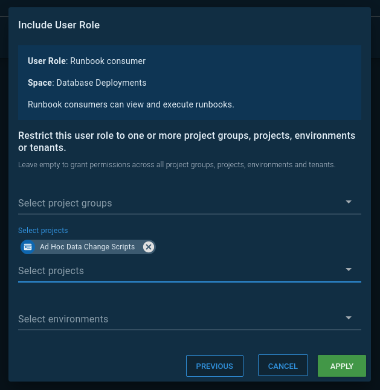
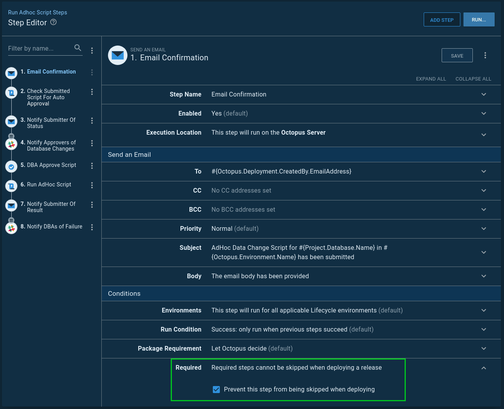

In a previous post, I wrote [how to run ad-hoc scripts in the database deployment pipeline](https://octopus.com/blog/database-deployment-automation-adhoc-scripts).  At the time of writing, I felt that was the best process, given my requirements.  The new [runbooks feature](https://octopus.com/runbooks), released as part of our 2019.11 release, looks like it could be a much better fit for this process.  In this article, I walk through the new process I put together using the Octopus Deploy Operations Runbooks feature.

!toc

## Why ad-hoc scripts need to exist

In my previous article, I went into detail as to why ad-hoc scripts need to exist in an automated database deployment pipeline.  Below is a quick summary to bring you up to speed.

All software has bugs, but not all bugs are worth the time and effort to fix.  It is hard to justify the engineering cost to fix a bug that happens once a quarter to one person, and only when specific conditions occur.  A phrase I like to use for these bugs is it occurs when "the sun, moon, and stars all align."  Sometimes a bug like this causes data to get into a bad state. The bug is unlikely to be fixed, but the data needs to be fixed so the user can continue to use the application.  A developer writes an SQL script for the DBAs to run to fix the data.

Each company I've worked at and worked with seems to have a process for running these kinds of scripts.  It could be as simple as emailing a DBA to ask them to run it, or it could be as complicated as a multi-page form requiring lots of sign-off, but it seems the process is always manual.

Using a tool like Octopus Deploy for this process has many advantages:

- **Auditing**: Octopus Deploy can tell you who made the request, who approved the request, and when this all happened.  
- **Artifacts**: Using the artifact functionality built into Octopus Deploy, it’s possible to store and capture the exact script that was run, however, if someone changes the script after the fact on a file-share, there is no way to know that.
- **Approvals**: In some cases, it’s important to have another set of eyes look at the script. Octopus Deploy can be set up to conditionally approve scripts based on a set of criteria.
- **Automation**: No more manually sending emails.  No more manually sending confirmations.  No more opening up SSMS and running the script.
- **Repeatable**: The same process will be used across all environments to run the scripts.

## Requirement re-evaluation

In looking at my previous article, I see a lot of moving parts.  I want to simplify this process when porting it to a runbook.  That complexity was a result of forcing an ad-hoc script process into a deployment process.  But is there anything else in my requirements forcing that complexity? 

Here are those requirements again:

- Octopus Deploy.
- No source control. A lot of DBAs, support engineers, and business analysts are not familiar with source control tooling.
- Automated. When the scripts are ready, they should be run within five minutes without having to fill out a form or notify anyone.
- Analysis of the script. If the script contains certain keywords, then a human should review the script prior to running it.
- Work in any environment. We want to encourage people to run this for any environment., even dev.

This one stands out:

> Automated. When the scripts are ready, they should be run within five minutes _without having to fill out a form_ or notify anyone.

With runbooks, I can tweak that requirement a bit.

> Automated.  When the scripts are ready, they should be submitted via an easy to use form and executed straight away.

## The runbook process

All right, the requirements are updated; it is now time to re-work the process:

1. A user initiates a runbook run and enters the database name and a script into [prompted variables](https://octopus.com/docs/projects/variables/prompted-variables).
2. A confirmation message is sent to the submitter.
3. A script is run that evaluates the submitted script.  It looks for schema change commands, uses a transaction to run and rollback the script, and checks the number of changed rows.  The [output variable](https://octopus.com/docs/projects/variables/output-variables) `DBA Approval Required` is set to `False` if all conditions are met, otherwise it is set to `True`.
4. The submitter is sent the results of the auto-approval.
5. If a DBA is required to review the script, a notification is sent, and the process is paused for a [manual intervention](https://octopus.com/docs/deployment-process/steps/manual-intervention-and-approvals).  
6. If the script was auto-approved or the DBA approves the script, then the script is run.
7. DBAs and the submitter are notified of the result of the run.

I am going to put that runbook into a new project.  This will help when I configure security later in the article:



## The auto-approval script

The auto-approval script is the brains of the whole operation.  It ensures standards are met, and no one is trying to sneak in a schema change script.

It'd be rather confusing to put the entire script in this article without context, but you can view the script in our [samples instance](https://samples.octopus.app/app#/Spaces-106/projects/ad-hoc-data-change-scripts/operations/runbooks/Runbooks-225/steps/RunbookProcess-Runbooks-225/step/7ff33a39-2088-4a52-aea2-cce41c70c61b).  

Below are some of the highlights of the script.  First, I put all the schema change commands to look out for into a variable:

```PowerShell
$scriptToRun = $OctopusParameters["Project.ScriptToRun.Text"]
$commandsToLookFor = $OctopusParameters["SQLServer.Commands.Warnings"]

$approvalRequired = $false
$messages = ""

Write-Highlight "Looping through the script to look for schema change commands"
$commandsToCheck = $CommandsToLookFor -split ","
foreach ($command in $commandsToCheck)
{
    Write-Host "Checking for command $command"
    $foundCommand = $scriptToRun -match "$command"

    if ($foundCommand)
    {
        $warningMessage = "A '$command' SQL Statement was found, approval by DBA is required."
        $messages += $warningMessage + "`r`n"
        Write-Highlight $warningMessage
        $approvalRequired = $true        
    }
}
```

Next, it attempts to run the script provided in a transaction.  No matter what, the transaction is rolled back:

```PowerShell
$scriptToRun = $OctopusParameters["Project.ScriptToRun.Text"]
$databaseName = $OctopusParameters["Project.Database.Name"]
$databaseServer = $OctopusParameters["Project.Database.Server"]
$connectionString = $OctopusParameters["Project.Database.ConnectionString"]
$environmentName = $OctopusParameters["Octopus.Environment.Name"]

Write-Highlight "Attempting test run of script in a transaction"
$sqlConnection = New-Object System.Data.SqlClient.SqlConnection
$sqlConnection.ConnectionString = $connectionString

$command = $sqlConnection.CreateCommand()
$command.CommandType = [System.Data.CommandType]'Text'
$command.CommandText = $scriptToRun

Write-Host "Opening the connection to $databaseName on $databaseServer"

$sqlConnection.Open()   

try
{
    Write-Host "Creating transaction"
    $command.Transaction = $sqlConnection.BeginTransaction()
    
    Write-Host "Running query now"
    $rowsChanged = $command.ExecuteNonQuery()
}
catch
{
    throw $_
}
finally 
{
    $command.Transaction.Rollback()
}
```

Make a note of this line in the above script:

```PowerShell
$rowsChanged = $command.ExecuteNonQuery()
```

The final check is to make sure the script isn't going to change a lot of records without someone looking at it.  It uses the `$rowsChanged` variable:

```PowerShell
if ($rowsChanged -gt 10)
{
    $warningMessage = "The number of rows which will changed is $rowsChanged, approval by DBA is required."
    $messages += $warningMessage + "`r`n"
    Write-Highlight $warningMessage
    
    $approvalRequired = $true
}
elseif ($rowsChanged -le 0)
{
    $warningMessage = "No rows will be changed, verify change with DBA"
    $messages += $warningMessage + "`r`n"
    Write-Highlight $warningMessage
    $approvalRequired = $true
}
```

Finally, it sets an output variable indicating if a DBA needs to approve the script:

```PowerShell
Set-OctopusVariable -name "ApprovalRequired" -value $approvalRequired
```

This is just the first iteration of the script.  I'd expect anyone reading this article to modify the script to their business requirements.

## The run ad-hoc script

The script that runs the submitted data change is a modified version of the auto-approval script.  One requirement I tend to see is every script needs to be wrapped in a transaction.  Either it all goes or none of it goes.  I couldn't agree with that requirement more.  The script that runs the submitted data change enforces that requirement:

```PowerShell
$scriptToRun = $OctopusParameters["Project.ScriptToRun.Text"]
$databaseName = $OctopusParameters["Project.Database.Name"]
$databaseServer = $OctopusParameters["Project.Database.Server"]
$connectionString = $OctopusParameters["Project.Database.ConnectionString"]

$sqlConnection = New-Object System.Data.SqlClient.SqlConnection
$sqlConnection.ConnectionString = $connectionString

$command = $sqlConnection.CreateCommand()
$command.CommandType = [System.Data.CommandType]'Text'
$command.CommandText = $scriptToRun

Write-Host "Opening the connection to $databaseName on $databaseServer"

$sqlConnection.Open()   

try
{
	Write-Highlight "Creating transaction"
	$command.Transaction = $sqlConnection.BeginTransaction()
    
    Write-Highlight "Running query now"
	$rowsChanged = $command.ExecuteNonQuery()
    
    Write-Highlight "Committing Transaction"
    $command.Transaction.Commit()
}
catch
{
	Write-Highlight "Exception with running script, rolling back transaction"
	$command.Transaction.Rollback()
	throw $_
}
```

## Seeing it in action

Now it is time to test the process.  I want to do two tests:

1. A script with data and schema changes. I'd expect the manual intervention to be triggered.
2. A script with only data changes.  No manual intervention.

### Script with data and schema changes

As stated earlier, I am using prompted variables for the database and script to run.  When I create a runbook run, I have to provide values for both:


As expected, the `Create Table` command triggers a manual intervention:



There are cases where a `Create Table` is needed.  Perhaps the script is creating a temp table, but in this case, the DBA would reject a script like this:



### Script with data changes only

In my next test, I remove the create table command:



As expected, that change was auto-approved and ran right away:


## Security

Anyone can submit an ad-hoc script, but only DBAs should be allowed to edit this process.  Let's set up two teams in Octopus to enforce this requirement.

The DBAs will be assigned the role of `Runbook producer` for the new project.  That grants them the ability to edit and execute runbooks in that specific project:



Meanwhile, developers will be assigned the role of `Runbook consumer` for the new project.  That grants them the ability to execute runbooks only:



Finally, it is important no step in this process is skipped when the runbook run is created.  Every step in the process will be marked as required to prevent that from happening:



## Conclusion

I'll be honest; I like this process a lot more.  Runbooks made everything more simple and easier to maintain.  The number of moving parts has been reduced.  I really like not having to create a release to run an ad-hoc script.  And I don't have to create a funky lifecycle just to run a script in any environment.  

I think it is a great start to a better process.  As I am typing this, I can think of a few more iterations to make this process more useful.  Eventually, retention policies will run, and runbook runs will be cleaned up.  Retention policies are needed to keep Octopus running lean and mean, but we don't want to lose any audit history for specific environments.  I could add a step to save the submitted script and results to a file share.  

If you would like to see a working example, you can visit our [samples instance](https://samples.octopus.app/app#/Spaces-106/projects/ad-hoc-data-change-scripts/operations/runbooks).  

Until next time, happy deployments!

---

!include <database-deployment-automation-posts>
