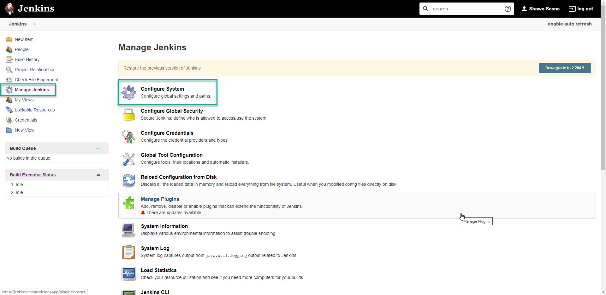
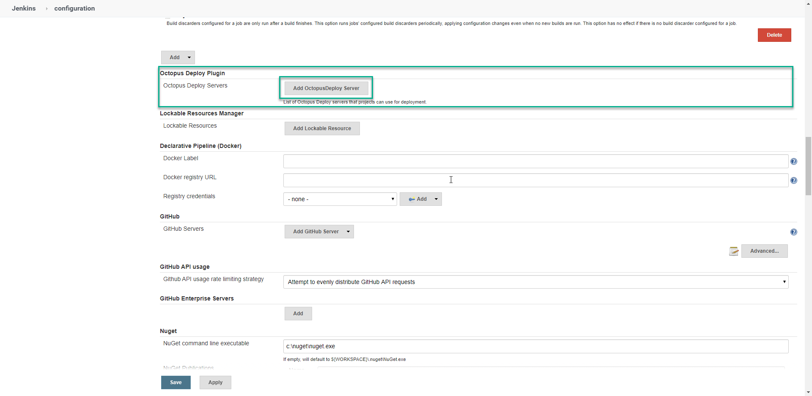
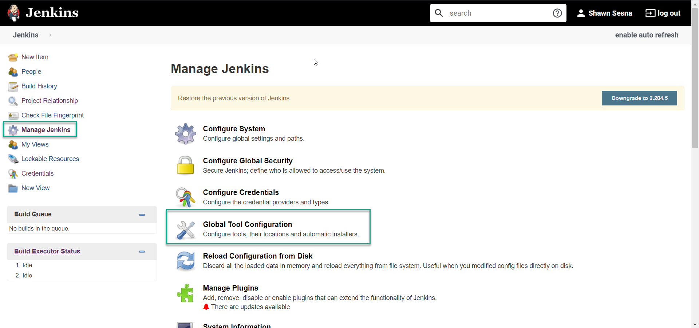
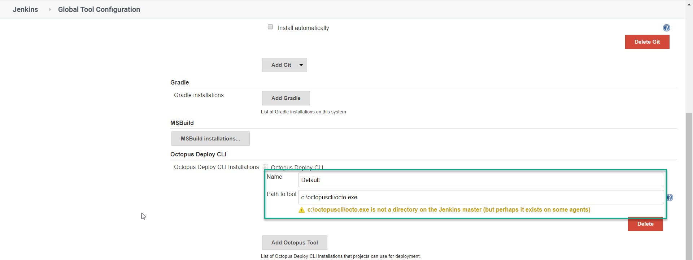
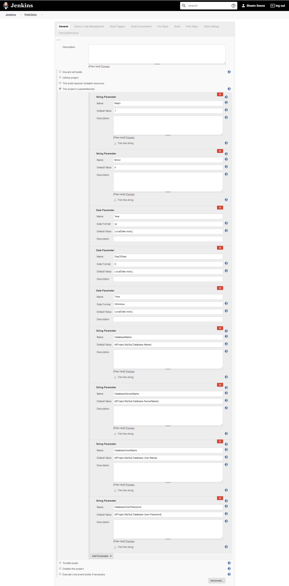
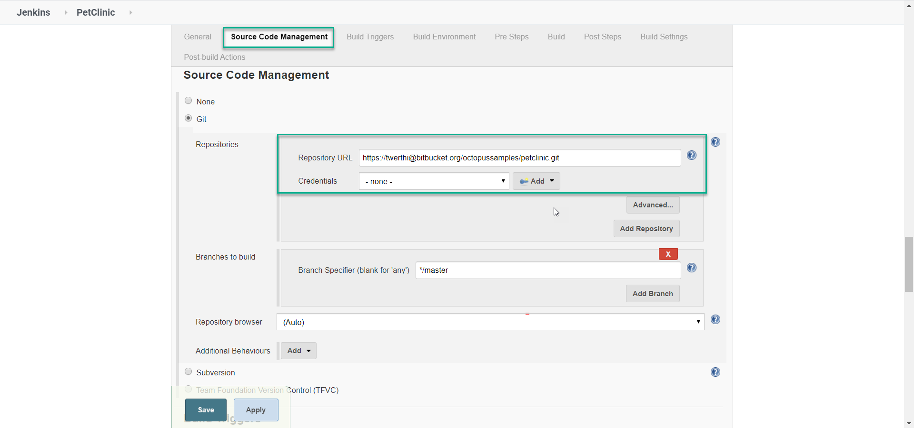
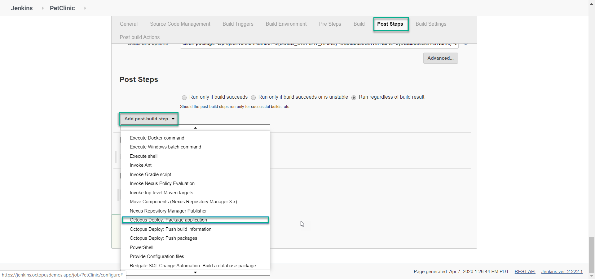
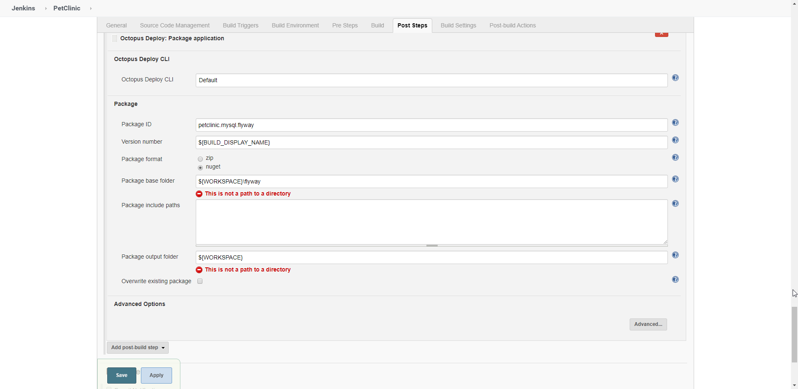
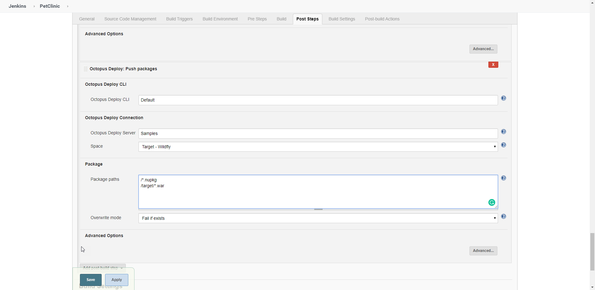

DevOps adoption has dramatically increased in recent years as people recognize the benefits it offers.  Integration of Continuous Integration (CI) solutions with Continuous Delivery (CD) solutions are now quite commonplace, though few provide any input to the continuous feedback loop of DevOps.  In this post, I will show you how to integrate Jenkins, Octopus Deploy, and Jira to provide a solution that will hook into the continuous feedback loop.

## Jenkins Octopus plugin
An Octopus Deploy plugin for Jenkins has existed for a number of years, however, this plugin was developed by the Jenkins community and not by Octopus Deploy.  In 2019, Octopus Deploy officially took over development and maintenance of the Jenkins plugin, implementing the same features that are avialable on other build platforms.

:::hint
Prior to Octopus Deploy taking ownership of the plugin, there was a security issue where passwords were stored in plain text.  This is no longer the case and the warning that Jenkins would display has since been removed.
:::

### Installation of the Octopus Deploy plugin
Installation of the Octopus Deploy plugin is no different than installing any other plugin for Jenkins.  From the landing page in Jenkins, click Manage Jenkins


From here, click on Manage Plugins


Click on the `Available` tab, then filter by Octo.  Tick the box next to Octopus Deploy and then choose either `Install without restart` or `Download now and install after restart`.


Once the plugin has been installed, you will have access to the following build tasks
- Octopus Deploy: Package application
- Octopus Deploy: Push packages
- Octopus Deploy: Push build information

Along with those build tasks, you will also have the following Post Build tasks
- Octopus Deploy: Create Release
- Octopus Deploy: Deploy Release

:::hint
The Jenkins plugin differs from Azure DevOps, TeamCity, and Bamboo in that Create Release and Deploy Release are only available as Post build actions.  Jenkins only allows one of each type of Post build action type, meaning you cannot have more than one Create Release action per build definition.  
:::

#### Configure Octopus Deploy Server connection
A number of the Octopus Deploy steps require a connection to be configured.  To configure a connection, click on `Manage Jenkins`, then `Configure System`



Scroll down to the `Octopus Deploy Plugin` and click `Add Octopus Deploy Server`



Add your Octopus Server details


#### Octopus Deploy CLI
The Octopus Deploy plugin contains all of the commands necessary to perform the actions, but it still relies on the [Octopus Deploy CLI](https://octopus.com/downloads) being present on the build agent.  Once you've downloaded the CLI and extracted it to a folder, we'll need to configure Jenkins so that it knows it's there.

Click on Manage Jenkins, then Global Tool Configuration



Scroll to the Octopus Deploy CLI section and click on Add Octopus Tool


Fill in where the cli is located and give the tool a name




### Example build
For this post, I'm building the PetClinic application which is a Java application using MySQL as a backend.  

#### Build setup
To start, we'll select a New Item from the Jenkins menu


Give your project a name and slect `Maven project`


Once you click `OK` you will be brought to the configuration screen for your build definition.

:::hint
I've configured my build to create a unique version number based on some parameters.  This version number will be stamped on the artifacts of the build that are later pushed to Octopus Deploy.  I've installed a couple of Jenkins plugins to make this work
- Build Name and Description Setter
- Date Parameter Plugin
:::

Under the `General Tab`, check the box `This project is parameterized`.


The required parameters of our build are (all `String` parameters):
- DatabaseName: #{Project.MySql.Database.Name}
- DatabaseServerName: #{Project.MySql.Database.Server.Name}
- DatabaseUserName: #{Project.MySql.Database.User.Name}
- DatabaseUserPassword: #{Project.MySql.Database.User.Password}

Optional parameters are (these are used to construct the version number, ie: 1.0.2098.101603):
- Major (String): 1
- Minor (String): 0
- Year (Date):
  - Date Format: yy
  - Default Value: LocalDate.now();
- DayOfYear (Date):
  - Date Format: D
  - Default Value: LocalDate.now();
- Time (Date):
  - Date Format: HHmmss
  - LocalDate.now();



With our parameters defined, let's hook the build into source control.  I'll be using the PetClinic public Bitbucket repo for this build:
https://twerthi@bitbucket.org/octopussamples/petclinic.git



Under the `Build Environment` tab, check the box `Set Build Name`.  This feature allows us to configure the build name to be the version number that we've configured with our parmaters (if you used the optional ones).  Set the `Build Name` to `${MAJOR}.${MINOR}.${YEAR}${DAYOFYEAR}.${TIME}`


#### Build steps
Since we chose a Maven build, Jenkins creates the build step for us.  All we need to do is fill in the Goals and options:
```
clean package -Dproject.versionNumber=${BUILD_DISPLAY_NAME} -DdatabaseServerName=${DatabaseServerName} -DdatabaseName=${DatabaseName} -DskipTests -DdatabaseUserName=${DatabaseUserName} -DdatabaseUserPassword=${DatabaseUserPassword}
```


This step builds a .war file with the name petclinic.web.Version.war.  The package ID in this case is `petclinic.web`.

#### Post Steps
The remainder of our steps will be in the Post steps section of our build definition.  Here is where we're going to package up the Flyway project for the MySQL database backend, push the packages and build information to Octopus Deploy, then create our Release.

In the Post Steps tab, click on Add post-build step and select `Octopus: package application`



Fill in the details of the task: 
 - Package ID: petclinic.mysql.flyway
 - Version number: ${BUILD_DISPLAY_NAME} (this is the version number we configured through Parameters and set via the Set Build Name option from above)
 - Package format: zip|nuget
 - Package base folder: ${WORKSPACE}\flyway (ignore the warning, it works fine)
 - Package include paths:  Nothing here for this project
 - Package output folder: ${WORKSPACE}

 

 Next up is the Push step!  Just like the previous step, click on `Add post-build step` and chose `Octopus Deploy: push packages`

 

Choose the Octopus Deploy Server connection we created during configuration, then the Space you'd like to push to (if no Space is specified, the default Space will be used).  Lastly, add the paths to the packages to be pushed.  This step accepts wildcard formats.  The starting folder for the path is ${WORKSPACE} so there's no reason to specify that (in fact it'll fail if you do)

In the `Octopus Deploy: package application` step for Flyway we defined above, we told the step to place the package in the ${WORKSPACE} folder.  The Maven build places the built .war file in `/target/` folder, so our Package Paths folder values are

```
/*.nupkg
/target/*.war
```



That takes are of pushing the packages, let's push some build information!  Just like before, click on `Add post-build step` and choose `Octopus Deploy: Push build information`.  This step is where release notes from Jira would show up.


Fill in the following details
- Octopus Server: Server connection defined previously
- Space: The space you've pushed the packages
- Package IDs
  - petclinic.web
  - petclinic.mysql.flyway
- Version Number: ${BUILD_DISPLAY_NAME}


#### Build definition complete
In this build defintion, we've integrated Jenkins with Octopus Deploy.  Not only that, we've configured the Jenkins build to retrieve the release notes from Bitbucket so they'll appear in Octopus Deploy!  Let's head over to Jira and get that integration configured.

## Jira Integration
Jira is a popular software package used to track issues within software projects.  Jira is able to keep track of logged bugs, tasks, and epic items that are associated with your project.

