Infrastructure as Code (IaC) is a modern approach to declarative infrastructure configuration. In this post, I share some lessons learned about how Runbooks can help you manage infrastructure setup and teardown in a clean and straightforward way.

In preparation for the [Octopus 2020.1 release webinar](https://www.youtube.com/watch?v=M5ejzd8KdbQ&feature=youtu.be), I needed to spin up and down the infrastructure for my demos.  Before runbooks, I had a separate *Infrastructure as Code* project to handle this.  I didn't want to do that again, and Operations Runbooks was built with this scenario in mind.  The webinar prep allowed me to port my process over to a runbook, and it gave me an opportunity to adjust how I approach Infrastructure as Code in Octopus Deploy. 

!toc

## What is Infrastructure as Code?

Infrastructure as Code is a way of modeling the desired infrastructure in a file, typically written in YAML, JSON, or Hashcorp Language (HCL).  Cloud providers have mechanisms that ingest that file and provisions your requested infrastructure, but each provider has its own infrastructure definitions:

- [AWS CloudFormation](https://aws.amazon.com/cloudformation/)
- [Azure ARM Templates](https://docs.microsoft.com/en-us/azure/azure-resource-manager/templates/overview)
- [GCP Deployment Manager](https://cloud.google.com/deployment-manager/docs)

Using the tooling provided by the cloud providers has its advantages; for instance, they typically have a UI to help with debugging.  The process is kicked off by a CLI, but when something goes wrong, you can splunk through the logs in the UI to find the root cause.  Also, to help with the learning curve, they either provide samples or let you define the desired infrastructure in the UI and export it to a file. Incidentally, this is how I create ARM templates.

The downside to using the provided tooling is the risk of lock-in.  The terminology for AWS Cloudformation doesn't translate over to Azure ARM Templates.  This is where third party tooling such as [Hashcorp's Terraform](https://www.terraform.io/) is useful.  They provide a common framework that can be used across all cloud providers.  

## Infrastructure as Code before runbooks

Before runbooks, my Infrastructure as Code process was a normal deployment process, even though I wasn't *deploying* anything, but instead, running scripts against a cloud provider.  My goal for my process was simple; have a single project to tear up and down my infrastructure.  

This approach led to some quirks. The first being, I had to create a lifecycle because I was using a deployment process, and deployment processes have lifecycles. In this example, I have two environments, `Test` and `Production`.  However, I needed an environment to tear every thing down.  Which led to my second quirk.  I needed another environment called `Teardown`.

My deployment process was a bit complex as it had steps which were either:

- Scoped to any environment but `Teardown`
- Scoped to `Teardown`

You will notice in my lifecycle `Test` and `Production` are optional.  This brings me to my next quirk.  Configuring IaC for the first time, whether for AWS CloudFormation, Azure ARM Templates, GCP Deployment Manager, or Hashicorp's Terraform takes a lot of trial and error.  Typically I get the infrastructure created after one or two tries, but everything after that causes headaches.  A VM is created, but the bootstrap script missed something.  Properly testing the fix requires tearing down and spinning up the infrastructure.  Sometimes the error happened in `Test` and other times `Production`.  I needed a way to get to `Teardown` if the deployment actually failed.  Hence, `Test` and `Production` are optional.

## AWS region specific settings

For this article, I use AWS CloudFormation to spin up an Ubuntu VM, install a Tentacle on that VM, and register the Tentacle with Octopus Deploy.  In choosing AWS, I stumbled across another quirk: Each region is segregated.  For the most part, resources cannot be shared between regions; this includes:

- SSH Keys for VMs
- AMI Images
- Subnets
- Security Groups

That is not an all-inclusive list.  

I _did not_ want to have an environment per region (that scales poorly), but I needed a way to have region-specific settings, so I used [Octopus Deploy's multi-tenancy](https://octopus.com/docs/deployment-patterns/multi-tenant-deployments) functionality. A tenant can be:

- A customer for a SaaS application
- A sandbox per developer
- A data center
- An AWS Region

One of my favorite features with tenants is that each tenant can have a unique variable value per environment.  It makes sense for database connection strings, but in my IaC example, it would've led to a lot of duplicate values.  I don't want to define the same AMI on `Test`, `Production`, and `Teardown`.  Thankfully, it is possible to configure tenant-specific variables to be used across all environments.  

### Option 1. Leverage tenant tag sets

First, I created a tenant tag set called `AWS Region`:

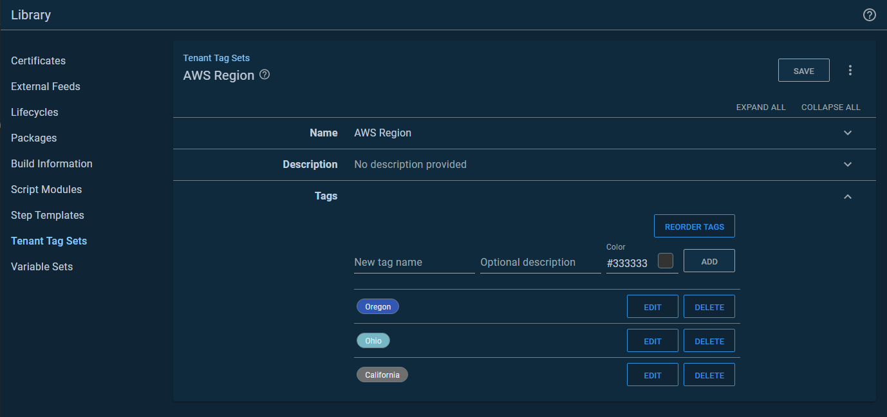

I did this because tenant tags can be scoped to a variable.  You can access that variable scoping by clicking on the `Open Editor` link:

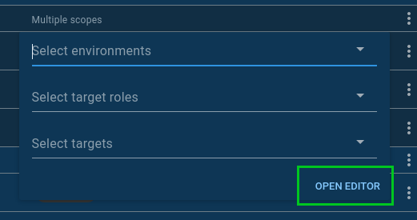

That will open up a modal window, which lets you select the tenant tag:

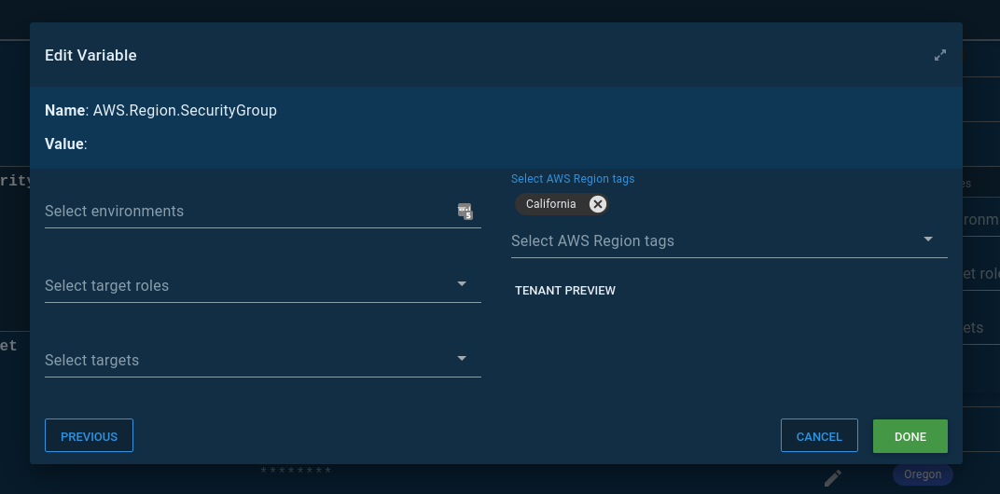

I created a variable set called `AWS`, that I populated with variables I need for my CloudFormation template:

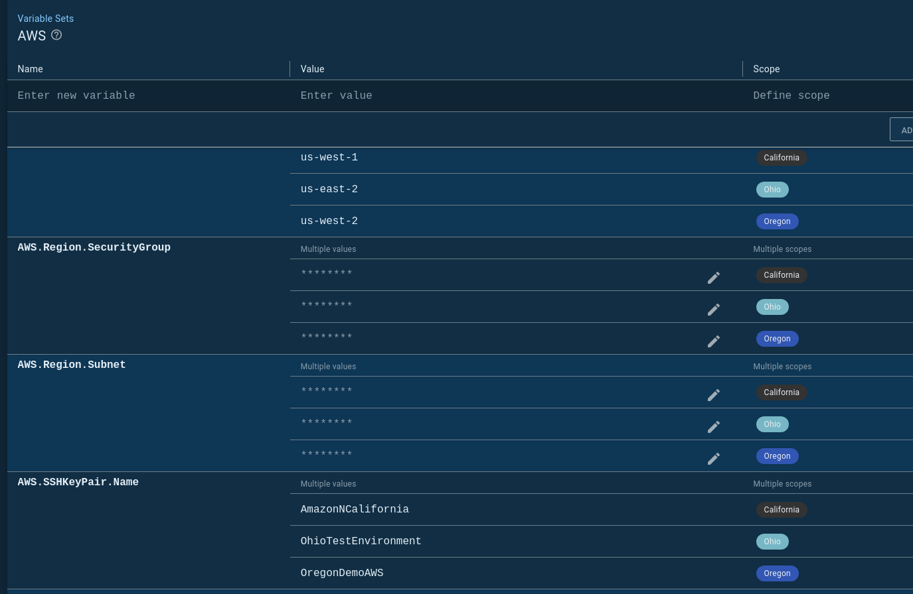

### Option 2. Leverage variable set variable templates

I chose option 1 because it makes it easier to create screenshots and demo to new users. I've found most people *get it* when they see the above screenshot.  It's also useful for showing the differences in each AWS region.  However, you have to duplicate the tenant names as tenant tags.  

Another option is to leverage the variable set variable templates.  In variable sets, there is a `Variable Templates` tab.  First, add a variable template:

On the tenant variable screen, you'll see a `Common Templates` tab.  That variable template you added to the variable set will appear.  The California region gave me the most heartache, which is why it has an image of Arnold screaming California:

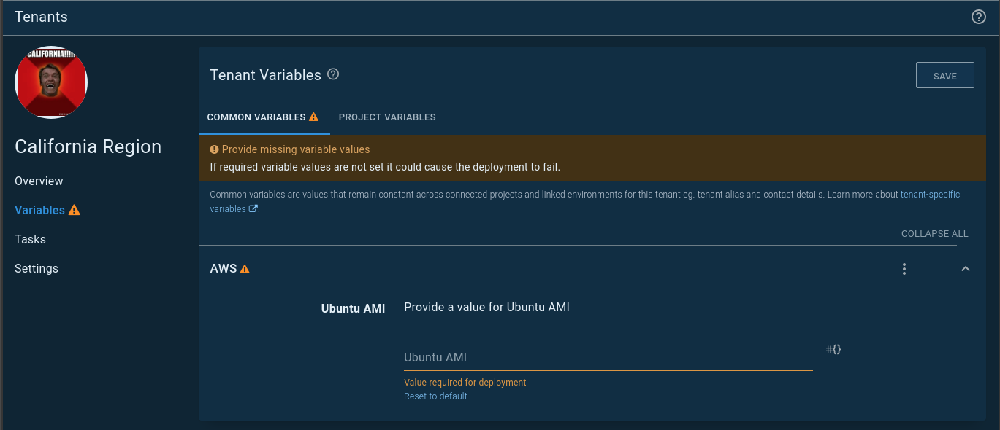

:warning
The tenant must be connected to a project that is connected to the variable set.  
:

If I were setting up Octopus Deploy in an enterprise setting, I'd use this option.

## Porting the deployment process to runbooks

I quickly learned I shouldn't do a straight port from a deployment process to runbooks.  I needed to rethink how I thought about configuring my IaC process.  As stated earlier, I wanted a single process to spin up and down my infrastructure.  My *Infrastructure as Code* project's process reflected that goal.  However, that single project goal caused me to make some suboptimal configurations.  

Those suboptimal configurations were:

- The entire concept of a `Teardown` environment and the subsequent lifecycle.
- Having to scope a step to either `Teardown` or run in every environment but `Teardown`.  In other words, I had two processes jammed into one.  
- That `Teardown` environment required me to write scripts to tear down `Test` and `Production` at the same time.  
- Because I needed to tear down everything at the same time, my variable scoping was more complex.

Let's take a moment to discuss the variable scoping as it does an excellent job of shining a light on multiple problems with my process.  In `Test` and `Production`, the variable template for the VM name followed this format `[Application Name]-[Component]-[Environnment Abbreviation]`.  For example, `todo-web-t` for the web server for the To-Do application.  The `Teardown` variable didn't include the environment abbreviation.  It was just `[Application Name]-[Component]`.  The `Teardown` process needed to de-register VMs for all environments.  That de-register script found and removed all targets that started with `[Application Name]-[Component]`.  That is a simple example; adding regions gets more complicated.  It took quite a bit of time to come up with a variable template that didn't result in accidentally deleting the wrong target.

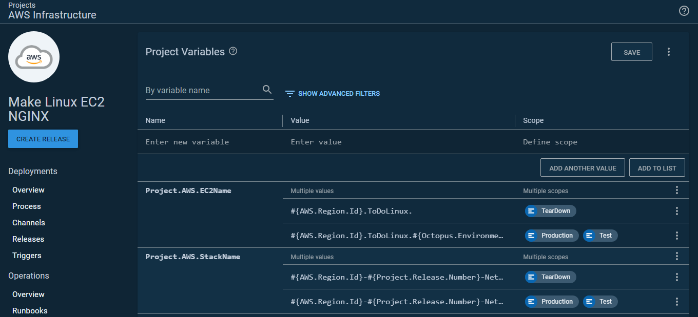

### Split the process

The first change I made was to split my IaC process into two runbooks.  One runbook spun up the infrastructure, and the other deleted it.  

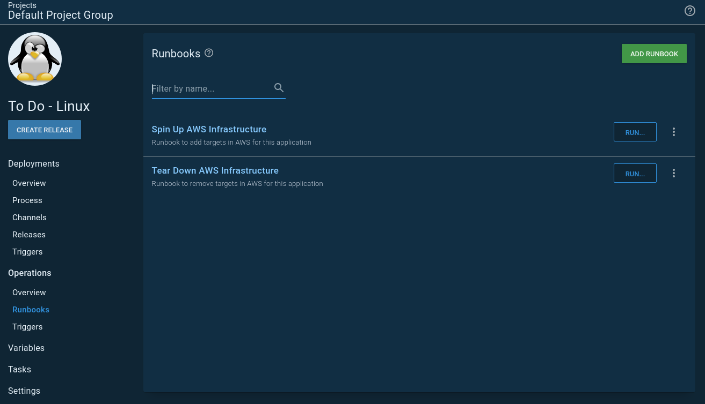

Because of that split, I no longer needed the `Teardown` environment. This, in turn, simplified the variables.  I also learned I could scope variables to specific runbooks.  This meant I wasn't passing in unused variables to my deployments.  In other words, I could have simple variables, and they were only used for specific runbooks:

The process also became easier to wrap my head around.  I wasn't trying to mash two processes into one:

### Tenants

I still wanted to keep my tenant per region configuration.  However, my sample application isn't multi-tenant; it's a small .NET core web application running on NGINX with a NoSQL backend.  It doesn't require anything other than to be split across some regions.  Doing something like Canary deployments or Blue/Green deployments is overkill.

What I wanted was:

- When I deploy to test, deploy to the servers in the `Ohio` region.
- When I deploy to production, deploy to all servers across the `Ohio`, `California`, and `Oregon` regions using a rolling deployment:

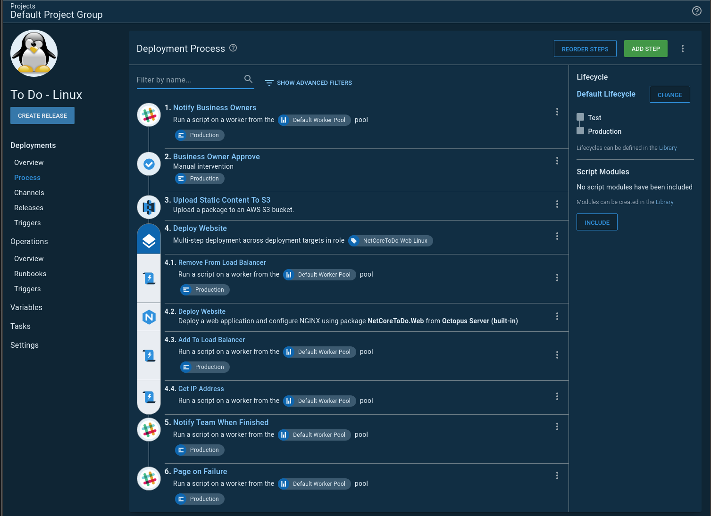

This is when I found out it's possible for a project to not allow tenanted deployments, BUT a runbook can require them.  In my project settings, I set it to disable tenanted deployments:

However, I set each runbook to require a tenant:

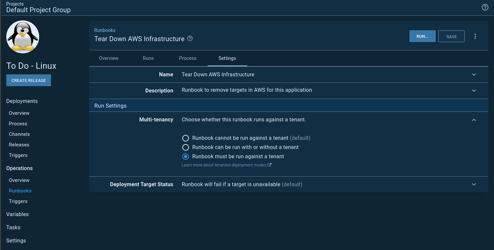

Because runbooks don't have a lifecycle the overview screen looks a little different from the usual project overview screen you might be used to:

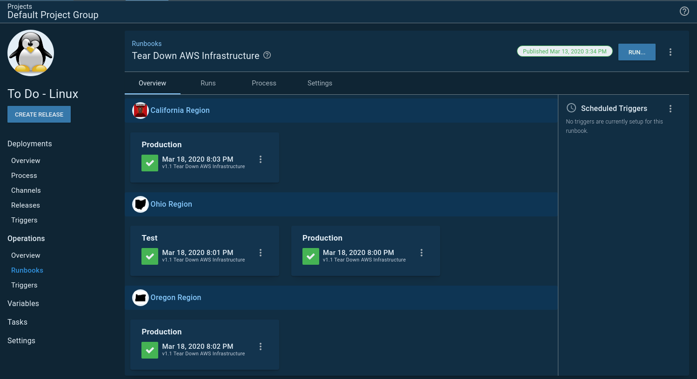

### Spinning up and down infrastructure on a schedule

VMs cost money.  For this example, I don't need the VMs running 24/7.  I'd rather have them only run during workdays.  You might have a similar requirement for your testing environments.  If nothing is using the VMs, why pay to have them running?

This led me to a slight problem.  The scheduled trigger for runbooks lets me select 1 to N number of environments:

The trigger will kick-off two tasks, one for each of my specified environments.  With two environments, that isn't that big of a deal, but I ran into a wall when I was configuring another example, and I wanted four environments.  The number of concurrent tasks running would exponentially grow.  I didn't want to overload my task queue with spinning up and down my infrastructure.  My first thought was I could schedule the triggers 15 minutes apart.  For example:

- Project A spin up `Development` infrastructure: 6:00 AM
- Project A spin up `Test` infrastructure: 6:15 AM
- Project B spin up `Test` infrastructure: 6:30 AM
- Project A spin up `Staging` infrastructure: 6:45 AM
- Project A spin up `Production` infrastructure: 7:00 AM
- Project B spin up `Production` infrastructure: 7:15 AM

This doesn't scale all that well.  Especially when I add more projects.  Sometimes it takes 5 minutes to spin up the infrastructure, sometimes it takes 20 minutes, and I didn't want to waste time waiting, but at the same time, I'd like to avoid overloading the task queue.

What I needed was a runbook that would spin up all my infrastructure in an orderly fashion.  If you are familiar with JQuery promises, essentially I wanted to chain my promises.  Run one runbook at a time, and when it was done, start on the next one.  

There is no built-in step for one runbooks to start another runbook, so I wrote this [step template](https://library.octopus.com/step-templates/0444b0b3-088e-4689-b755-112d1360ffe3/actiontemplate-run-octopus-deploy-runbook).  Now I can have a runbook spin up and down my infrastructure in an orderly fashion.  I called that runbook `Unleash the Kraken`:

I have two scheduled triggers, one to spin everything up, and another to tear everything down.  You'll notice the teardown trigger runs every day while the spin up only runs on the weekends.  That is just in case any infrastructure is spun up on the weekends:

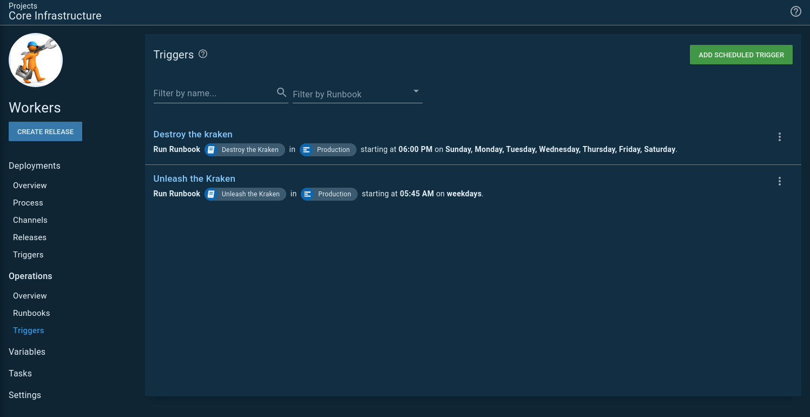

## Conclusion

There are a few changes to go from spinning up infrastructure using a deployment process to a runbook.  All in all, I am happy with those changes, and everything feels a lot cleaner.  

My absolute favorite part about runbooks is not having to create a release for each run.  To get my CloudFormation template and bootstrap script right, I had to do a lot of runs before landing on something which worked.  Not having to do the release dance was very nice.

This sample is available on our [samples instance](https://samples.octopus.app/app#/Spaces-102/projects/to-do-linux/operations/runbooks) for you to play around with.  You will need to sign in as a guest.  Don't worry about breaking anything; guest users have read-only permissions.
