Continuous integration and delivery (CI/CD) is a common goal for DevOps teams to cost and increase the agility of software teams. But the CI/CD pipeline is far more than simply testing, compiling and deploying applications. A robust CI/CD pipeline needs to address a number of concerns such as:

* High availability (HA)
* Multiple environments
* Zero downtime deployments
* Database migrations
* Load balancers
* HTTPS and certificate management
* Feature branch deployments
* Smoke testing
* Rollback strategies

How these goals are implemented depends on the type of software being deployed. In this blog post we'll look at how to create a CI/CD pipeline deploying Java applications to Tomcat. We'll them build a supporting infrastructure stack including the Apache web server for load balancing, PostgreSQL for the database, Keepalived for highly available load balancers, and Octopus orchestrating the deployments.

## A note on the PostgreSQL server

This blog post assumes that the PostgreSQL database is already deployed in a highly available configuration. For more information on how to deploy PostgreSQL, refer to the [documentation](https://www.postgresql.org/docs/current/high-availability.html).

The instructions in that blog post can be followed with a single PostgreSQL instance, with the understanding that the database represents a single point of failure.

## Implementing HA in Tomcat

When talking about HA, it is important to understand exactly what components of a platform need to be managed to address the unavailability of an individual Tomcat instance, for example when an instance is unavailable due to routine maintenance or a hardware failure.

For the purpose of this post we will create infrastructure that allows a traditional stateful Java servlet application to continue to operate when an individual Tomcat server is no longer available. In practical terms this means that the application session state will persist and be available when the server originally hosting the session is no longer available.

As a brief recap, Java servlet application can save data against a `HttpSession` instance which is then available across requests. In the (naïve, as it does not deal with race conditions) example below we have a simple counter variable that is incremented with each request to the page. This demonstrates how information can be persisted across individual requests made by a web browser:

```Java
@RequestMapping("/pageCount")
public String index(final HttpSession httpSession) {
    httpSession.setAttribute("pageCount", ObjectUtils.defaultIfNull((Integer)httpSession.getAttribute("pageCount"), 0) + 1);
    return (Integer)httpSession.getAttribute("pageCount");
}
```

The session state is held in memory on an individual server. If that server is no longer available, the session data is also lost. For a trivial example like a page count, this is not important. But it is not uncommon for more critical functionality to rely on the session state. For example, a shopping card may hold the list of items for purchase in session state, and losing that information may result in a lost sale.

Therefor, to maintain high availability, the session state needs to be duplicated so it can be recovered if a server goes offline.

Tomcat offers three solutions to enable session replication:

1. Using session persistence, and saving the session to a shared file system (PersistenceManager + FileStore)
2. Using session persistence, and saving the session to a shared database (PersistenceManager + JDBCStore)
3. Using in-memory-replication, using the SimpleTcpCluster that ships with Tomcat (lib/catalina-tribes.jar + lib/catalina-ha.jar)

Because our infrastructure stack already assumes a highly available database, we'll implement option two. This is arguably the simplest solution for us, as we do not have to implement any special networking, and can reuse an existing database. However, this solution does introduce a delay between when the session state is modified and when it is persisted to the database. This delay introduces a window during which data may be lost in the case of hardware or network failure. Schedule maintenance tasks are supported though, as any session data will be written to the database when Tomcat is shutdown, allowing us to patch the operating system or update Tomcat itself safely.

We noted that the example code above is naïve as it does not deal with the fact that the session cache is not thread safe. Even this simple example is subject to race conditions that may result in the page count being incorrect. The solution to this problem is to use the traditional thread locks and synchronization features available in Java, but these features are only valid within a single JVM. This means we must ensure that client requests are always directed to a single Tomcat instance, which in turn means that only one Tomcat instance contains the single, authoritative copy of the session state, which can then ensure consistency via thread locks and synchronization. This is achieved with sticky sessions.

Sticky sessions provide a way for client requests to be inspected by a load balancer and then directed to one web server in a cluster. By default in a Java servlet application a client is identified by a `JSESSIONID` cookie that is sent by the web browser and inspected by the load balancer to identify the Tomcat instance that holds the session, and then by the Tomcat server to associate a request with an existing session.

In summary, our HA Tomcat solution:

* Persists session state to a shared database.
* Implements sticky sessions to direct client requests to a single Tomcat instance.
* Supports routine maintenance by persisting session state when Tomcat is shutdown.
* Has a small window during which a hardware or network failure may result in lost data.

## Implementing HA load balancers

To ensure that network requests are distributed amongst multiple Tomcat instances and not directed to an offline instance we need to implement a load balancer solution. These load balancers sit in front of the Tomcat instances and direct network requests to those instances that are available.

Many load balancer solutions exist that can perform this role, but for this blog post we'll use the Apache web server with the mod_jk plugin. Apache will provide the networking functionality, while mod_jk will distribute traffic to multiple Tomcat instances, implementing sticky sessions to direct a client to the same backend server for each request.

In order to maintain high availability, we need at least two load balancers. But how do we then split a single incoming network connection across two load balancers in a reliable manner? This is where Keepalived comes in.

Keepalived is a Linux service run across multiple instances and picks a single master instance from the pool of healthy instances. Keepalive is quite flexible when it comes to determining what that master instance does, but in our scenario we will use Keepalived to assign a virtual, floating IP address to the instance that assumes the master role. This means our incoming network traffic will be sent to a floating IP address that is assigned to a healthy load balancer, and the load balancer then forwards the traffic to the Tomcat instances. Should one of the load balancers be taken offline, Keepalived will ensure that the remaining load balancer is assigned the floating IP address.

In summary, our HA load balancing solution:

* Implements Apache with the mod_jk plugin to direct traffic to the Tomcat instances.
* Implements Keepalived to ensure one load balancer has a virtual IP address assigned to it.

## The network diagram

Here is the diagram of the network that we will be creating:

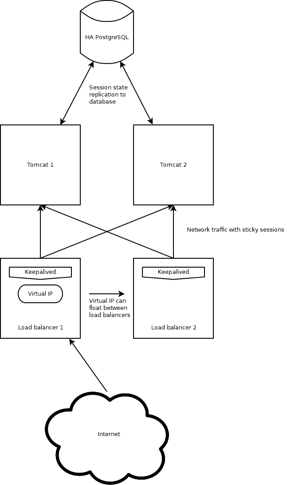

## Implementing zero downtime deployments and rollbacks

A goal of continuous delivery is to always be in a state where you can deploy (even if you choose not to). This means moving away from deployment schedules that require people to be awake at midnight to perform a deployment when your customers are asleep.

Zero downtime deployments require reaching a point where deployments can be done at any time without disruption. In our example infrastructure, there are two points that we need to consider in order to achieve zero downtime deployments:

* The ability for customers to use the existing version of the application to complete their session even after a newer version of the application has been deployed.
* Forwards and backwards compatibility of any database changes.

Ensuring database changes are backwards and forwards compatible requires some design work and discipline when pushing new application versions. Fortunately there are tools available, including Flyway and Liquidbase, that provide a way to roll out database changes with the applications themselves, taking care of versioning the changes and wrapping any migrations in the required transactions. We'll see Flyway implemented in a sample application later in the post.

As long as the shared database remains compatible between the current and the new version of the application, Tomcat provides a feature called parallel deployments that allows clients to continue to access the previous version of the application until their session expires, while new sessions are created against the new version of the application. Parallel deployments therefor allow a new version of the application to be deployed without disrupting any existing clients. Once sessions on the old version of the application have expired, Tomcat automatically removes the old version of the application.

Ensuring database changes are compatible between the current and new version of the application means we can easily roll back the application deployment. Redeploying the previous version of the application provides a quick fallback in case the new version introduced any errors.

In summary, our zero downtime deployments solution:

* Relies on database changes being forwards and backwards compatible (at least between the new and current versions of the application).
* Utilizes parallel deployments to allow existing sessions to complete uninterrupted.
* Provides application rollback by reverting to the previously installed application version.

## Building the infrastructure

The example infrastructure is deployed to Ubuntu 18.04 virtual machines. Most of the instructions will be distribution agnostic, although some of the package names and file locations may change.

### Configuring Tomcat

#### Installing the packages

We start by installing Tomcat and the Manager application:

```
apt-get install tomcat tomcat-admin
```

#### Adding the AJP connector

Communication between the Apache web server and Tomcat is performed with a AJP connector. AJP is an optimized binary HTTP protocol that the mod_jk plugin for Apache and Tomcat both understand. The connector is added to the `Service` element in the `/etc/tomcat9/server.xml` file:

```xml
<Server>
  <!-- ... -->
  <Service name="Catalina">
    <!-- ... -->
    <Connector port="8009" protocol="AJP/1.3" redirectPort="8443"></Connector>
  </Service>
</Server>
```

#### Defining the Tomcat instance names

Each Tomcat instance needs a unique name added to the `Engine` element the `/etc/tomcat9/server.xml` file. The default `Engine` element looks like this:

```xml
<Engine name="Catalina" defaultHost="localhost">
```

The name of the Tomcat instance is defined in the `jvmRoute` attribute. We'll call the first Tomcat instance `worker1`:

```xml
<Engine defaultHost="localhost" name="Catalina" jvmRoute="worker1">
```

The second Tomcat instance is called `worker2`:

```xml
<Engine defaultHost="localhost" name="Catalina" jvmRoute="worker2">
```

#### Adding a manager user

Octopus performs deployments to Tomcat via the manager application. This is what we installed with the `tomcat-admin` package earlier.

In order to authenticate with the Manager application, a new user needs to be defined in the `/etc/tomcat9/tomcat-users.xml` file. We'll call this user `tomcat` with the password of `Password01!`, and it will belong to the `manager-script` and `manager-gui` roles.

The `manager-script` role grants access to the Manager API, while the `manager-gui` role grants access to the Manager web console.

Here is a copy of the `/etc/tomcat9/tomcat-users.xml` file with the `tomcat` user defined:

```xml
<tomcat-users xmlns="http://tomcat.apache.org/xml"
              xmlns:xsi="http://www.w3.org/2001/XMLSchema-instance"
              xsi:schemaLocation="http://tomcat.apache.org/xml tomcat-users.xsd"
              version="1.0">
  <role rolename="manager-gui"/>
  <role rolename="manager-script"/>
  <user username="tomcat" password="Password01!" roles="manager-script,manager-gui"/>
</tomcat-users>
```

#### Adding the PostgreSQL JDBC driver jar

Each Tomcat instance will communicate with a PostgreSQL database to persist session data. In order for Tomcat to communicate with a PostgreSQL database we need to install the PostgreSQL JDBC driver JAR file. This is done by saving the file https://jdbc.postgresql.org/download/postgresql-42.2.11.jar as `/var/lib/tomcat9/lib/postgresql-42.2.11.jar`.

#### Enabling session replication

To enable session persistence to a database we add a new `Manager` definition in the file `/etc/tomcat9/context.xml`. This manager uses the `org.apache.catalina.session.PersistentManager` to save the session details to a database defined in the nested `Store` element.

The `Store` element in turn defines the database that the session information will be persisted to.

We also need to add a `Valve` loading the `org.apache.catalina.ha.session.JvmRouteBinderValve` class. This valve is important when a client is redirected from a Tomcat instance that is no longer available to another Tomcat instance in the cluster. We'll see this valve in action later on once we have a sample application deployed.

Here is a copy of the `/etc/tomcat9/context.xml` file with the `Manager`, `Store` and `Valve` elements defined:

```xml
<Context>
  <Manager
    className="org.apache.catalina.session.PersistentManager"
    processExpiresFrequency="3"
    maxIdleBackup="1" >
      <Store
        className="org.apache.catalina.session.JDBCStore"
        driverName="org.postgresql.Driver"
        connectionURL="jdbc:postgresql://postgresserver:5432/tomcat?currentSchema=session"
        connectionName="postgres"
        connectionPassword="passwordgoeshere"
        sessionAppCol="app_name"
        sessionDataCol="session_data"
        sessionIdCol="session_id"
        sessionLastAccessedCol="last_access"
        sessionMaxInactiveCol="max_inactive"
        sessionTable="session.tomcat_sessions"
        sessionValidCol="valid_session" />
  </Manager>
  <Valve className="org.apache.catalina.ha.session.JvmRouteBinderValve"/>
  <WatchedResource>WEB-INF/web.xml</WatchedResource>
  <WatchedResource>WEB-INF/tomcat-web.xml</WatchedResource>
  <WatchedResource>${catalina.base}/conf/web.xml</WatchedResource>
</Context>
```

### Configuring the PostgreSQL database

#### Installing the packages

We need to initialize the PostgreSQL database with a new database, schema and table. To do this, we'll use the `psql` command line tool, which is installed with:

```
apt-get install postgresql-client
```

#### Adding the database, schema and table

If you look at the `connectionURL` attribute from the `/etc/tomcat9/context.xml` file defined above you will see that we are saving session information into:

* The database called `tomcat`.
* The schema called `session`.
* A table called `tomcat_sessions`.

To create these resources in the PostgreSQL server, we run a number of SQL commands.

First, save the following text into a file called `createdb.sql`. This command creates the database if it does not exist (see [this StackOverflow](https://stackoverflow.com/a/18389184/157605) post for more information on this syntax):

```
SELECT 'CREATE DATABASE tomcat' WHERE NOT EXISTS (SELECT FROM pg_database WHERE datname = 'tomcat')\gexec
```

Then execute the SQL with the following command, replacing `postgresserver` with the hostname of your PostgreSQL server:

```
cat createdb.sql | /usr/bin/psql -a -U postgres -h postgresserver
```

Next we create the schema and table. Save the following text to a file called `createschema.sql`. Note that the columns of the `tomcat_sessions` table match the attributes of the `Store` element in the `/etc/tomcat9/context.xml` file:

```
CREATE SCHEMA IF NOT EXISTS session;

CREATE TABLE IF NOT EXISTS session.tomcat_sessions
(
  session_id character varying(100) NOT NULL,
  valid_session character(1) NOT NULL,
  max_inactive integer NOT NULL,
  last_access bigint NOT NULL,
  app_name character varying(255),
  session_data bytea,
  CONSTRAINT tomcat_sessions_pkey PRIMARY KEY (session_id)
);

CREATE INDEX IF NOT EXISTS app_name_index
  ON session.tomcat_sessions
  USING btree
  (app_name);
```

Then execute the SQL with the following command, replacing `postgresserver` with the hostname of your PostgreSQL server:

```
psql -a -d tomcat -U postgres -h postgresserver -f /root/createschema.sql
```

We now have a table in PostgreSQL ready to save the Tomcat sessions.

### Configuring the Apache web server

#### Installing the packages

We need to install the Apache web server, the mod_jk plugin, and the keepalived service:

```
apt-get install apache2 libapache2-mod-jk keepalived
```

#### Configuring the load balancer

The mod_jk plugin is configured via the file `/etc/libapache2-mod-jk/workers.properties`. In this file we define a number of workers that traffic can be directed to. The fields in this file are documented [here](https://tomcat.apache.org/connectors-doc/reference/workers.html).

We start by defining a worker called `loadbalancer` that will recieve all of the traffic:

```
worker.list=loadbalancer
```

We then define the two Tomcat instances that were created earlier. Make sure to replace `worker1_ip` and `worker2_ip` with the IP addresses of the matching Tomcat instances.

Note that the name of the workers defined here as `worker1` and `worker2` match the value of the `jvmRoute` attribute in the `Engine` element in the `/etc/tomcat9/server.xml` file. These names must match, as they are used by mod_jk to implement sticky sessions:

```
worker.worker1.type=ajp13
worker.worker1.host=worker1_ip
worker.worker1.port=8009

worker.worker2.type=ajp13
worker.worker2.host=worker2_ip
worker.worker2.port=8009
```

Finally we define the `loadbalancer` worker as a load balancer that directs traffic to the `worker1` and `worker2` workers, with sticky sessions enabled:

```
worker.loadbalancer.type=lb
worker.loadbalancer.balance_workers=worker1,worker2
worker.loadbalancer.sticky_session=1
```

Here is a complete copy of the `/etc/libapache2-mod-jk/workers.properties` file:

```
# All traffic is directed to the load balancer
worker.list=loadbalancer

# Set properties for workers (ajp13)
worker.worker1.type=ajp13
worker.worker1.host=worker1_ip
worker.worker1.port=8009

worker.worker2.type=ajp13
worker.worker2.host=worker2_ip
worker.worker2.port=8009

# Load-balancing behaviour
worker.loadbalancer.type=lb
worker.loadbalancer.balance_workers=worker1,worker2
worker.loadbalancer.sticky_session=1
```

#### Adding a Apache VirtualHost

In order for Apache to accept traffic we need to define a `VirtualHost`, which we'll create the the file `/etc/apache2/sites-enabled/000-default.conf`. This virtual host will accept HTTP traffic on port 80, defines some log files, and uses the `JkMount` directive to forward traffic to the worker called `loadbalancer`:

```xml
<VirtualHost *:80>
  ErrorLog ${APACHE_LOG_DIR}/error.log
  CustomLog ${APACHE_LOG_DIR}/access.log combined
  JkMount /* loadbalancer
</VirtualHost>
```

#### Configuring Keepalived

We have two load balancers to ensure that one can be taken offline for maintenance at any given time. Keepalived is the service that we use to assign a virtual IP address to one of the load balancer services, which Keepalived refers to as the master.

Keepalived is configure via the file `/etc/keepalived/keepalived.conf`.

We start by naming the load balancer instance. The first load balancer is called `loadbalancer1`:

```
vrrp_instance loadbalancer1 {
```

The `state` MASTER designates the active server:

```
state MASTER
```

The `interface` parameter assigns the physical interface name to this particular virtual IP instance.

::hint
You can find the interface name by running `ifconfig`.
::

```
interface ens5
```

`virtual_router_id` is a numerical identifier for the Virtual Router instance. It must be the same on all LVS Router systems participating in this Virtual Router. It is used to differentiate multiple instances of keepalived running on the same network interface:

```
virtual_router_id 101
```

The `priority` specifies the order in which the assigned interface takes over in a failover; the higher the number, the higher the priority. This priority value must be within the range of 0 to 255, and the Load Balancing server configured as state `MASTER` should have a priority value set to a higher number than the priority value of the server configured as state `BACKUP`.

```
priority 101
```

`advert_int` defines how often to send out VRRP advertisements:

```
advert_int 1
```

The `authentication` block specifies the authentication type (`auth_type`) and password (`auth_pass`) used to authenticate servers for failover synchronization. `PASS` specifies password authentication.

```
authentication {
    auth_type PASS
    auth_pass passwordgoeshere
}
```

`unicast_src_ip` is the IP address of this load balancer:

```
unicast_src_ip 10.0.0.20
```

`unicast_peer` lists the IP address of other load balancers. Since we have have two load balancers total, there is only 1 other load balancer to list here:

```
unicast_peer {
  10.0.0.21
}
```

`virtual_ipaddress` defines the virtual, or floating, IP address that keepalived assigns to the master node:

```
virtual_ipaddress {
    10.0.0.30
}
```

Here is a complete copy of the `/etc/keepalived/keepalived.conf` file for the first load balancer:

```
vrrp_instance loadbalancer1 {
    state MASTER
    interface ens5
    virtual_router_id 101
    priority 101
    advert_int 1
    authentication {
        auth_type PASS
        auth_pass passwordgoeshere
    }
    # Replace unicast_src_ip and unicast_peer with your load balancer IP addresses
    unicast_src_ip 10.0.0.20
    unicast_peer {
      10.0.0.21
    }
    virtual_ipaddress {
        10.0.0.30
    }
}
```

Here is a complete copy of the `/etc/keepalived/keepalived.conf` file for the second load balancer.

Note that the name has been set to `loadbalancer2`, the `state` has been set to `BACKUP`, the `priority` is lower at `100`, and the `unicast_src_ip` and `unicast_peer` IP addresses have been flipped:

```
vrrp_instance loadbalancer2 {
    state BACKUP
    interface ens5
    virtual_router_id 101
    priority 100
    advert_int 1
    authentication {
        auth_type PASS
        auth_pass passwordgoeshere
    }
    # Replace unicast_src_ip and unicast_peer with your load balancer IP addresses
    unicast_src_ip 10.0.0.20
    unicast_peer {
      10.0.0.21
    }
    virtual_ipaddress {
        10.0.0.30
    }
}
```

Restart the `keepalived` service on both load balancers with the command:

```
systemctl restart keepalived
```

On the first load balancer, runn the command `ip addr`. This will show the virtual IP address assigned to the interface that keepalived was configured to manage with the output `inet 10.0.0.30/32 scope global ens5`:

```
$ ip addr
1: lo: <LOOPBACK,UP,LOWER_UP> mtu 65536 qdisc noqueue state UNKNOWN group default qlen 1000
    link/loopback 00:00:00:00:00:00 brd 00:00:00:00:00:00
    inet 127.0.0.1/8 scope host lo
       valid_lft forever preferred_lft forever
    inet6 ::1/128 scope host
       valid_lft forever preferred_lft forever
2: ens5: <BROADCAST,MULTICAST,UP,LOWER_UP> mtu 9001 qdisc mq state UP group default qlen 1000
    link/ether 0e:2b:f9:2a:fa:a7 brd ff:ff:ff:ff:ff:ff
    inet 10.0.0.21/24 brd 10.0.0.255 scope global dynamic ens5
       valid_lft 3238sec preferred_lft 3238sec
    inet 10.0.0.30/32 scope global ens5
       valid_lft forever preferred_lft forever
    inet6 fe80::c2b:f9ff:fe2a:faa7/64 scope link
       valid_lft forever preferred_lft forever
```

If the first load balancer was shutdown, the second load balancer would assume the virtual IP address, and the second Apache web server would act as the load balancer.

## Building the deployment pipeline

Our deployment pipeline will involve deploying the [Random Quotes](https://github.com/OctopusSamples/RandomQuotes-Java) sample application. This is a simple stateful Spring Boot application utilizing Flyway to manage database migrations.

When you click the **Refresh** button, a new quote is loaded from the database, and a counter is incremented in the session and displayed as the **Quote count** field on the page. The application version is shown in the **Version** field.

We can use the **Quote count** and **Version** information to verify that existing sessions are preserved as new deployments are performed or Tomcat instances are taken offline.

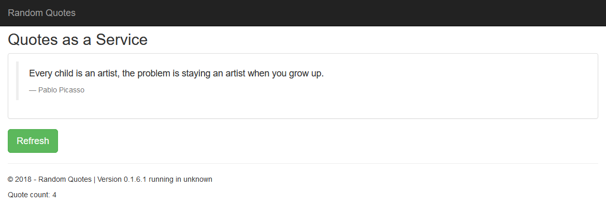

### Getting an Octopus instance

If you do not already have Octopus installed, the easiest way to get an Octopus instance is to [sign up for a cloud account](https://octopus.com/start/cloud). These instances are free for up to 10 targets.

### Creating the environments

We'll create two environments for this example: **Dev** and **Prod**. This means we will configure 8 targets in total: 4 load balancers and 4 Tomcat instances.

Here is a screenshot of the environments in Octopus:


### Deploying the tentacle

We will install a tentacle on each of our virtual machines to allow us to perform updates and system maintenance tasks. The instructions for installing the Tentacle software is found on the [Octopus download page](https://octopus.com/downloads/tentacle#linux). As this example is using Ubuntu as the base OS, we install the Tentacle with the commands:

```
apt-key adv --fetch-keys https://apt.octopus.com/public.key
add-apt-repository "deb https://apt.octopus.com/ stretch main"
apt-get update
apt-get install tentacle
```

Once the Tentacle is installed we configure an instance with the command:

```
/opt/octopus/tentacle/configure-tentacle.sh
```

The installation gives you a choice between polling or listening tentacles. Which option you choose often depends on your network restrictions. Polling tentacles require that the VM hosting the tentacle be able to reach the Octopus server, while listening tentacles require that the Octopus server be able to reach the VM. The choice of communication style depends on whether the Octopus server or VMs have fixed IP addresses and the correct ports opened in the firewall. Either option is a valid choice though and does not impact the deployment process.

Here is a screenshot of the **Dev** environment with tentacles for the Tomcat and Load Balancer instances. The Tomcat instances have a role of **tomcat**, and the load balancer instances have a role of **loadbalancer**:

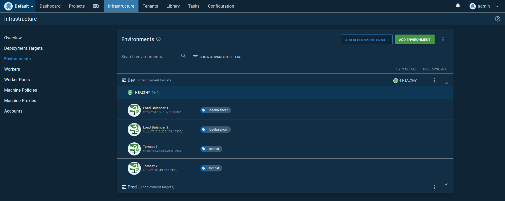

### Creating the external feed

The Random Quotes sample application has been pushed to Maven Central as a WAR file. This means we can deploy the application directly from a Maven feed.

Create a new Maven feed pointing to https://repo.maven.apache.org/maven2/. A screenshot of this feed is shown below:


Test the feed by searching for `com.octopus:randomquotes`. Here we can see that our application is found in the repository:


### Creating the deployment process

#### Generate a timestamp

In order to support zero downtime deployments, we want to take advantage of the parallel deployments feature in Tomcat. Parallel deployments are enabled by versioning each application when it is deployed.

This version number uses string comparisons to determine the latest version. Typical versioning schemes (like SemVer) use a *major.minor.patch* format, like *1.23.4*, to identify versions. For a lot of cases, these traditional versioning schemes can be compared as strings to determine their order.

However, padding can introduce issues. For example, the version *1.23.40* is lower than *01.23.41*, but a direct string comparison returns the opposite result.

For this reason we use the time of the deployment as the Tomcat version. Because the version needs to be consistent across targets, we start with a script step that generates a timestamp and saves it to an output variable with the code:

```PowerShell
$timestamp = Get-Date -Format "yyMMddHHmmss"
Set-OctopusVariable -name "TimeStamp" -value $timestamp
```

#### The Tomcat deployment

Our deployment process started with deploying the application to each Tomcat instance using the **Deploy to Tomcat via Manager** step. We'll call this step **Random Quotes** and run it on the **tomcat** targets:

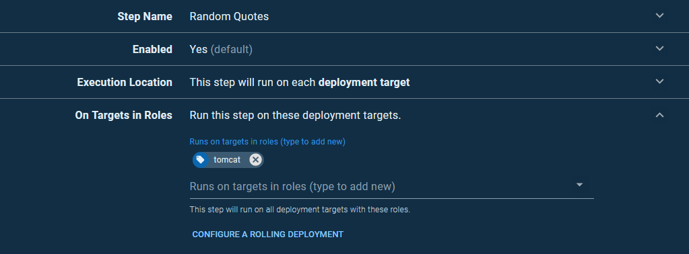

We will deploy the **com.octopus:randomquotes** package from the Maven feed we setup earlier:

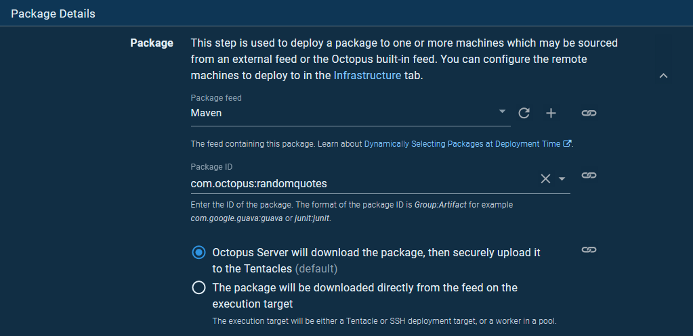

Because the tentacle is located on the VM that hosts Tomcat, the location of the Manager API is **http://localhost:8080/manager**. We then supply the manager credentials, which were the details entered into the **tomcat-users.xml** file when we configured Tomcat:

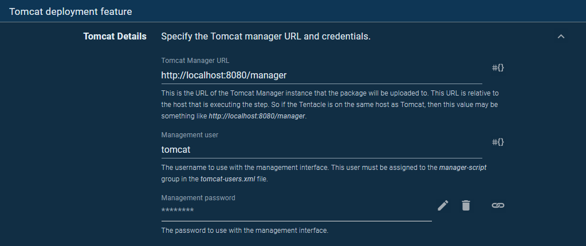

The context path makes up the path in the URL that the deployed application is accessible on. Here we expose the application on the path **/randomquotes**:


The deployment version is set to the timestamp that was generated by the previous step by referencing the output variable as **#{Octopus.Action[Get Timestamp].Output.TimeStamp}**:

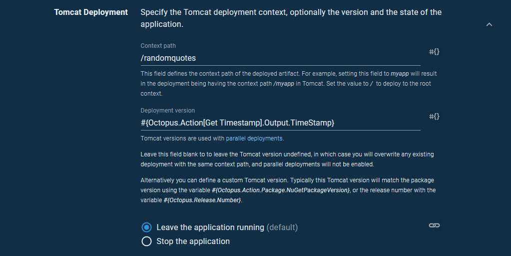

#### Smoke testing the deployment

To verify that our deployment was successful, we will issue a HTTP request and check the response code. To do this we'll use a community step template called **HTTP - Test URL (Bash)**.

As before, this step will run on the Tomcat instances:

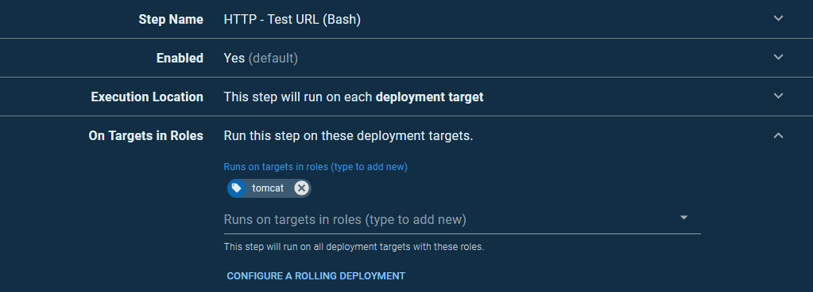

The step will attempt to open the **index.html** page from the newly deployed application, expecting a HTTP response code of **200**:

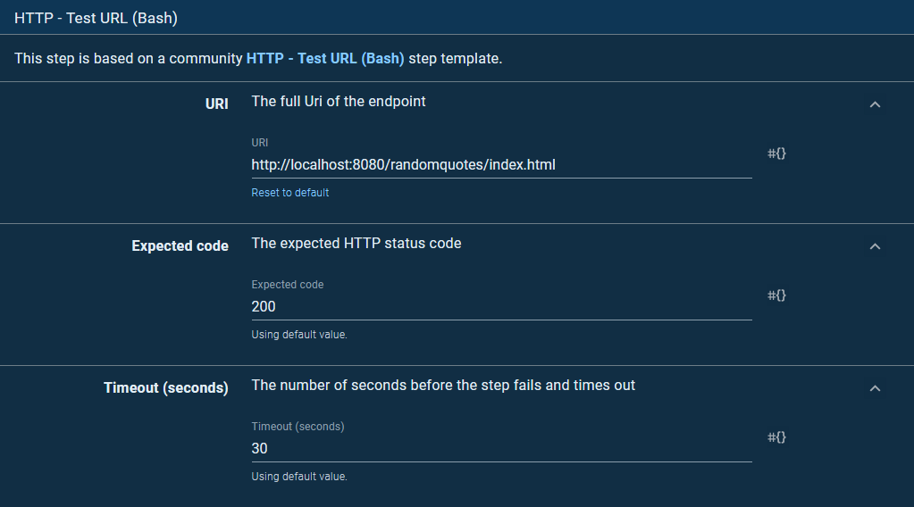

#### Performing the initial deployment

Let's go ahead and perform the initial deployment. For this deployment we'll specifically select a previous version of the Random Quotes application. Version **0.1.6.1** in this case is our second last artifact version:


Octopus then proceeds to download the WAR file from the Maven repo, push it to the Tomcat instances and deploy it to Tomcat via the manager. Once complete, the smoke test runs to ensure that the application can be opened successfully:

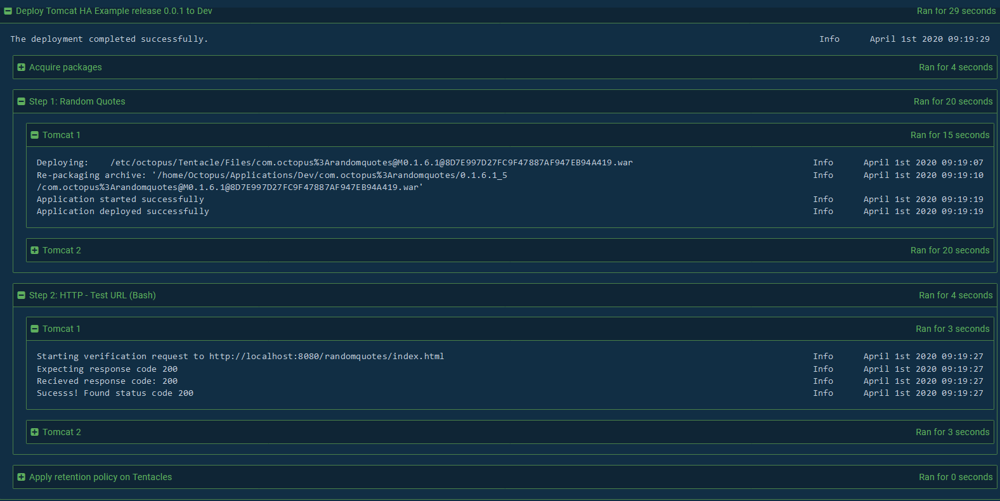

## Inspecting a request through the stack

With the deployment done we can now access it via the load balancer.

::hint
In the previous configuration examples we had a floating IP address of 10.0.0.30, but for these screenshots I have used keepalived to assign a public IP address to the load balancers.
::

Here is a screenshot of the application opened with the Chrome developer tools:

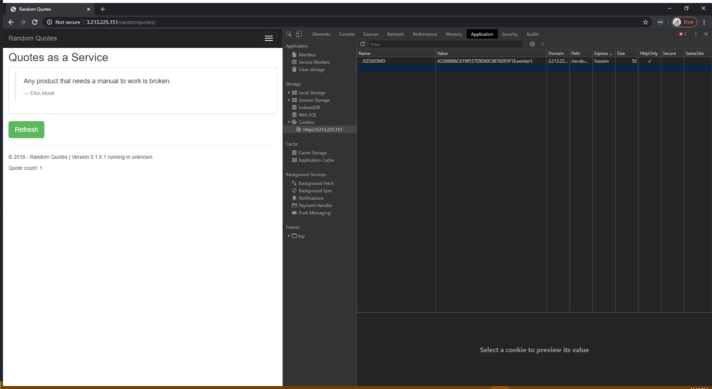

There are three things to note in this screenshot:

1. The **JSESSIONID** cookie is set with a random session ID and the name of the Tomcat instance that responded to the request. In this example, the Tomcat instance whose **jvmRoute** was set to **worker1** responded to the request.
2. We have opened version 0.1.6.1 of the application.
3. The **Quote count** is set to 1, but will increase as we hit the **Refresh** button.

Let's increase the **Quote count** by clicking the **Refresh** button. This value is saved on the Tomcat server in the session associated with the **JSESSIONID** cookie:

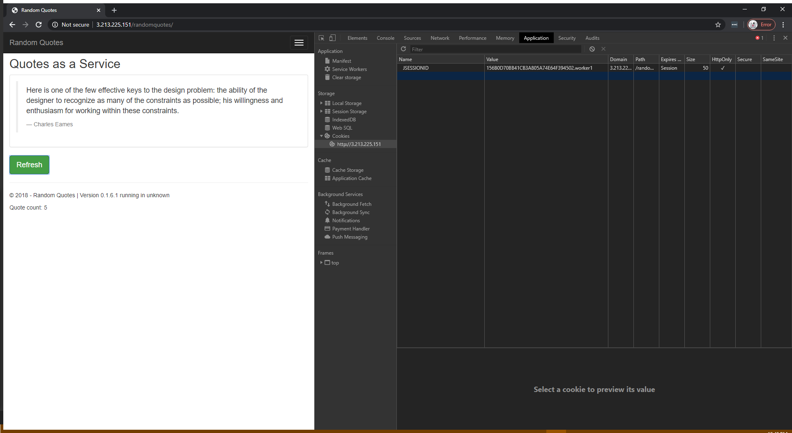

Let's now shut down the **worker1** Tomcat instance. Once shutdown, we click the **Refresh** button again:

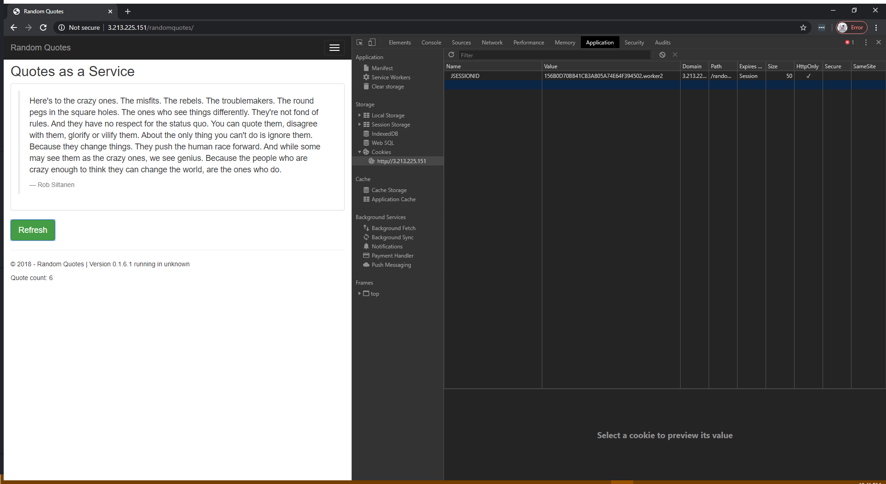

There are three things to note in this screenshot:

1. The suffix on the **JSESSIONID** cookie changed from **worker1** to **woker2**.
2. The **JSESSIONID** cookie session ID remained the same.
3. The **Quote count** increased to 6.

When Tomcat is gracefully shut down, it will write out the contents of any sessions to the database. Then because the **worker1** Tomcat instance was no longer available, the request was directed to the **worker2** Tomcat instance. The **worker2** Tomcat instance loaded the session information from the database and incremented the counter. The **JvmRouteBinderValve** valve rewrote the session cookie to append the current Tomcat instance name to the end, and the response was returned to the browser.

We can now see that it is important that the worker names in the load balancer **/etc/libapache2-mod-jk/workers.properties** file match the names assigned to the **jvmRoute** in the **/etc/tomcat9/server.xml** file, because matching these names allow sticky sessions to be implemented.

Because the **Quote count** did not reset back to one we know that the session was persisted to the database and replicated to the other Tomcat instances in the cluster. We also know that the request was served by another Tomcat instance because the **JSESSIONID** cookie shows a new worker name.

Even if we brought **worker1** back online, this browser session would continue to be handled by **worker2** because the load balancers implement sticky sessions by inspecting the **JSESSIONID** cookie. This also means that the load balancers don't need to share state, as they only require the cookie value to direct traffic.

We've now demonstrated that the Tomcat instances support session replication and failover, making them highly available.

To demonstrate failover of the load balancers we only need to restart the instance designated as the master by keepalived. We can then watch the events on the backup instance with the command:

```
journalctl -u keepalived -f
```

Very quickly we'll see these messages appear on the backup as it assumes the master role:

```
Apr 01 03:15:00 ip-10-0-0-21 Keepalived_vrrp[32485]: VRRP_Instance(loadbalancer2) Transition to MASTER STATE
Apr 01 03:15:01 ip-10-0-0-21 Keepalived_vrrp[32485]: VRRP_Instance(loadbalancer2) Entering MASTER STATE
```

Having assumed the master role, the load balancer will be assigned the virtual IP address, and distribute traffic as the previous master did.

Once the previous master instance restarts it will reassume the master role because it is configured with a higher priority, and the virtual IP address will be assigned back.

The whole process is seamless, and upstream clients never need to be aware that a failover and failback took place.

In summary:
* The **JSESSIONID** cookie contains the session ID and the name of the Tomcat instance that processed the request.
* The load balancers implement sticky sessions based on the worker name appended to the **JSESSIONID** cookie.
* The **JvmRouteBinderValve** valve rewrites the **JSESSIONID** cookie when a Tomcat instance received traffic for a session it was not originally responsible for.
* Keepalived assigns a virtual IP to the backup load balancer if the master goes offline.
* The master load balancer reassumes the virtual IP when it comes back online.
* The infrastructure stack can survive the loss of one Tomcat instance and one load balancer and still maintain availability.

## Zero downtime deployments

We have now successfully deployed version *0.1.6.1* of our web application to Tomcat. This version of the application uses a very simple table structure to hold the names of those accredited with the quotes, placing both the first name and last name into a single column called **AUTHOR**.

This table structure was originally created by a Flyway database script with the following SQL:

```sql
create table AUTHOR
(
	ID INT auto_increment,
	AUTHOR VARCHAR(64) not null
);
```

The next version of our application will split the names into a **FIRSTNAME** and **LASTNAME** column. We add these columns with a new Flyway script that contains the following SQL:

```sql
ALTER TABLE AUTHOR
ADD FIRSTNAME varchar(64);

ALTER TABLE AUTHOR
ADD LASTNAME varchar(64);
```

At this point we have to consider how these changes can be made in a backwards compatible way. A cornerstone of the zero downtime deployment strategy requires that a shared database support both the current version of the application and the new version. Unfortunately there is no silver bullet to provide this compatibility, and it is up to us as developers to ensure that our changes don't break any existing sessions.

In this scenario we must keep the old **AUTHOR** column, and duplicate the data it held into the new **FIRSTNAME** and **LASTNAME** columns:

```sql
UPDATE AUTHOR SET FIRSTNAME = 'Rob', LASTNAME = 'Siltanen' WHERE ID = 1;
UPDATE AUTHOR SET FIRSTNAME = 'Albert', LASTNAME = 'Einstein' WHERE ID = 2;
UPDATE AUTHOR SET FIRSTNAME = 'Charles', LASTNAME = 'Eames' WHERE ID = 3;
UPDATE AUTHOR SET FIRSTNAME = 'Henry', LASTNAME = 'Ford' WHERE ID = 4;
UPDATE AUTHOR SET FIRSTNAME = 'Antoine', LASTNAME = 'de Saint-Exupery' WHERE ID = 5;
UPDATE AUTHOR SET FIRSTNAME = 'Salvador', LASTNAME = 'Dali' WHERE ID = 6;
UPDATE AUTHOR SET FIRSTNAME = 'M.C.', LASTNAME = 'Escher' WHERE ID = 7;
UPDATE AUTHOR SET FIRSTNAME = 'Paul', LASTNAME = 'Rand' WHERE ID = 8;
UPDATE AUTHOR SET FIRSTNAME = 'Elon', LASTNAME = 'Musk' WHERE ID = 9;
UPDATE AUTHOR SET FIRSTNAME = 'Jessica', LASTNAME = 'Hische' WHERE ID = 10;
UPDATE AUTHOR SET FIRSTNAME = 'Paul', LASTNAME = 'Rand' WHERE ID = 11;
UPDATE AUTHOR SET FIRSTNAME = 'Mark', LASTNAME = 'Weiser' WHERE ID = 12;
UPDATE AUTHOR SET FIRSTNAME = 'Pablo', LASTNAME = 'Picasso' WHERE ID = 13;
UPDATE AUTHOR SET FIRSTNAME = 'Charles', LASTNAME = 'Mingus' WHERE ID = 14;
```

In addition the new JPA entity class needs to ignore old **AUTHOR** column (through the **@Transient** annotation). The **getAuthor()** method then returns the combined values of the **getFirstName()** and **getLastName()** methods:

```Java
@Entity
public class Author {
    @Id
    @GeneratedValue(strategy= GenerationType.AUTO)
    private Integer id;
    @Column(name = "FIRSTNAME")
    private String firstName;
    @Column(name = "LASTNAME")
    private String lastName;

    @OneToMany(
            mappedBy = "author",
            cascade = CascadeType.ALL,
            orphanRemoval = true
    )
    private List<Quote> quotes = new ArrayList<>();

    protected Author() {

    }

    public Integer getId() {
        return id;
    }

    @Transient
    public String getAuthor() {
        return getFirstName() + " " + getLastName();
    }

    public List<Quote> getQuotes() {
        return quotes;
    }

    public String getFirstName() {
        return firstName;
    }

    public String getLastName() {
        return lastName;
    }
}
```

While this is a trivial example that is easy to implement thanks to the fact that the **AUTHOR** table is read only, it does demonstrate how database changes can be implemented in a backwards compatible manner. It would be possible to write entire books on the strategies for maintaining backwards compatibility, but for the purposes of this blog post we'll leave this discussion here.

Before we perform the next deployment, reopen the existing application and refresh some quotes. This creates a session against the existing *0.1.6.1* version, which we'll use to test our zero downtime deployment strategy.

With our migration scripts written in a backwards compatible manner, we can deploy the new version of our application. For convenience this new version has been pushed to Maven Central as version *0.1.7*:


Once the deployment completes, open up the manager application at http://tomcatip:8080/manager/html. Note that while you could access the manager through the load balancer, you do not get to choose which Tomcat instance you will be managing as the load balancer will pick a Tomcat instance for you. This means it is better to connect to the Tomcat instance directly, bypassing the load balancer:

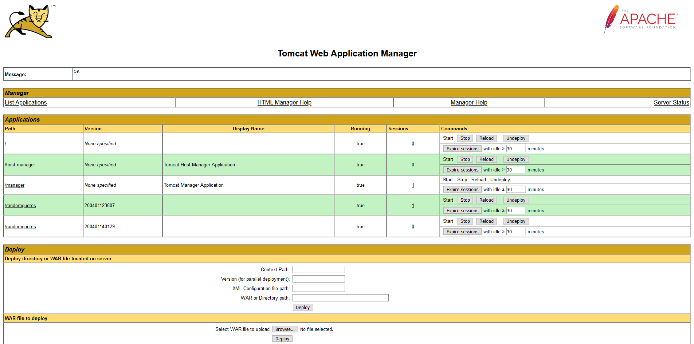

There are two things to notice in this screenshot:
1. We have two applications under the path **/randomquotes**, each with a unique version.
2. The application with the earlier version has a session associated with it. This was the session we created by accessing version *0.1.6.1* before version *0.1.7* was deployed.

If we go back to the browser where we opened version *0.1.6.1* of the application, we can continue to refresh the quotes. The counter increases as we expect, and the version number displayed in the footer remains at version *0.1.6.1*.

If we reopen the application in a private browsing window, we can be guaranteed that we won't be reusing an old session cookie, and we are directed to version *0.1.7* of the application:

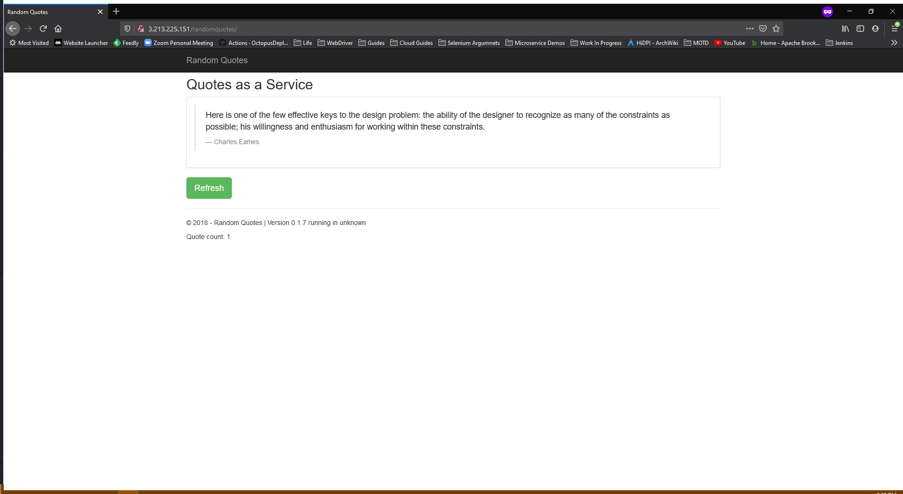

With that we have demonstrated zero downtime deployments. Because our database migrations were designed to be backwards compatible, version *0.1.6.1* and version *0.1.7* of our application can run side by side using Tomcat parallel deployments. Best of all, sessions for old deployments can still be transferred between Tomcat instances, so we retain high availability along with the parallel deployments.

## Feature branch deployments

## Certificate management

To finish configuring our infrastructure we will enable HTTPS access via our load balancers. This requires editing the Apache web server virtual host configuration to enable SSL and point to the keys and certificates we have obtained for our domain.

Before we can enable HTTPS, we first need to enable **mod_ssl** with the command:

```
a2enmod ssl
```

If you recall from earlier in the post we created a the file `/etc/apache2/sites-enabled/000-default.conf` with the following contents:

```xml
<VirtualHost *:80>
  ErrorLog ${APACHE_LOG_DIR}/error.log
  CustomLog ${APACHE_LOG_DIR}/access.log combined
  JkMount /* loadbalancer
</VirtualHost>
```

We want to modify this file to look like this:

```xml
<VirtualHost *:443>
  ErrorLog ${APACHE_LOG_DIR}/error.log
  CustomLog ${APACHE_LOG_DIR}/access.log combined
  JkMount /* loadbalancer
  SSLEngine on
  SSLCertificateFile /etc/apache2/ssl/octopus_tech.crt
  SSLCertificateKeyFile /etc/apache2/ssl/private/octopus_tech.key
  SSLCertificateChainFile /etc/apache2/ssl/octopus_tech_bundle.pem
</VirtualHost>
```

```bash
mkdir /etc/apache2/ssl
mkdir /etc/apache2/ssl/private
get_octopusvariable "Certificate.CertificatePem" > /etc/apache2/ssl/octopus_tech.crt
get_octopusvariable "Certificate.PrivateKeyPem" > /etc/apache2/ssl/private/octopus_tech.key
get_octopusvariable "Certificate.ChainPem" > /etc/apache2/ssl/octopus_tech_bundle.pem

{
cat << EOF
<VirtualHost *:443>
  ErrorLog ${APACHE_LOG_DIR}/error.log
  CustomLog ${APACHE_LOG_DIR}/access.log combined
  JkMount /* loadbalancer
  SSLEngine on
  SSLCertificateFile /etc/apache2/ssl/octopus_tech.crt
  SSLCertificateKeyFile /etc/apache2/ssl/private/octopus_tech.key
  SSLCertificateChainFile /etc/apache2/ssl/octopus_tech_bundle.pem
</VirtualHost>
EOF
} > /etc/apache2/sites-enabled/000-default.conf
```
