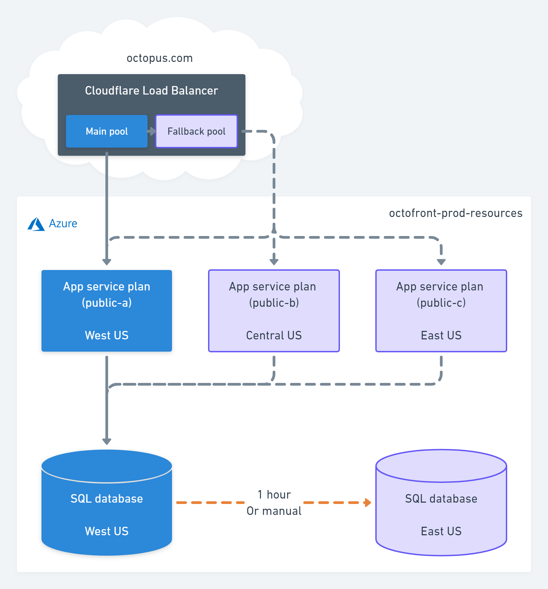
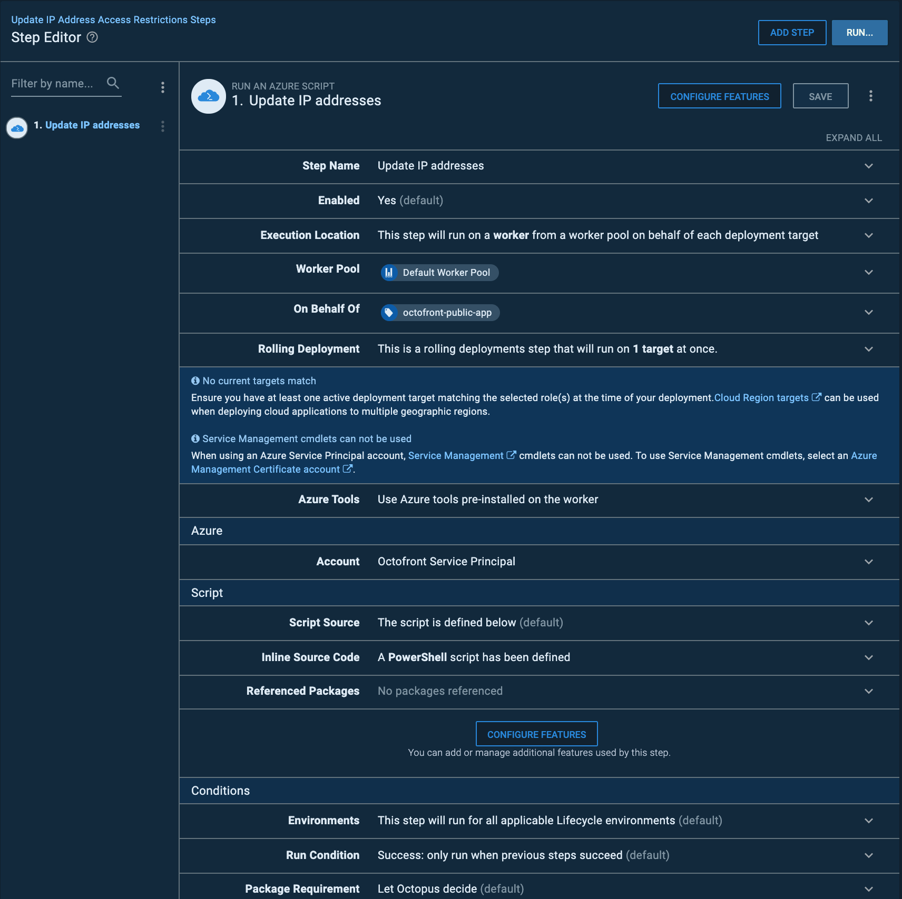

We recently released Operations Runbooks for all those maintenance and emergency tasks that don't fit into a deployment. In this post, we look at how we use Operations Runbooks to minimize downtime on Octopus.com and ensure anybody on the Octopus team (no matter their role at the company) can to respond to an unexpected outage and get the website back up and running.

## Octopus.com

Our website is mission critical. It hosts the downloads our customers need to get started with Octopus Server or to sign up for Octopus Cloud and access their instance of Octopus Cloud, it's the home of our documentation and this blog, and it's how customers upgrade and manage their accounts. Most of the interactions our users have with us, is through the website.

The website typically gets hundreds of visitors an hour, so if Octopus.com goes down, it makes their life harder: They can't access their Octopus Cloud instance, the downloads they need, the documentation, support or anything else through the website. If somebody decides to try Octopus for the first time and they're met with the dreaded 404 page, our credibility is shot and they might never come back.

## How Octopus.com works

DNS for Octopus.com is hosted on Cloudflare. There’s a load balancer, which typically sends all traffic to a single Azure app service (website). If that web app is unavailable (because there's an outage or during a deployment is underway), Cloudflare fails over to a pool that includes that web app plus two other copies in different Azure regions. It will redirect traffic to whichever web application is healthy. 

The **B** and **C** web apps are in different Azure regions for availability, but they are further away from the SQL database, which makes them slower. This is why we typically only send traffic to the **A** web app. 

## How do we manage an unexpected outage

The first thing we do is let you know that we're aware of the problem and that we're working on it.

### Update status.octopus.com

We use [statuspage.io](https://www.statuspage.io/) to log incidents, which are then displayed on [status.octopus.com](https://status.octopus.com/) and sent out from our [twitter account](https://twitter.com/OctopusDeploy).

### Runbook in action

Each Azure website has IP restrictions that only allow traffic from Cloudflare and the Octopus Deploy worker that does the deployment. This means we can’t access them directly, but Cloudflare can, which means we can use a runbook in Octopus to update the IP address, switching from the web apps that is currently down, to one that is up. 

The advantage of this approach is that anybody at Octopus can run the runbook. They don't need to understand the script that is executed by the step, they don't personally need any of the permissions for the services involved or even a familiarity with those services.

They log into our Octopus instance and execute the runbook.

## Conclusion

By moving this process into an Operations Runbook with Octopus, our entire team can take steps to restore Octopus.com if it goes down, and better yet, it's all logged in Octopus and if we ever need to update the steps in the runbook with the certainty that if there's ever another incident, we don't have to worry about people following an outdated process.
