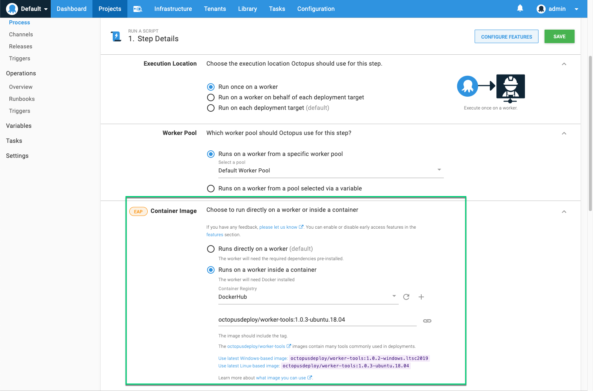

Modern deployments depend on tools. For example: AWS, Azure, and Google command-lines, Terraform, kubectl, Helm, Java, NodeJS, .NET, etcetera, etcetera, _etcetera_.         

Octopus has historically taken an inconsistent approach to these. Some are bundled with the Octopus Server and pushed to deployment targets. Examples of these are the Azure CLI, AWS CLI, and Terraform. In other cases Octopus assumes the dependencies are pre-installed on the targets, e.g. kubectl, Helm, Java. Neither approach is all rainbows.

The bundled dependencies have a number of drawbacks.  They are always out of date, and users often require the latest versions of tools. They can't be updated independently of the Octopus Server. There is no way to pin the versions of the bundled dependencies, so if the tool's publisher introduce breaking changes we find ourselves unable to update them without potentially causing users' deployment processes to fail (this is currently an issue with Terraform).   

But by _not_ bundling dependencies, we are pushing our pain onto our users. Spinning up a new machine to use as an Octopus worker is a chore if you have to then install dozens of dependencies. And managing the relationship between various projects' deployment processes and workers is not obvious.  

Fortunately, there is a technology that is perfect for this scenario: _containers_. 

From: https://twitter.com/b0rk/status/1237464479811633154

It's no coincidence that CI tools have converged on using containers as execution environments for building software.  The same power can be leveraged for deployments. 

Octopus 2020.2 introduces the ability to run a deployment action inside a container:

This will be available on any step which executes on a worker (or on the Octopus Server, for self-hosted instances).

We have also published some images to a repository on DockerHub ([octopusdeploy/worker-tools](https://hub.docker.com/r/octopusdeploy/worker-tools)), which contain many of the most common deployment tools, and we will regularly update these with the latest versions of the contained tools.  And if your deployment process requires tools that aren't in the octopusdeploy/worker-tools images, or you prefer a smaller image, then you can certainly use your own. 

It is worth noting that when configuring a deployment action to execute inside a container, the specified image is treated differently to the packages being deployed.  The action image includes the tag, which is configured when editing the deployment process, unlike deployed packages which have their versions selected when creating the release.  This is significant, as it allows the maintainers of the deployment process to control when the image is updated, and anyone creating a release of the project doesn't require any knowledge of these images.

As Octopus continues to support deploying many types of applications (.NET, Java, NodeJS, etc) to many platforms (Windows, Linux, PaaS) in many clouds (self-hosted, AWS, Azure, etc), we hope this will provide a generic way to tame deployment tooling dependencies.

Happy Deployments!