When I started automating database deployments, I was afraid the tooling would drop a column or table when it shouldn’t.  I couldn’t help but always wonder, did I have everything configured correctly?  The core problem is I didn’t include the necessary steps to build trust in my database deployment process.  In this blog post, I walk through some techniques and configurations I used to help build that trust so I can automate my database deployments with confidence.

!toc

## Assume zero trust on day one

This article focuses on how to build trust in the deployment pipeline using database tooling with Octopus Deploy.  

Note, tasks such as verifying if the database changes are syntactically correct, or if the database changes pass static analysis and should be done on the CI or build server and are out of the scope of this article.

When designing and implementing an automated database deployment process, I start with this mindset:

> I need to prove to myself, and everyone on my team, that a deployment will **_NOT_** result in data loss or a production outage.    


In this article, I create an automated database deployment process from scratch.  Each section builds on the previous section by leveraging a new feature in Octopus Deploy.  I realize it is easy to lose track of each feature, so to make things easier, here is a list of features this article will use:  

- [Manual interventions](https://octopus.com/docs/deployment-process/steps/manual-intervention-and-approvals) to pause deployments and wait for someone to approve or reject the change.
- [Artifacts](https://octopus.com/docs/deployment-process/artifacts) to store the delta scripts for the DBAs to review during the manual interventions.
- [Run conditions](https://octopus.com/docs/deployment-process/conditions#run-condition) to always notify the development team of the deployment outcome and to page the DBAs on production failures.
- [Custom log levels](https://octopus.com/docs/deployment-examples/custom-scripts/logging-messages-in-scripts) used by the run a script step to notify DBAs of potential problems in the scripts.
- [Email and other notification options](https://octopus.com/docs/deployment-process/steps/email-notifications) to let the approvers know of a pending change.
- [Guided failure mode](https://octopus.com/docs/managing-releases/guided-failures) to pause the deployment on failure and let people investigate the failure and potentially try again.
- [Output variables](https://octopus.com/docs/projects/variables/output-variables) to enable skipping unnecessary steps in the deployment.  For example, if the tooling reports no database changes, there is no point in running the deploy database change step.
- [Audit log](https://octopus.com/docs/administration/managing-users-and-teams/auditing) to know who kicked off the deployment, who approved it, and when it all happened.
- [Users and teams](https://octopus.com/docs/administration/managing-users-and-teams) to only allow DBAs permission to kick off production deployments, but still enable developers to deploy to lower environments.

## Bare bones deployment process

If we had total trust in the process, we would only need the deployment step.  Let’s start there.

:::success
This article uses [DbUp](https://dbup.github.io/), a cross-platform database deployment tool to handle the database deployments.  The core concepts of this article apply for any database deployment tool to any database server.
:::

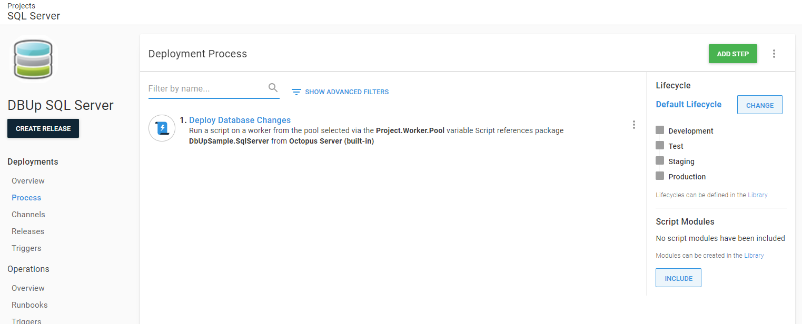

Right now, this process will take the scripts in the package and run them on the database.  It’d be nice to know what those scripts are.  Let’s add a step to generate a delta script or report.

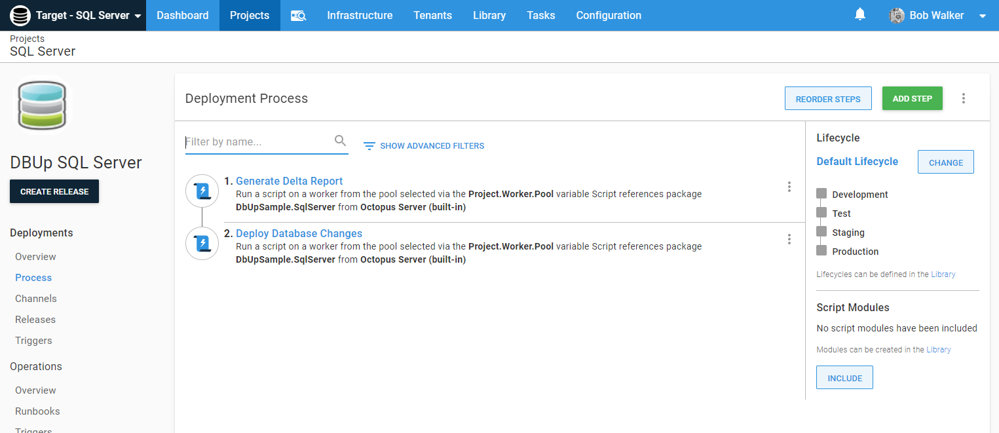

The `Create Delta Report` step has this line at the end of the script, which uploads the script to Octopus Deploy as an artifact:

```PowerShell
New-OctopusArtifact -Path "$generatedReport" -Name "$environmentName.UpgradeReport.html"
```

:::success
The method for creating a delta report will vary based on your database deployment tooling.  Please consult the tooling’s documentation to find out how.  In some cases, our [docs](https://octopus.com/docs/deployment-examples/database-deployments) have examples that you can leverage.
:::

During a deployment, that artifact will appear in two places on the screen.  

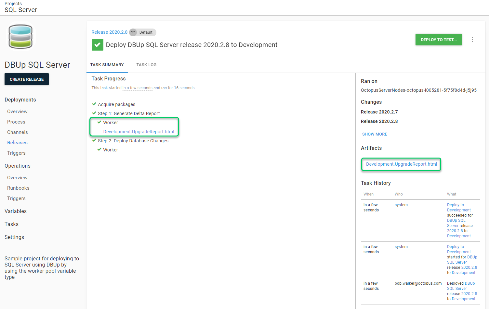

Clicking on either of them will download the artifact.  

The deployment screen also shows who started the deployment and when it was started.  Both this audit log and the artifact will be kept until the end of time unless you have configured [retention policies](https://octopus.com/docs/administration/retention-policies), in which case, they will only be kept until the deployment is deleted by the retention policy.

Now we are getting somewhere; we have a delta report which will be kept as long as the release exists for anyone (including auditors) to download and review.

## Approvals

But what if the delta report shows a script with a command like `drop table` or `drop column`? Is that okay?  Maybe, maybe not.  It doesn’t make sense to reject the script outright.  It makes more sense to pause the deployment, review the scripts, and if something doesn’t look right, find the person who created the script and discuss it with them.  To do that, we can add a manual intervention.  

An interesting thought comes up when creating a manual intervention.  A team must be selected.  I know what you’re thinking.  “The team should be DBAs!”  This step is going to run for all environments.  When _should_ a DBA review changes?  They are busy keeping the database servers up and running.  Having to review _every_ delta script for _every_ deployment would be a full-time job.  

Putting two teams, developers and DBAs, won’t work because that means a developer **OR** a DBA could approve the deployment.  That’s acceptable for the `Development` and `Test` environments but not `Production`:

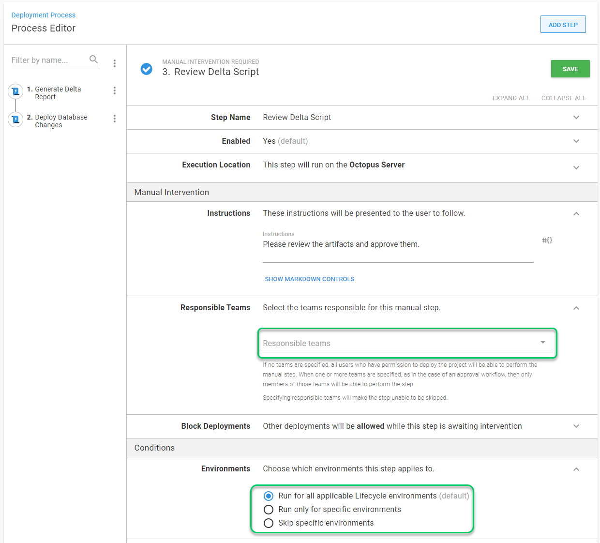

In this example, it makes sense for DBAs to approve the delta script for `Staging` and `Production`.  Meanwhile, the developers can approve the delta script for `Development` and `Test`.

:::success
I like to add the Octopus Managers team to all manual interventions.  This way, they can take responsibility in the event of an emergency if all the DBAs are unavailable.
:::

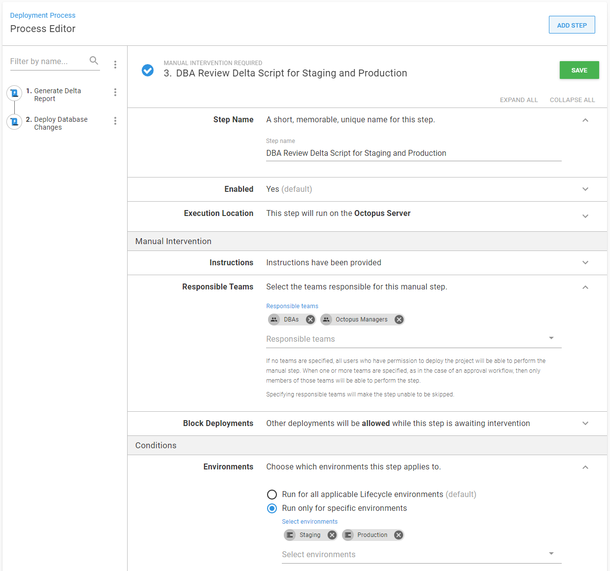

The resulting deployment process will have two manual intervention steps.

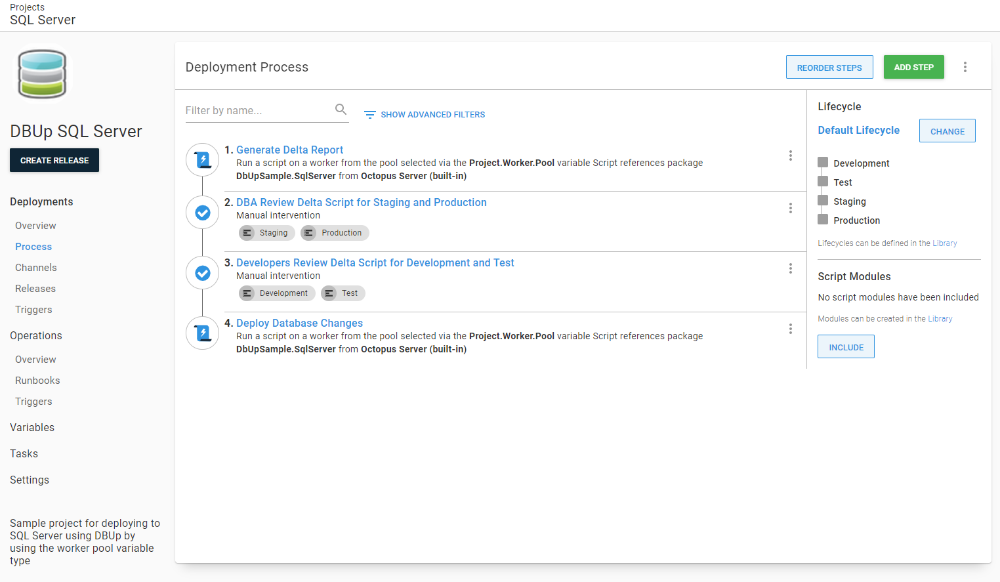

In my experience, the ability to pause and review the delta script before it runs goes a long way in building trust.  If the approver sees something they disagree with, they can abort the deployment.  Even better, the person who took responsibility for the approval is in the audit log.  We can see I started the deployment as well as approved it (which outside of a demo/test environment is a big no-no).

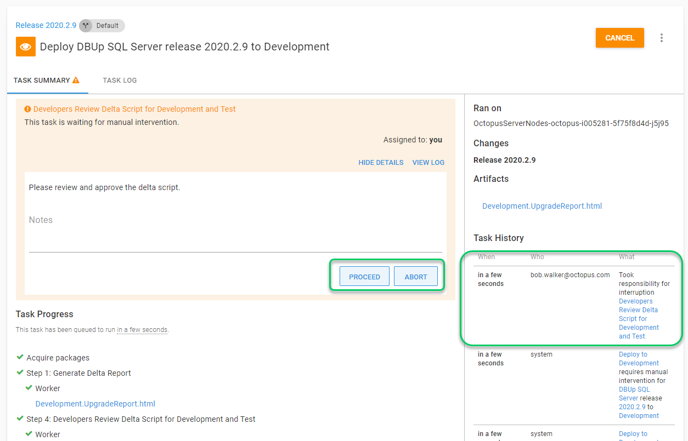

## Notifications

Chances are DBAs are not watching Octopus Deploy all day, every day.  They need to be notified about the approvals they are responsible for.  But what should they do after they approve a deployment?  Watch it finish?  That could take quite a while.  That doesn’t seem like a productive use of their time.  And if the deployment is successful, they probably don’t need to do anything else.  A failed `Production` deployment is a pretty big deal; they should be notified.

For this example, I include the email notifications directly in the process.  You can also leverage the [subscription](https://octopus.com/docs/administration/managing-infrastructure/subscriptions) feature in Octopus Deploy.

The initial fields in the email form are fairly straight forward.  The subject and body are what caused me to pause.  The DBAs might be getting dozens of these emails a day.  It should be very easy for them to approve the deployment, so the subject line should include details about the deployment.  If something doesn’t look right, they can forward you the email and provide their feedback.  The body should include a deep link for the approver to click on.

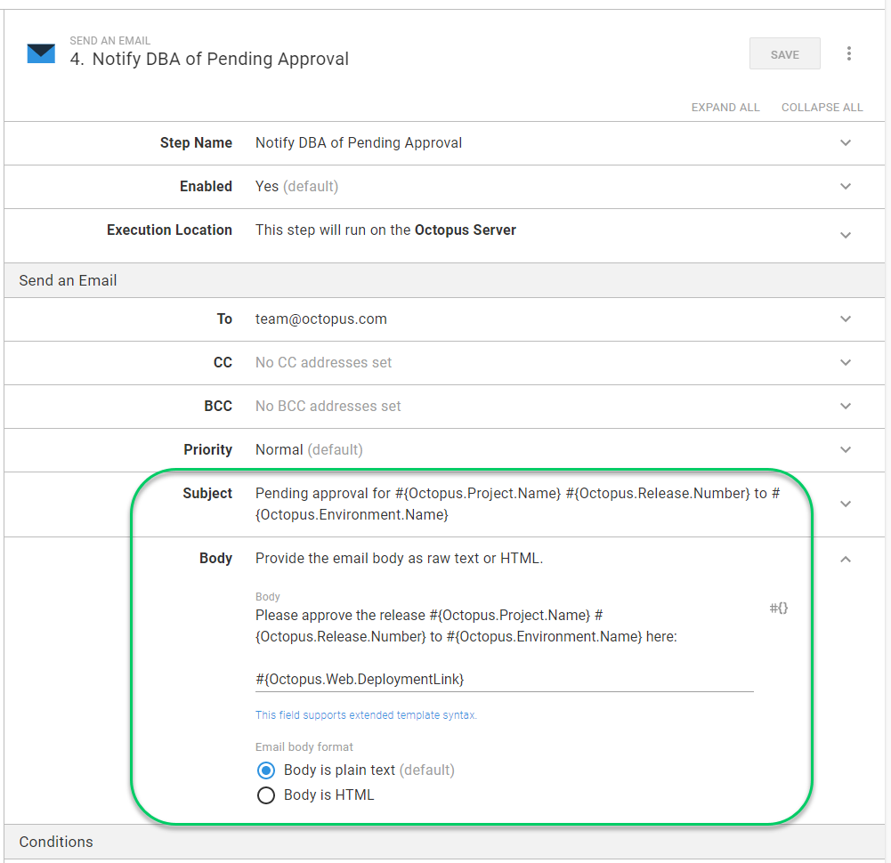

The subject is getting cut off in the screenshot.  The subject is:

```
Pending approval for #{Octopus.Project.Name} #{Octopus.Release.Number} to #{Octopus.Environment.Name}
```

The failure notification is a bit different.  The priority of the email needs to change from normal to high, and the run condition should be configured only to run the step on failure.

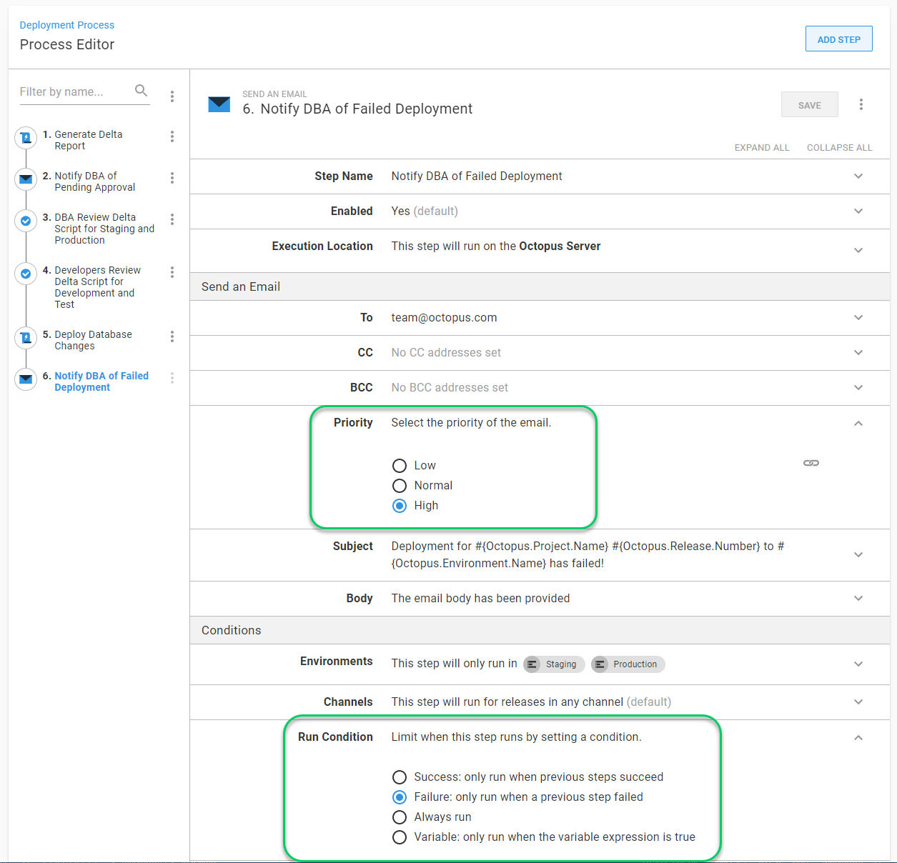

:::success
This example uses email notifications, but you can also leverage other tools such as Slack, Teams, VictorOps, and more.
:::

Finally, the team responsible for the application should always be notified of the status of the deployment.  If the deployment team uses Slack, we can drop a similar message in their Slack channel.  This example uses the [Slack - Send Simple Notification](https://library.octopus.com/step-templates/99e6f203-3061-4018-9e34-4a3a9c3c3179/actiontemplate-slack-send-simple-notification) step template from the library.

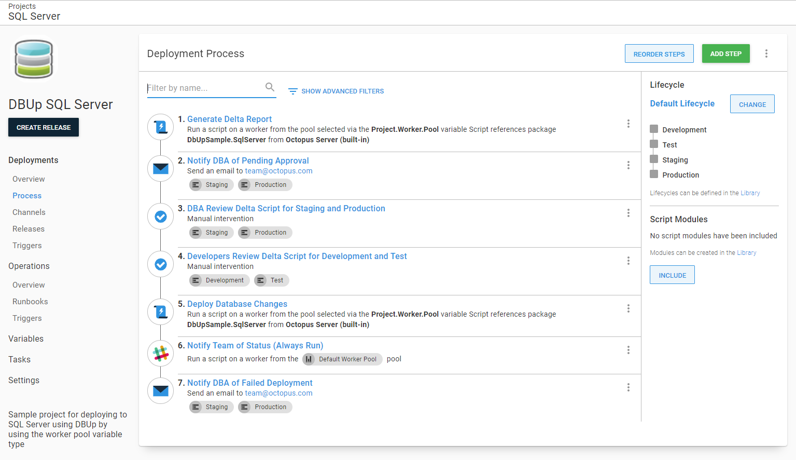

Now we have notifications going out to key people.  Typically, key people are also busy people; don’t be surprised if you need to dial in the notifications to keep the signal to noise ratio down.

## Helping the approvers

As time goes on, the number of deployments the DBAs have to approve will exponentially grow.  It is the nature of automation.  When teams feel comfortable with the tooling and trust the process, they will naturally do more deployments.  

More deployments are a double-edged sword; the downside is there’s less time available to review database changes.  A DBA or developer could miss a schema change that causes significant damage, but this process should help them.  Thankfully, Octopus Deploy is an API first application, using the API it possible to download the delta report or SQL artifacts to find any potentially damaging statements:  

```PowerShell
$CommandsToLookFor = "Drop Table,Drop Column,Alter Table,Create Table,Create View"

$OctopusURL = ## YOUR URL
$APIKey = ## YOUR API KEY
$FileExtension = "SQL"
$SpaceId = $OctopusParameters["Octopus.Space.Id"]
$DeploymentId = $OctopusParameters["Octopus.Deployment.Id"]

Write-Host "Commands to look for: $CommandsToLookFor"
Write-Host "Octopus Url: $OctopusUrl"
Write-Host "SpaceId: $SpaceId"
Write-Host "DeploymentId: $DeploymentId"
Write-Host "File Extension: $FileExtension"

$header = @{ "X-Octopus-ApiKey" = $APIKey }

[Net.ServicePointManager]::SecurityProtocol = [Net.SecurityProtocolType]::Tls12
$artifactUrl = "$OctopusUrl/api/$SpaceId/artifacts?take=2147483647&regarding=$DeploymentId&order=asc"
Write-Host "Getting the artifacts from $artifactUrl"
$artifactResponse = Invoke-RestMethod $artifactUrl -Headers $header
$fileListToCheck = @()

foreach ($artifact in $artifactResponse.Items)
{
    $fileName = $artifact.Filename

    if ($fileName.EndsWith($FileExtension))
    {       
        Write-Host "The artifact is a SQL Script, downloading"
        $artifactId = $artifact.Id
        $artifactContentUrl = "$OctopusUrl/api/$SpaceId/artifacts/$artifactId/content"
        Write-Host "Pulling the content from $artifactContentUrl"
        $fileContent += Invoke-RestMethod $artifactContentUrl -Headers $header
        Write-Host "Finished downloading the file $fileName"

        $sqlFileToCheck = @{
            FileName = $fileName;
            Content = $fileContent;
        }

        $fileListToCheck += $sqlFileToCheck                
    }    
}

if ($fileListToCheck.Length -le 0)
{
    Write-Highlight "No sql files were found"

    Exit 0
}

Write-Host "Looping through all commands"
$commandsToCheck = $CommandsToLookFor -split ","
foreach ($sqlFile in $fileListToCheck)
{       
    foreach ($command in $commandsToCheck)
    {
        Write-Host "Checking $($sqlFile.FileName) for command $command"
        $foundCommand = $sqlFile.Content -match "$command"

        if ($foundCommand)
        {
            Write-Highlight "$($sqlFile.FileName) has the command '$command'"            
        }
    }
}
```

When certain commands are found, the script will leverage the `Write-Highlight` [logging command](https://octopus.com/docs/deployment-examples/custom-scripts/logging-messages-in-scripts) provided by Octopus Deploy.  The message will appear in the deployment log.  

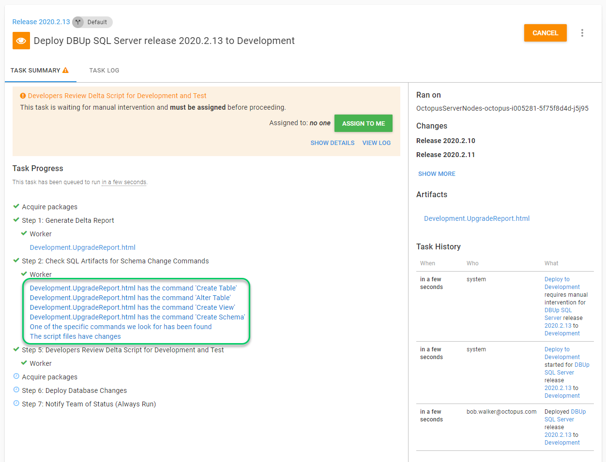

Seeing those messages should hopefully make it a little easier on the approver.  

## Handling errors and failures

Errors and failures will happen.  A number of them occur because of something out of the control of Octopus Deploy, for instance, a network failure, an SQL Server restart, incorrect permissions, and missing accounts are amongst the most common.  After the issue is fixed, it would be much better just to try the failed step again and prevent unnecessary rework.  If a DBA already approved a script, they don’t need to approve it again.  

[Guided failures](https://octopus.com/docs/managing-releases/guided-failures) was designed for scenarios like this.  Guided failures can be enabled per project or per environment.  For this example, it is enabled at the project level:

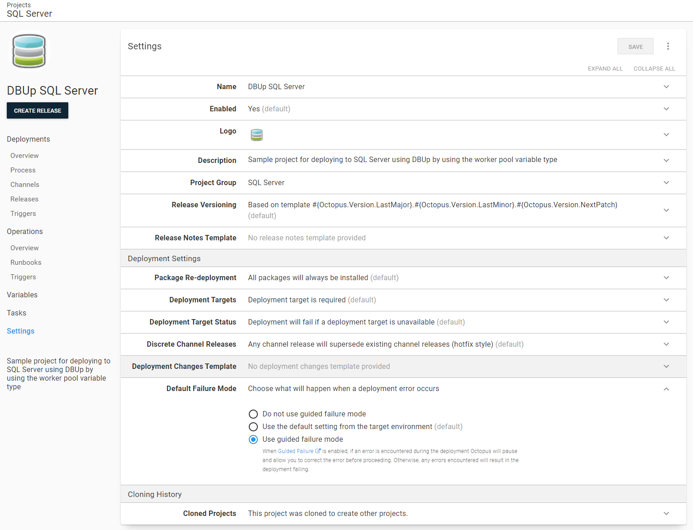

Just like a manual intervention, the deployment will pause when a failure is detected.  Octopus Deploy provides the option to `Fail`, `Ignore`, or `Retry` the step.  

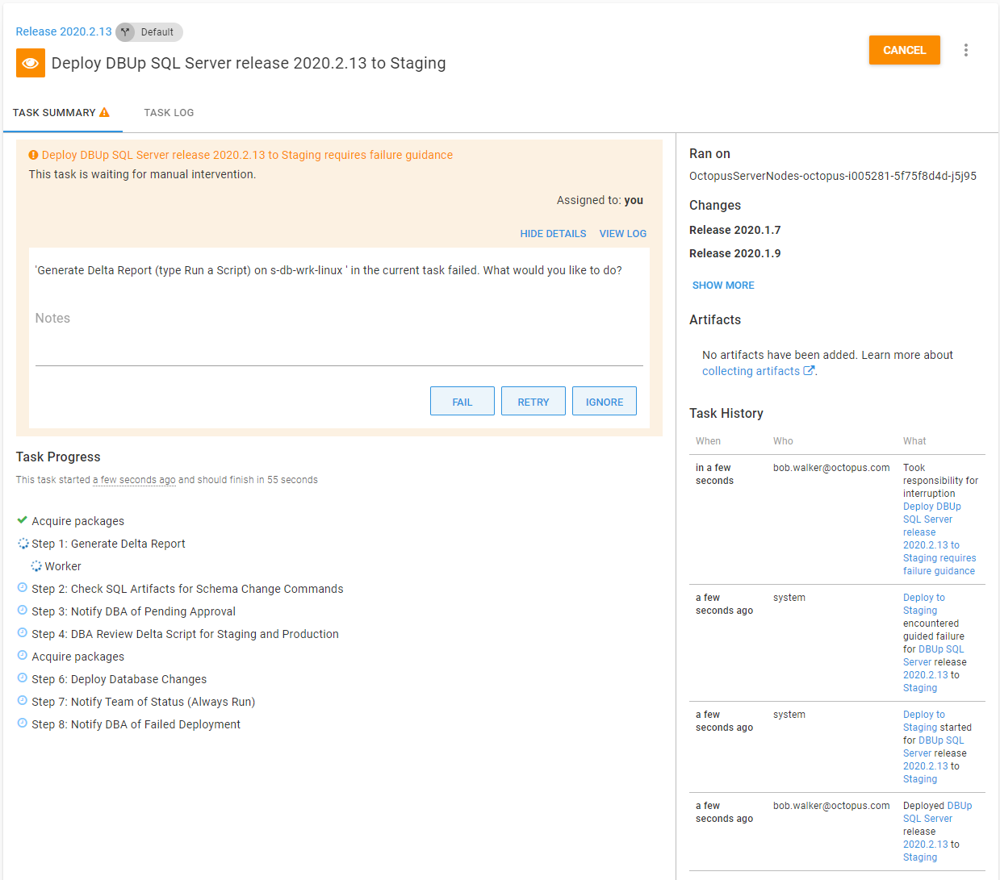

With this small change, we have given the users the chance to handle failure gracefully.

## Separation of concerns

Separation of concerns is a common practice.  The person who made the code change shouldn’t be the person who approved it or deployed it to `Production`.  Note, developers should be able to deploy to `Development` and `Test`, and in Octopus Deploy, it is possible to configure the teams to support this.

There are five roles that help achieve this in Octopus Deploy.

- **Deployment Creator**: People assigned to this role can kick off deployments.  In this example, DBAs will be assigned this role for `Production`.
- **Project Contributor**: People assigned to this role can edit the project, but there cannot create or deploy releases.  In this example, developers will be assigned this role for `Production`.
- **Project Deployer**: People assigned to this role can do everything a project contributor can do, including deploying a release.  In this example, developers will be assigned this role for the lower environments.
- **Project Viewer**: People assigned to this role have a read-only view of the project.  Perfect for QA, Business Owners, and other people who don’t have permission to change a process but still want to see the status.

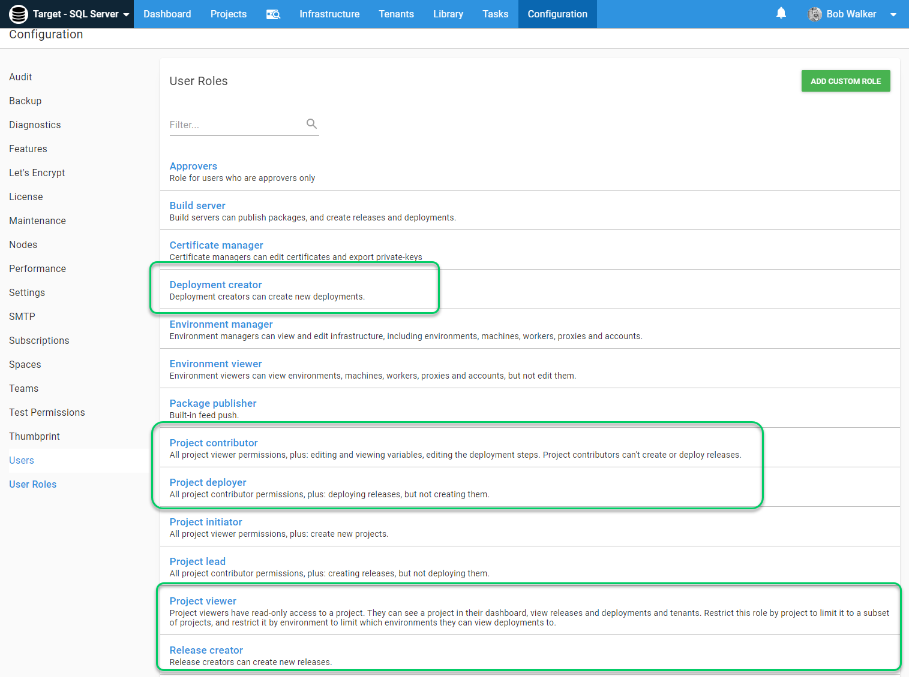

The developer team user roles will be:

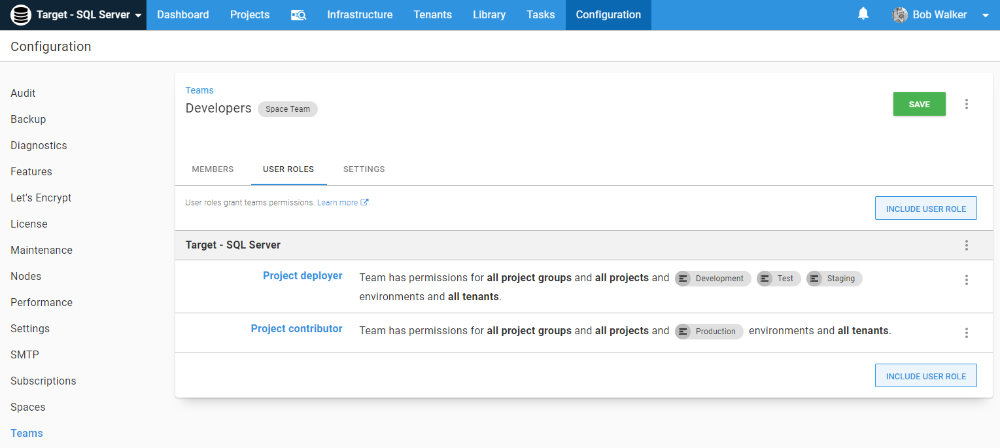

The DBA’s permissions will be:

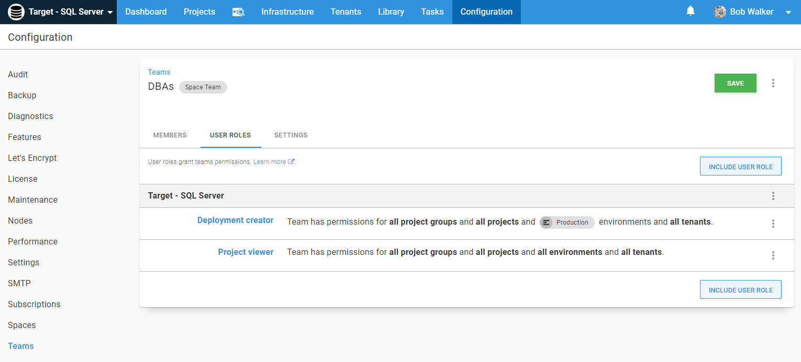

## Adjusting the DBAs’ role in the process

With those permissions, the DBAs’ role in this process is still a bit odd.  They are the ones who trigger a deployment to `Production`.  Should they also have to manually approve the deployment as well?  At first blush, it makes sense.  They should approve a `Production` release.  

Here is the real question: how often has a development team changed something during a `Production` deployment because a DBA found something they didn’t like?  

The answer is probably never.  When an outage window has been communicated to users and customers, the `Production` deployment is too late for a DBA to voice their concerns.  Unless the DBA can say with 100% certainty a problem is going to happen, the production deployment will proceed.

A `Production` deployment is too late for a DBA to be involved.  A much better approach is for a delta script for `Production` to be created during the `Staging` deployment.  That way, the DBA can approve both of them at the same time.  

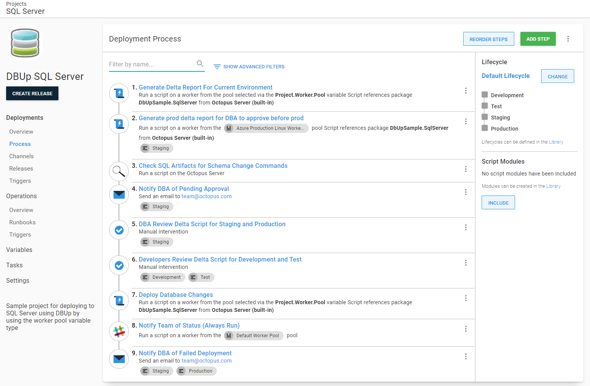

When the DBA creates the `Production` deployment, they can also review the delta report generated during the `Staging` deployment.  The added bonus is the DBA can now schedule the deployment, and they don’t have to be online.

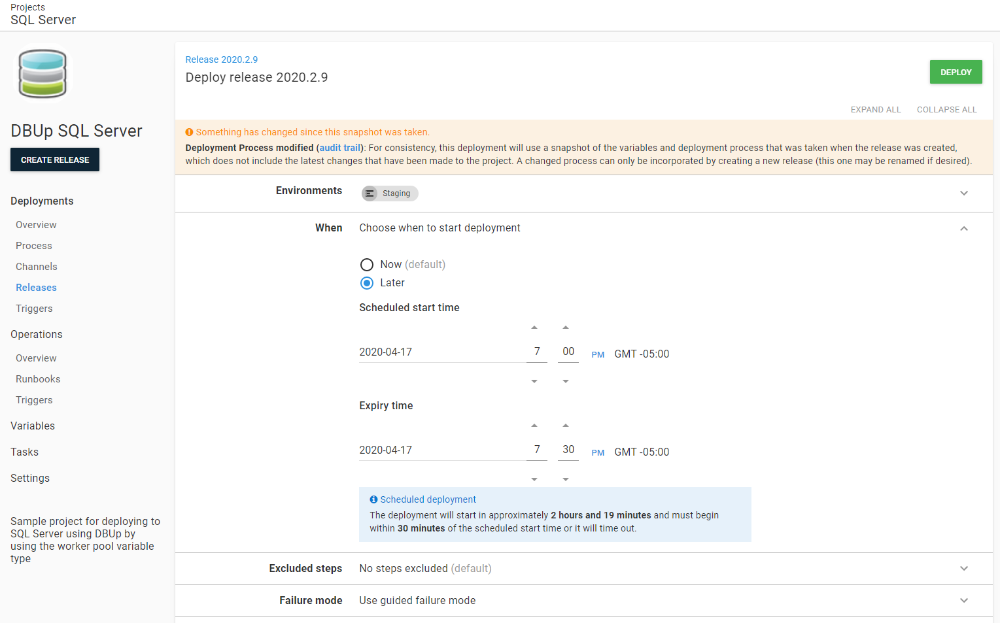

That being said, don’t expect the DBA to schedule deployment and not be online when you start out.  It will take quite a number of deployments before they trust the team, trust the process, and trust themselves to understand the tool.

## Future iterations

All the manual approvals and notifications will create noise.  When starting out, that noise is good.  The team is still learning the tooling.  Eventually, the team will become comfortable with the tooling, and the manual approvals and notifications will annoy and eventually hinder the team.  

It isn’t wise to remove those notifications and approvals.  Something damaging could slip through the pull request process.  The process has a step that automatically finds potential problems, `Check SQL Artifacts for Schema Change Commands`.  That script can be modified to set [output variables](https://octopus.com/docs/projects/variables/output-variables).  If a potentially damaging command is found, then the deployment must go through the approval process:

```PowerShell
$ApprovalRequired = $false
Write-Host "Looping through all commands"
$commandListToCheck = $CommandsToLookFor -split ","
foreach ($sqlFile in $fileListToCheck)
{       
    foreach ($command in $commandListToCheck)
    {
        Write-Host "Checking $($sqlFile.FileName) for command $command"
        $foundCommand = $sqlFile.Content -match "$command"

        if ($foundCommand)
        {
            Write-Highlight "$($sqlFile.FileName) has the command '$command'"
            $ApprovalRequired = $true
        }
    }
}

if ($approvalRequired -eq $false)
{
    Write-Highlight "All scripts look good"
}
else
{
    Write-Highlight "One of the specific commands we look for has been found"
}

Set-OctopusVariable -name "DBAApprovalRequired" -value $ApprovalRequired
```

Output variables are a bit verbose.  To make them easier to use, set another variable to the result.


In the notification and manual intervention steps, the variable run condition can be set to be:

```
#{if Octopus.Deployment.Error == ""}#{Project.DBA.ApprovalRequired}#{/if}
```

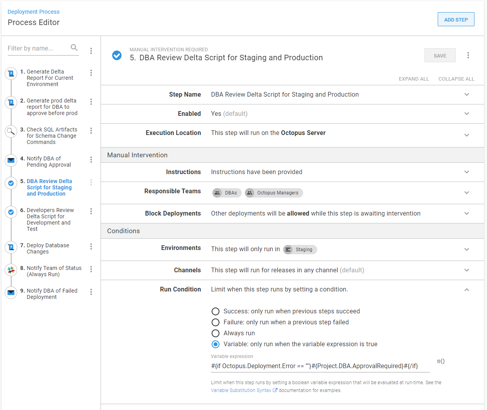

## Preventing bad actors

One flaw in this process is it assumes developers don’t go into the deployment process and disable or delete the manual intervention steps.  Trust, but verify is our recommended approach.  

For starters, we are working on a *process as code* that integrates with Git.  If it integrates with Git, it can then go through a pull request process.  

[This video](https://www.youtube.com/watch?v=i4qYdsYyu9s&list=PLAGskdGvlaw3-cd9rPiwhwfUo7kDGnOBh&index=19&t=0s) also outlines a process to automatically audit your projects.

Finally, you can configure [subscriptions](https://octopus.com/docs/administration/managing-infrastructure/subscriptions) to notify admins when changes are made.

## Conclusion

At the start of the article, I set this goal:

> I need to prove to myself, and everyone on my team, that a specific deployment will **_NOT_** result in data loss or a production outage.   

The process created in this article helps achieve that goal by doing the following:

1. It generates a delta report and publishes it as an Octopus Artifact for anyone to review.
2. Keeps track of who triggered the deployment, who approved the deployment, and when everything happened.
3. A script will download the delta report and look for potential problem commands.
4. The deployment will pause in each environment, except `Production`, for approvers to review and approve the delta report.
5. Notifications are sent to key people at various times during the process.
6. Developers have permissions to deploy to `Development`, `Test`, and `Staging`, but DBAs must approve the deployment to `Staging`.
7. DBAs approve and review changes for both `Staging` and `Production` during a `Staging` deployment.  This gives them much more time to review the changes and raise any concerns prior to a `Production` push.  

I implemented something similar while working at previous companies.  It was much better than the previous process, which was an email saying, “Please run these SQL scripts.” I felt confident about the database changes going out, and eventually, the DBAs did too.  It got the point where they would say “I’ll schedule it for 7 PM, I won’t be online, but if anything goes wrong it’ll page me, and I’ll hop on.”    

I am not naive enough to believe this will solve all the potential trust concerns.  The process isn’t perfect; for example, it doesn’t integrate with a Production Change Request system, and it doesn’t integrate with issue trackers.  While important, I felt those items muddied the waters for this article.  My goal for this article was to provide tips and techniques for you to feel confident in starting your own POC or Pilot for automated database deployments.  

The deployment process from this article can be found on our [samples instance](https://samples.octopus.app/app#/Spaces-106/projects/dbup-sql-server/deployments).  

Until next time, happy deployments!
