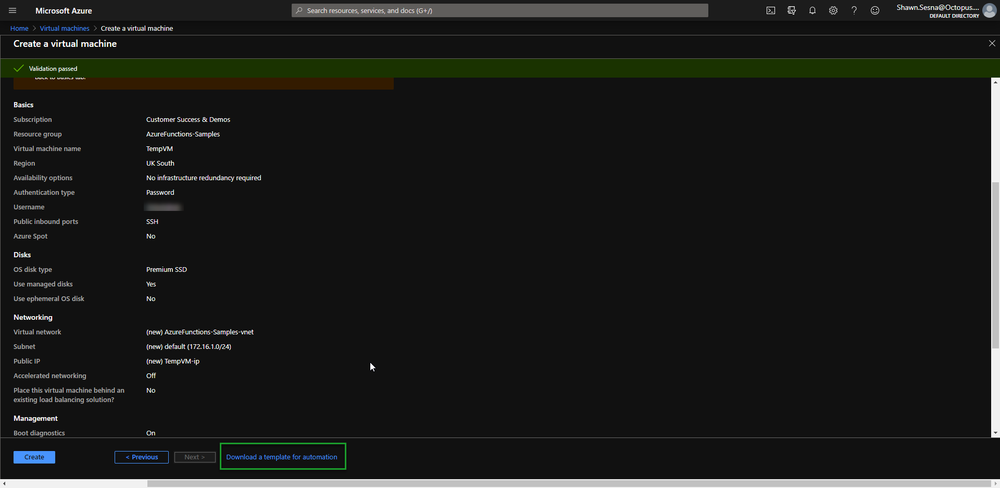
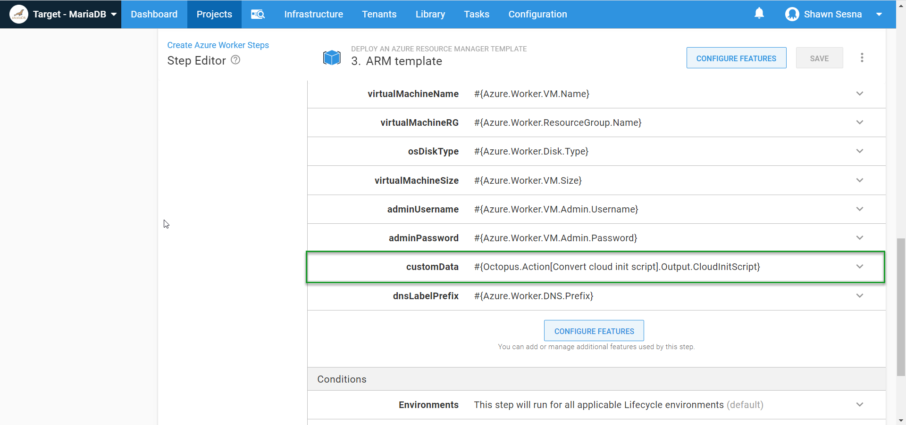

Octopus Deploy started out life as a tool for deploying .NET applications.  As such, the vast majority of our step templates are written in PowerShell.  With the introduction of the [Linux Tentacle](https://octopus.com/docs/infrastructure/deployment-targets/linux/tentacle) there have been a handful of step templates that have been converted to Bash versions.  However, with PowerShell Core, converting existing templates to Bash isn't necessary!  In this post I demonstrate how existing PowerShell templates will work perfeclty fine on a Linux worker.

## Setting up
The first thing I'll need for this is a Linux machine to work with.  For grins and giggls, I decided to use a Ubuntu Linux VM in Azure.

### Azure Resource Manager (ARM) Template
Creating a VM in Azure is dead easy using ARM templates.  Microsoft did a fantastic job in making the generation of an ARM template quick and easy.  Simply go through the process of defining how you want your VM configured and export the template at the end!  It's that simple!



The ARM template allows to different ways to attach intit scripts
 - [Custom Script Extension](https://docs.microsoft.com/en-us/azure/virtual-machines/extensions/custom-script-windows)
 - Use the CustomData parameter

 ##### Custom Script Extension
 Using the Custom Script Extension, you can supply a Uri to a file (such as a [Gist](https://gist.github.com/discover)) that contains the script to include.

 ##### CustomData Parameter
 The CustomData Parameter allows us to include the script as a string and attach it as a parameter.  When provisioning Windows VMs, this value can be a string.  For Linux, this value must first be Base64 encoded.  This can easily be done within a Run a script task

#### The Cloud Init Script
For this example I want my new VM to do the following
- Install Linux Tentacle
- Install PowerShell Core
- Configure Tentacle and register itself of to my cloud instance


##### Install Linux Tentacle
This portion of the script will cover the installation of the tentacle.  If you've read any of our other blog posts about Linux Tentacle, it should look familiar :)

```
serverUrl="#{Global.Base.Url}"   # The url of your Octous server
thumbprint="#{Global.Server.Thumbprint}"       # The thumbprint of your Octopus Server
apiKey="#{Global.Api.Key}"           # An Octopus Server api key with permission to add machines
name="#{Octopus.Space.Name}-#{Octopus.Environment.Name}"      # The name of the Tentacle at is will appear in the Octopus portal
publicHostName="#{Azure.Worker.DNS.Prefix}.centralus.cloudapp.azure.com"      # The url to the tentacle
workerPoolName="#{Azure.Worker.Pool.Name}"
configFilePath="/etc/octopus/default/tentacle-default.config"
applicationPath="/home/Octopus/Applications/"
spaceName="#{Octopus.Space.Name}"

sudo apt install --no-install-recommends gnupg curl ca-certificates apt-transport-https && \
curl -sSfL https://apt.octopus.com/public.key | sudo apt-key add - && \
sudo sh -c "echo deb https://apt.octopus.com/ stable main > /etc/apt/sources.list.d/octopus.com.list" && \
sudo apt update && sudo apt install tentacle -y
```

##### Install PowerShell Core
This bit will install PowerShell Core onto Ubuntu
```
# Download the Microsoft repository GPG keys
wget -q https://packages.microsoft.com/config/ubuntu/18.04/packages-microsoft-prod.deb

# Register the Microsoft repository GPG keys
sudo dpkg -i packages-microsoft-prod.deb

# Update the list of products
sudo apt-get update

# Enable the "universe" repositories
sudo add-apt-repository universe

# Install PowerShell
sudo apt-get install -y powershell
```

##### Configure Tentacle and register itself of to my cloud instance
Lastly we need the script to configure the Tentacle and then register itself to our instance
```
sudo /opt/octopus/tentacle/Tentacle create-instance --config "$configFilePath"
sudo /opt/octopus/tentacle/Tentacle new-certificate --if-blank
sudo /opt/octopus/tentacle/Tentacle configure --port 10933 --noListen False --reset-trust --app "$applicationPath"
sudo /opt/octopus/tentacle/Tentacle configure --trust $thumbprint
echo "Registering the Tentacle $name as a worker with server $serverUrl in $workerPoolName"
sudo /opt/octopus/tentacle/Tentacle register-worker --server "$serverUrl" --apiKey "$apiKey" --name "$name" --space "$spaceName" --publicHostName "$publicHostName" --workerpool "$workerPoolName"
# Install and start the service
sudo /opt/octopus/tentacle/Tentacle service --install --start
```

With our script set up, we need to convert it to a Base64 string, then set it to an ouput variable so it can be used in the ARM template.  Here's the whole thing put together

```
# Define cloud init script
$cloudInitScript = @'
#!/bin/bash
# https://linuxize.com/post/how-to-install-wildfly-on-ubuntu-18-04/

# Install Octpous listening tentacle
serverUrl="#{Global.Base.Url}"   # The url of your Octous server
thumbprint="#{Global.Server.Thumbprint}"       # The thumbprint of your Octopus Server
apiKey="#{Global.Api.Key}"           # An Octopus Server api key with permission to add machines
name="#{Octopus.Space.Name}-#{Octopus.Environment.Name}"      # The name of the Tentacle at is will appear in the Octopus portal
publicHostName="#{Azure.Worker.DNS.Prefix}.centralus.cloudapp.azure.com"      # The url to the tentacle
workerPoolName="#{Azure.Worker.Pool.Name}"
configFilePath="/etc/octopus/default/tentacle-default.config"
applicationPath="/home/Octopus/Applications/"
spaceName="#{Octopus.Space.Name}"

sudo apt install --no-install-recommends gnupg curl ca-certificates apt-transport-https && \
curl -sSfL https://apt.octopus.com/public.key | sudo apt-key add - && \
sudo sh -c "echo deb https://apt.octopus.com/ stable main > /etc/apt/sources.list.d/octopus.com.list" && \
sudo apt update && sudo apt install tentacle -y

sudo /opt/octopus/tentacle/Tentacle create-instance --config "$configFilePath"
sudo /opt/octopus/tentacle/Tentacle new-certificate --if-blank
sudo /opt/octopus/tentacle/Tentacle configure --port 10933 --noListen False --reset-trust --app "$applicationPath"
sudo /opt/octopus/tentacle/Tentacle configure --trust $thumbprint
echo "Registering the Tentacle $name as a worker with server $serverUrl in $workerPoolName"
sudo /opt/octopus/tentacle/Tentacle register-worker --server "$serverUrl" --apiKey "$apiKey" --name "$name" --space "$spaceName" --publicHostName "$publicHostName" --workerpool "$workerPoolName"


# Download the Microsoft repository GPG keys
wget -q https://packages.microsoft.com/config/ubuntu/18.04/packages-microsoft-prod.deb

# Register the Microsoft repository GPG keys
sudo dpkg -i packages-microsoft-prod.deb

# Update the list of products
sudo apt-get update

# Enable the "universe" repositories
sudo add-apt-repository universe

# Install PowerShell
sudo apt-get install -y powershell

# Install and start the service
sudo /opt/octopus/tentacle/Tentacle service --install --start
'@

Write-Output "Converting cloudInitScript to base64"

# Convert to base 64
$cloudInitScript = [System.Convert]::ToBase64String([system.Text.Encoding]::UTF8.GetBytes($cloudInitScript))

# Set output variable
Set-OctopusVariable -name "CloudInitScript" -value $cloudInitScript
```

With our script converted to a Base64 string, we can pass it to our ARM template




## Executing a PowerShell step template


## Conclusion
Prior to PowerShell Core, it was necessary to create Bash versions of step templates so that they could be supported on Linux.  PowerShell Core gives Linux the ability to support most of the existing Octopus Deploy templates that are avaialable.  Minus things like IIS of course :)