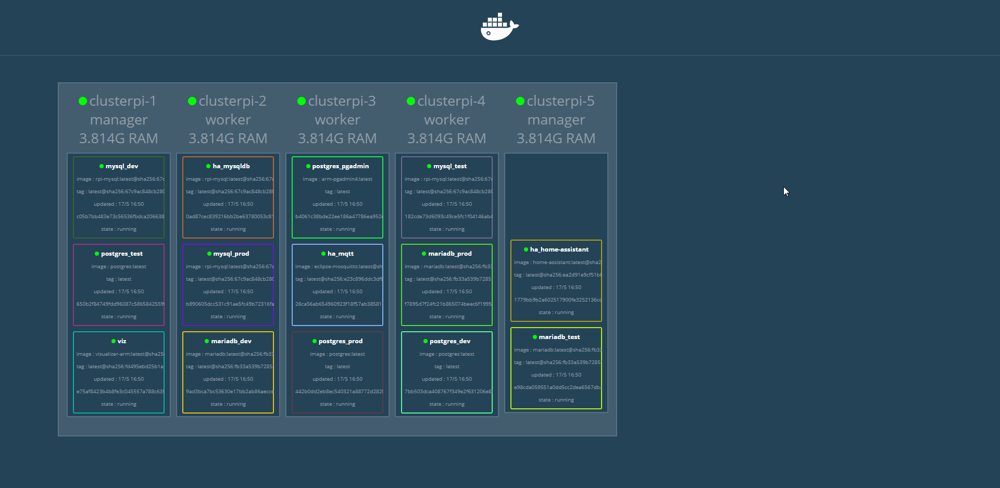

Like everyone else, we were told to stay home as this Covid-19 crisis unfolds.  Seeing as how I was going to be stuck at home, I figured I'd do something constructive with my time ... along with a fair amount of gaming ;)  I'd always wanted to create a cluster, but my other half didn't like the idea of having yet even more computers around the house (we're already at ~2:1 ratio of computers to people).  I'd read about people having great success with running the new Raspberry Pi 4 in a cluster with Docker Swarm, so I figured I'd give it a go!  Here are some of my experiences.

## Parts
No article about projects such as this would be complete without a parts list :)

- [Raspberry Pi 4 4GB](https://www.amazon.com/gp/product/B07TC2BK1X/ref=ppx_yo_dt_b_asin_title_o01_s00?ie=UTF8&psc=1) (I bought 5)
- [Heatsinks](https://www.amazon.com/gp/product/B082RKKQ2D/ref=ppx_yo_dt_b_asin_title_o03_s00?ie=UTF8&psc=1)
- [USB-C charge cables](https://www.amazon.com/gp/product/B01I4ZOIQY/ref=ppx_yo_dt_b_asin_title_o03_s00?ie=UTF8&psc=1)
- [MicroSD cards](https://www.amazon.com/gp/product/B07N73LB4T/ref=ppx_yo_dt_b_asin_title_o04_s00?ie=UTF8&psc=1)
- [USB wall charger](https://www.amazon.com/gp/product/B00YRYS4T4/ref=ppx_yo_dt_b_asin_title_o04_s00?ie=UTF8&psc=1)
- [Short network calbes](https://www.amazon.com/gp/product/B0721RFHT8/ref=ppx_yo_dt_b_asin_title_o04_s00?ie=UTF8&psc=1)
- [Case](https://www.amazon.com/gp/product/B07D5MJ7PQ/ref=ppx_yo_dt_b_asin_title_o05_s00?ie=UTF8&psc=1)

I chose the C4Labs Cloudlet case because it allowed me to access a single Pi without having to disassemble the whole case to get to it like the stackable cases.  The original design of the Cloudlet case has the fans powered by the Pi's.  I didn't want to have to worry about disconnecting cables if I needed to remove a Pi, so I went with the following parts to power the fans

- [Fan power splitter](https://www.amazon.com/gp/product/B082H6D611/ref=ppx_yo_dt_b_asin_title_o02_s00?ie=UTF8&psc=1)
- [3/4 pin to USB converter](https://www.amazon.com/gp/product/B07FNKPPT2/ref=ppx_yo_dt_b_asin_title_o02_s00?ie=UTF8&psc=1)
- [USB extension cable](https://www.amazon.com/gp/product/B00NH13UFQ/ref=ppx_yo_dt_b_asin_title_o02_s00?ie=UTF8&psc=1)

The Cloudlet case has plenty of room for these extra parts.

Lastly you'll need a network switch to connect the Pis to.  I had a spare 8-port lying around so I didn't need to buy another.  The Raspberry Pi 4 comes with a wireless adapter built-in, so you could utilize that as well.

## Creating the cluster
There are tons of blog posts out there that show you how to create a cluster of Raspberry Pis with Docker Swarm.  I found https://howchoo.com/g/njy4zdm3mwy/how-to-run-a-raspberry-pi-cluster-with-docker-swarm easy to follow.  All of the details you need are in the blog post, I won't bore you with all of that jazz :)

## Operating the Swarm
I had played around with Kubernetes (K8s) and Docker before taking on this project, however, I'd never run a Docker Swarm before.  There was some new concepts to learn when running things in a Docker Swarm mode versus a stand-alone Docker instance.  For example, where you would normally use a `docker run` statement, you'd create a service within the swarm to run the container using `docker service create`.  After messing around for a while, I had a fully operational Swarm!

## The lessons
Though it takes very little effort to get your swarm up and running, there were some lessons I learned, some good, some bad.

### Not all containers run on ARM
This lesson was one of the bad ones.   My original intention for this project was to lessen the burden on my VM Hypervisor by running containers.  When searching [Docker Hub](https://hub.docker.com), I found that very few official images would run on the ARM architecture.  I could usually find an image that someone made to run on the Raspberry Pi, but they were usually old and not the current version.

In some cases you can use a work-around and tell Docker not to resolve the image to an architecture.
- `docker service create --name <somename> --no-resolve-image <image>`
- `docker stack deploy --name <somename> --compose-file <somefile> --resolve-image never`

### Stacks!
Stacks are the Docker Swarm way of using docker-compose, in fact it uses a compose file as one of its arguments.  Just like docker-compose, you can define multiple containers within a single file.  By default, a stack deployment will create a network for the stack so they can all talk to each other.

### Persistent storage woes
