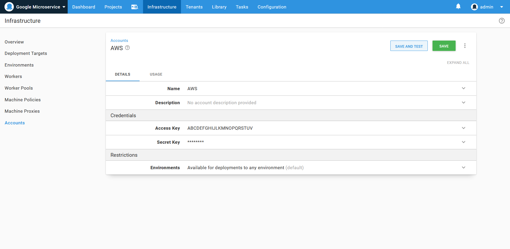
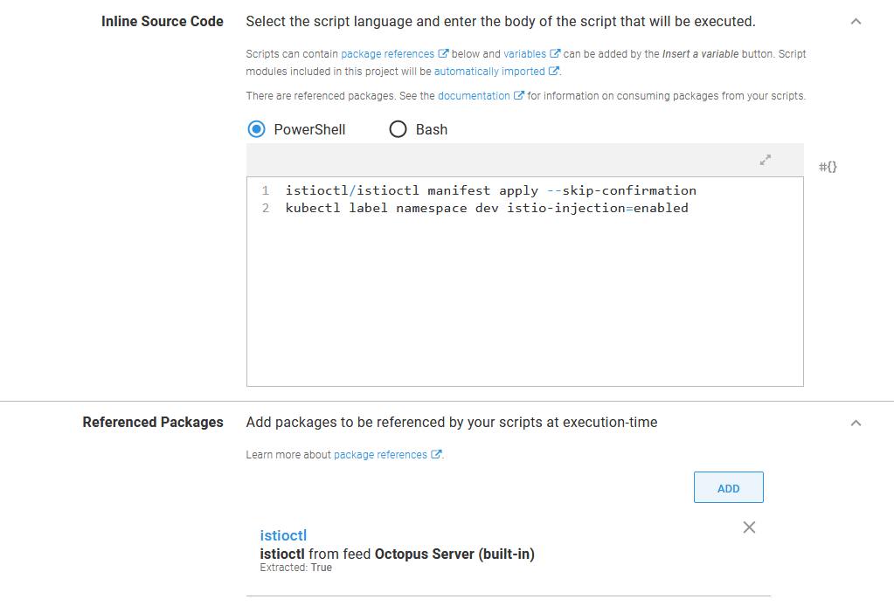
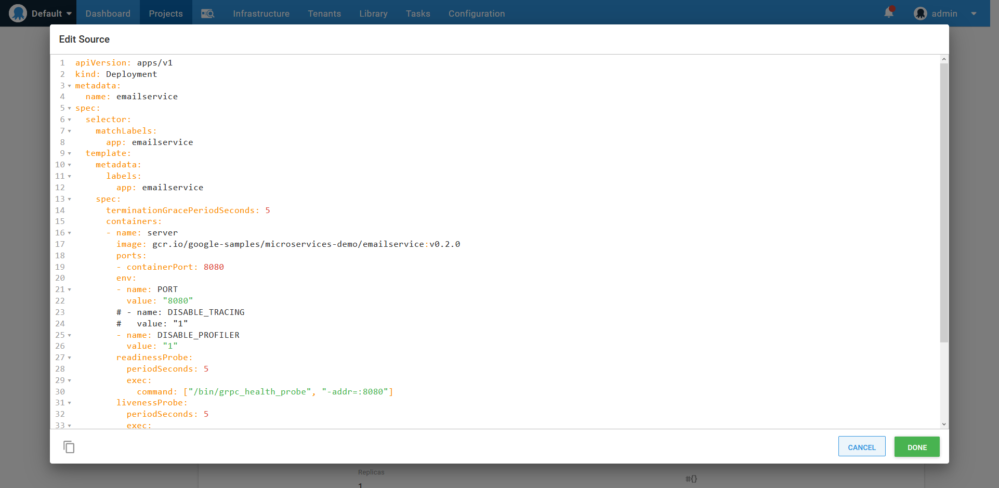
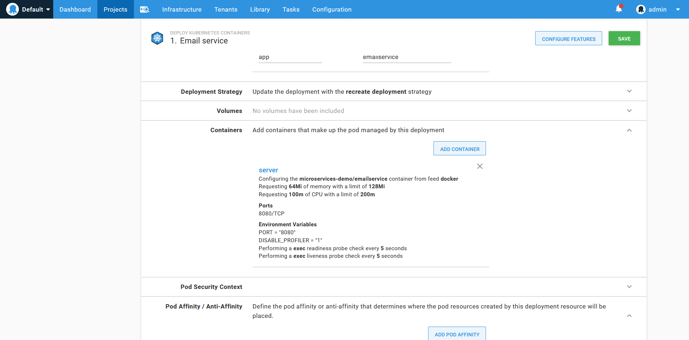
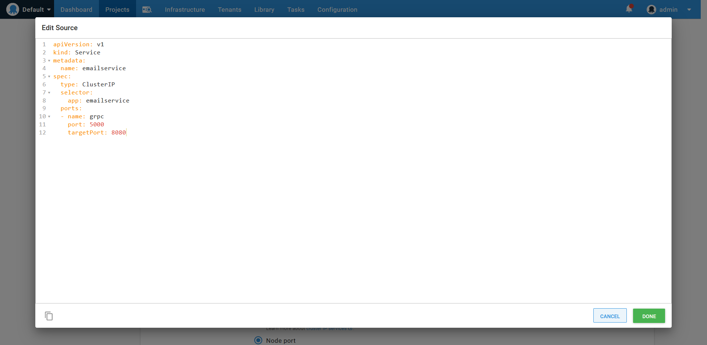
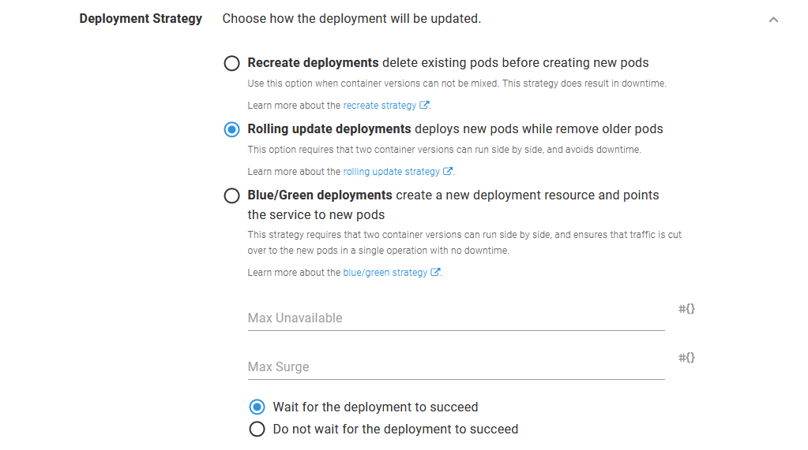
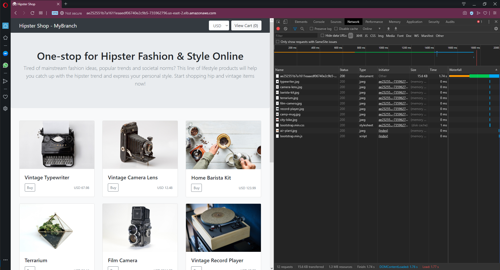
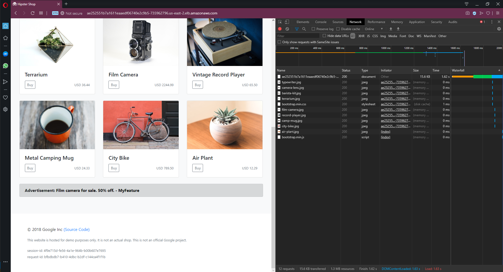
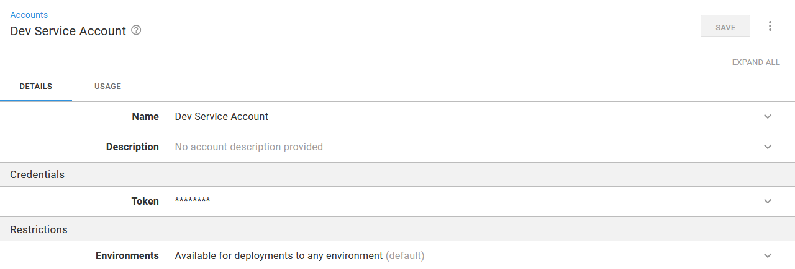
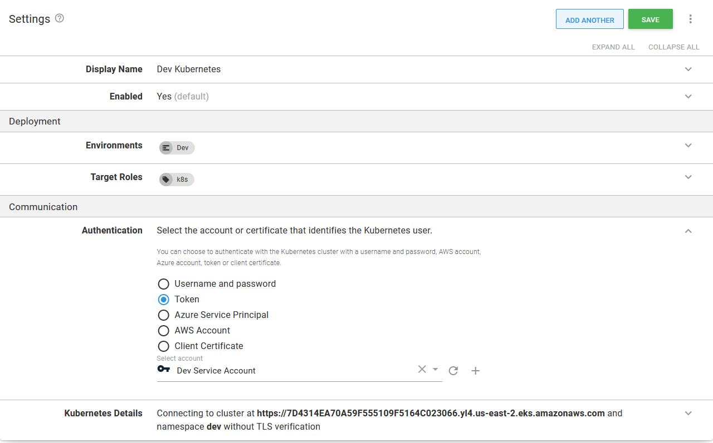

Microservices have emerged as a popular development practice for teams looking to release complex systems quickly and reliably. Kubernetes provides a natural platform for microservices as it handles much of the orchestration requirements imposed by deploying many instances of many individual microservices. On top, we have service mesh technologies which lift common networking concerns from the application layer into the infrastructure layer, making it easy to route, secure, log, and test network traffic.

Combining these development practices with Kubernetes to create a continuous integration and continuous delivery (CI/CD) pipeline does require some work, as a robust CI/CD pipeline must address a number of concerns such as:

* High availability (HA)
* Multiple environments
* Zero downtime deployments
* HTTPS and certificate management
* Feature branch deployments
* Smoke testing
* Rollback strategies

In this post, I look at how to create the continuous delivery (or deployment) half of the CI/CD pipeline by deploying a sample microservice application created by Google called [Online Boutique](https://github.com/GoogleCloudPlatform/microservices-demo) to an Amazon EKS Kubernetes cluster, configure the Istio service mesh to handle network routing, and dive into HTTP and gRPC networking to route tenanted network traffic through the cluster to test feature branches.

## Create an EKS cluster

For this post, I deploy the microservice application to a Kubernetes cluster hosted by Amazon EKS. However, I don't rely on any special functionality provided by EKS, so any Kubernetes cluster can be used to follow the process.

The easiest way to get started with EKS is with the [ekscli tool](https://eksctl.io/). This CLI tool abstracts away most of the details associated with creating and managing an EKS cluster and provides sensible defaults to get you up and running quickly.

## Create the AWS account

Octopus has native support for authenticating to EKS clusters via an AWS account. This account is defined under {{ Infrastructure, Accounts }}.



*An AWS account*

## Create the Kubernetes target

Kubernetes targets are created under  {{ Infrastructure, Deployment Targets }}. Select the **AWS Account** option in the **Authentication** section, and add the name of the EKS cluster.


*A Kubernetes target authenticating against the AWS account.*

Under the **Kubernetes Details** section add the URL to the EKS cluster, and either select the cluster certificate or check the **Skip TLS verification** option.

The default namespace that this target operates in is defined in the **Kubernetes namespace** field.

:::hint
Each step in a deployment process can override the namespace, so it is possible to leave this field blank and reuse one target across multiple namespaces. However, when sharing multiple environments within a single cluster, it is best to set the default namespace.
:::


*The EKS cluster details.*

:::hint
The Octopus server or workers that execute the steps must have `kubectl` and the AWS `aws-iam-authenticator` executable available on the path. See the [documentation](https://octopus.com/docs/infrastructure/deployment-targets/kubernetes-target#add-a-kubernetes-target) for more details.
:::

## Install Istio

Istio provides many installation options, but I find the `istioctl` tool to be the easiest.

Download a copy of `istioctl` from [GitHub](https://github.com/istio/istio/releases). The filename will be something like `istioctl-1.5.2-win.zip`, which we rename to `istioctl.1.5.2.zip` and then upload into Octopus. Placing the executable in the Octopus built in feed means we can use it from a script step.

Add a **Run a kubectl CLI Script** step to a runbook, and reference the `istioctl` package:


*An additional package referencing the Istio CLI tools.*

In the script body, execute `istioctl` as shown below to install Istio into the EKS cluster. You can find more information on these commands from the [Istio documentation](https://istio.io/docs/setup/install/istioctl/). Then add the `istio-injection` label to the namespace that holds our application to enable [automatic Istio sidecar injection](https://istio.io/docs/setup/additional-setup/sidecar-injection/#automatic-sidecar-injection):

```
istioctl/istioctl manifest apply --skip-confirmation
kubectl label namespace dev istio-injection=enabled
```

:::hint
You must use the `--skip-confirmation` argument to prevent `istioctl` waiting forever for input that can not be provided when the tool is run through Octopus.
:::



*The script to install Istio and enable automatic sidecar injection in a namespace.*

## Create a Docker feed

The Docker images that make up our microservice application will be hosted in DockerHub. While Google provides images from their own Google Container Registry, the images do not have SemVer compatible tags, which Octopus requires to sort images during release creation. We'll also be creating some feature branch images to deploy to the cluster, and so need a public repository we can publish to. In the screenshot below you can see a new Docker feed created under {{Library, External Feeds}}:


*The Dockerhub Docker feed.*

## Deploy the microservices

The Online Boutique sample application provides a [Kubernetes YAML file](https://github.com/GoogleCloudPlatform/microservices-demo/blob/master/release/kubernetes-manifests.yaml) defining all the deployments and services needed to run the application.

Each of the individual services will be deployed as a separate project in Octopus. One of the advantages of microservices is that each service has an independent lifecycle, allowing it to be tested and deployed independent of any other service. Creating individual Octopus projects for each microservice allows us to create and deploy releases for just that service.

The first microservice mentioned in the YAML file is called `emailservice`, which we'll deploy in a project called `01. Online Boutique - Email service`. This microservice has two Kubernetes resources: a deployment, and a service. The YAML for these two resources is shown below:

```YAML
apiVersion: apps/v1
kind: Deployment
metadata:
  name: emailservice
spec:
  selector:
    matchLabels:
      app: emailservice
  template:
    metadata:
      labels:
        app: emailservice
    spec:
      terminationGracePeriodSeconds: 5
      containers:
      - name: server
        image: gcr.io/google-samples/microservices-demo/emailservice:v0.2.0
        ports:
        - containerPort: 8080
        env:
        - name: PORT
          value: "8080"
        # - name: DISABLE_TRACING
        #   value: "1"
        - name: DISABLE_PROFILER
          value: "1"
        readinessProbe:
          periodSeconds: 5
          exec:
            command: ["/bin/grpc_health_probe", "-addr=:8080"]
        livenessProbe:
          periodSeconds: 5
          exec:
            command: ["/bin/grpc_health_probe", "-addr=:8080"]
        resources:
          requests:
            cpu: 100m
            memory: 64Mi
          limits:
            cpu: 200m
            memory: 128Mi
---
apiVersion: v1
kind: Service
metadata:
  name: emailservice
spec:
  type: ClusterIP
  selector:
    app: emailservice
  ports:
  - name: grpc
    port: 5000
    targetPort: 8080
```

This pairing of a deployment and a service resource is a pattern we'll find over and over in the YAML file. The deployments are used to deploy and manage the containers that implement the microservice, while the service resource exposes these containers to the other microservices, and for the front end application also exposing the microservice to end users.

The pattern of combining common Kubernetes resources is exposed in Octopus via the **Deploy Kubernetes containers** step. This opinionated step provides a rich user interface around Kubernetes deployments, services, ingresses, secrets and configmaps, making this step a natural choice to deploy our Online Boutique microservices.

Historically, a downside to using the **Deploy Kubernetes containers** step has been the time it took to translate the properties in an existing YAML file into the user interface. Each setting had to be copied in manually, which was a significant undertaking.

A recent feature added in Octopus 2020.2.4 is the ability to directly edit the YAML generated by this step. Clicking the **EDIT YAML** button for each Kubernetes resource allows YAML to be copied into the step directly in one operation:


*The EDIT YAML button imports and exports YAML.*

In the screenshot below you can see that I have pasted the YAML that makes up the `emailservice` deployment resource:



*Importing YAML from the microservice project.*

Any property from the supplied YAML matching a field exposed by the form is imported. In the screenshot below you can see the `server` container has been imported complete with environment settings, health checks, resource limits and ports:



*The resulting container definition from the imported YAML.*

:::hint
Not every possible deployment property is recognized by the **Deploy Kubernetes containers** step, and unrecognized properties are ignored during import. The `Deploy raw Kubernetes YAML` step provides a way to deploy generic YAML to a Kubernetes cluster. However, all properties used by the microservices that make up the Online Boutique sample application are exposed by the **Deploy Kubernetes containers** step.
:::

We'll then import the service YAML into the **Service** section of the step:


*The service section EDIT YAML button.*



*Importing a service resource defined in YAML.*

:::hint
Services direct traffic to pods that match the labels defined under the `selector` property. The **Deploy Kubernetes containers** step ignores the `selector` property in the imported service YAML, and instead assumes that the pods in the deployment are all to be exposed by the service. Coupling the deployment and service in this way is one of the opinions enforced by the **Deploy Kubernetes containers** step.
:::

Our microservices won't be deploying ingress, secret or configmap resources, so we can remove these features from the step by clicking the **CONFIGURE FEATURES** button, and unselecting the unused features:


*Configuring features to remove those that are unused.*

The final step is to reference the containers we have built and uploaded to Docker Hub. The import process referenced the container `microservices-demo/emailservice` that was defined in the deployment YAML. We need to change this to `octopussamples/microservicedemo-emailservice` to reference the container that has been uploaded by the [OctopusSamples](https://hub.docker.com/u/octopussamples) Docker Hub user:


*Updating the Docker image.*

And with that we have created an Octopus project to deploy `emailservice`, one of the eleven microservices that make up the Online Boutique sample application. The other microservices are called:

* `checkoutservice`
* `recommendationservice`
* `frontend`
* `paymentservice`
* `productcatalogservice`
* `cartservice`
* `loadgenerator`
* `currencyservice`
* `shippingservice`
* `redis-cart`
* `adservice`

Most of these microservices are deployed with the same deployment and service pairing that we have seen for the `emailservice`. The exceptions are `loadgenerator`, which has no service, and `frontend`, which includes an additional load balancer service that exposes the microservice to public traffic.

The additional load balancer service can be deployed with the **Deploy Kubernetes service resource** step. This stand alone step has the same **EDIT YAML** button found in the **Deploy Kubernetes containers** step, and so the `frontend-external` service YAML can be imported directly:


*Importing a standalone service YAML definition.*

:::hint
Unlike the **Deploy Kubernetes containers** step, the standalone **Deploy Kubernetes service resource** step is not coupled to a deployment, and so imports and exposes label selectors to define the pods that traffic is sent to.
:::

## High Availability

Since Kubernetes takes care of provisioning pods in the cluster and has built in support for tracking the health of pods and nodes, we gain a reasonable degree of high availability out of the box. In addition, we can often lean on cloud providers to monitor node health, recreate failed nodes, and physically provision nodes across availability zones to reduce the impact of an outage.

However, the default settings for the deployments we imported need some tweaking to make them more resilient.

First, we need to increase the deployment replica count, which determines how many pods a deployment will create. The default value is 1, meaning a failure of any single pod will result in a microservice being unavailable. Increasing this value means our application can survive the loss of a single pod. In the screenshot below you can see I have increase the replica count to 2 for the ad service:


*Increasing the pod replica count.*

Having two pods is a good start, but if both those pods have been created on a single node we still have a single point of failure. To address this we'll use a feature in Kubernetes called pod anti-affinity. This allows us to instruct Kubernetes to prefer that certain pods be deployed on separate nodes.

In the screenshot below you can see that I have created a preferred anti-affinity rule that instructs Kubernetes to attempt to place pods with the label `app` and value `adservice` (this is one label this deployment assigns to pods) on separate nodes.

The topology key is the name of a label assigned to nodes that defines the topological group that the node belongs to. In more complex deployments the topology key would be used to indicate details like the physical region a node was placed in or networking considerations. However in this example we select a label that uniquely identities each node called `alpha.eksctl.io/instance-id`, effectively creating topologies that contain only one node.

The end result is that Kubernetes will try to place pods belonging to the same deployment on different nodes, meaning our cluster is more likely to survive the loss of a single node without disruption:


*Defining pod anti-affinity.*

## Zero downtime deployments

Deployment resources in Kubernetes offer two built in strategies for deploying updates.

The first is the recreate strategy. This strategy first deletes any existing pods before deploying new ones. The recreate strategy removes the need for two pod versions to coexist, which can be important in situations such as when incompatible database changes have been incorporated into the new version. However it does introduce downtime from when the old pods are shut down to when the new pods are fully operational.

The second, and default, strategy is the rolling update strategy. This strategy incrementally replaces old pods with new ones, and can be configured in such a way as to ensure there are always healthy pods available during the update to serve traffic. The rolling update strategy means that both old and new pods run side by side for a short period, so careful attention must be made to ensure clients and datastores can also support both pod versions. The benefit of this approach is that there is no downtime as some pods are available to process any requests.

Octopus introduces a third deployment strategy called blue/green. The blue/green strategy is implemented by creating a distinct new deployment resource, which is to say a new deployment resource with a unique name, with each deployment. If a configmap or secret was defined as part of the **Deploy Kubernetes containers** step, distinct new instances of those resources are created as well. Once the new deployment has succeeded and all health checks have passed, the service is updated to switch traffic from the old deployment to the new one. This allows for a complete cutover from the old deployment to the new one with no downtime, and ensures that traffic is only sent to the old or new pods, but not both at the same time.

Selecting either the rolling or blue/green deployment strategies means we can deploy microservices with zero downtime:



*Enabling a rolling update.*

:::hint
True zero downtime deployments that result in no requests being lost during an update require some additional work. The blog post [Zero-Downtime Rolling Updates With Kubernetes](https://blog.sebastian-daschner.com/entries/zero-downtime-updates-kubernetes) provides some tips on how to minimize network disruption during updates.
:::

## Feature branch deployments

With a monolithic application, feature branch deployments are usually straight forward; the entire application is built, bundled and deployed as a single artifact, and maybe backed by a specific instance of a database.

It is a much different scenario with microservices. An individual microservice may only function in a meaningful way when all of it's upstream and downstream dependencies are available to process a request.

The blog post [Why We Leverage Multi-tenancy in Uber’s Microservice Architecture](https://eng.uber.com/multitenancy-microservice-architecture/) discusses two methods for performing integration testing in a microservice architecture: parallel testing, and testing in production.

The blog post goes into some detail about the implementation of these two strategies, but in summary:

* Parallel testing involves testing microservices in a shared staging environment configured like, but isolated from, the production environment.
* Testing in production involves deploying the microservice under test into production, isolating it with security policies, categorizing all resulting data at rest as test or production data, and directing a distinct subset of traffic to the test microservice.

The blog post goes on to advocate for testing in production, citing these limitations of parallel testing:

* Additional hardware cost
* Synchronization issues (or drift between the staging and production environments)
* Unreliable testing
* Inaccurate capacity testing

Few development teams will have embraced microservices to quite the extent that Uber has, and so I suspect for most deploying microservice feature branches will involve a solution somewhere between Uber's descriptions of parallel testing and testing in production. Specifically, here we'll look at how a microservice feature branch can be deployed alongside an existing version in a staging environment and have a subset of traffic directed to it.

Deploying feature branches to a staging environment removes the risk of interfering with production services by taking advantage of hardware and network isolation, which in turn removes the need to enforce this separation in the production environment. It also removes the need to partition or identify test and production data, as all data created in the staging environment is test data.

Before we begin, we need to briefly recap what a service mesh is, and how we can leverage the Istio service mesh to direct traffic independently of the microservices.

### What is a service mesh?

Before the days of service meshes, networking functionality was much like an old telephone switchboard. Applications are analogous to individuals placing a telephone call; they know who they needed to communicate with, and reverse proxies like NGINX would function as the switchboard operator to connect the two parties. This infrastructure works so long as all parties in this transaction are well known and the ways in which they communicate are relatively static and unspecialized.

Microservices are then analogous to the rise of mobile phones. There are significantly more devices to be connected together, roaming across the network in unpredictable ways, with each individual device often requiring its own unique configuration.

Service meshes were designed to accommodate the increasingly intricate and dynamic requirements of large numbers of services communicating with each other. In a service mesh, each service takes responsibility for defining how it will accept requests; what common networking functionality like retries, circuit breaking, redirects and rewrites it needs; avoids a central "switchboard" that all traffic must pass through; and does this mostly without the individual applications needing to be aware of how their network requests are being processed.

Service meshes are rich platforms that offer a great deal of functionality, but for the purposes of deploying a microservice feature branch, we are most interested in the ability to inspect and route network traffic.

### What traffic are we routing?

Below is the architecture diagram showing the various microservices that make up the Online Boutique, and how they communicate:


*The microservice application architecture.*

What you will notice from this diagram is that public traffic from the Internet enters the application via the frontend. This traffic is plain HTTP.

Communication between the microservices is then performed with [gRPC](https://grpc.io/), which is:  

> A high-performance, open source universal RPC framework

Importantly, under the hood gRPC uses HTTP2. So to route traffic to a microservice feature branch deployment, we will need to inspect and route HTTP traffic.

### Routing HTTP traffic

The Istio [HTTPMatchRequest](https://istio.io/docs/reference/config/networking/virtual-service/#HTTPMatchRequest) defines the properties of a request that can be used to match HTTP traffic. The properties are reasonably comprehensive including URI, scheme, method, headers, query parameters, port and more.

In order to route a subset of traffic to a feature branch deployment, we need to be able to propogate additional information as part of the HTTP request in a way that does not interfeer with the data contained in the request. The scheme (i.e. HTTP or HTTPS), method (GET, PUT, POST etc), port, query paramaters (the part of the URI after a question mark) and the URI itself all contain information that is very specific to the request being made, and modifying these is not an option. This leaves the headers, which are key value pairs often modified to support request tracing, proxying and other metadata.

Looking at the network traffic submitted by the browser when interacting with the Online Boutique frontend, we can see that the `Cookie` header likely contains a useful value we can inspect to make routing decisions. The application has persisted a cookie with a GUID identifying the browser session, which as it turns out is the method this sample application implements to identify users. Obviously a real world example interact with an authentication service to identify users, but for our purposes a randomly generated GUID will do just fine.


*Capturing network traffic from a browser.*

Armed with a HTTP header we can inspect and route, the next step is to deploy a feature branch.

### Create a feature branch Docker image

Online Boutique has been written in a variety of languages, and the frontend component is written in Go. We'll make a small change to the [header template](https://github.com/GoogleCloudPlatform/microservices-demo/blob/master/src/frontend/templates/header.html) to include the text **MyFeature**, making it clear that this code represents our feature branch.

We'll build a Docker image from this branch and publish it as `octopussamples/microservicedemo-frontend:0.1.4-myfeature`. Note that the tag of `0.1.4-myfeature` is a SemVer string, which allows this image to be used as part of an Octopus deployment.

### Deploy the first feature branch

 We define two channels in the Octopus project that deploys the frontend application.

The **Default** channel has a version rule that requires SemVer prerelease tags to be empty with a regular expression of `^$`. This rule ensures this channel only matches versions (or Docker tags in our case) like `0.1.4`.

The **Feature Branch** channel has a version rule that requires SemVer prerelease tags to *not* be empty, with a regular expression of `.+`. This channel will match versions like `0.1.4-myfeature`.

We then add a variable to the deployment called `FeatureBranch` with the value of `#{Octopus.Action.Package[server].PackageVersion | Replace "^([0-9\.]+)((?:-[A-Za-z0-9]+)?)(.*)$" "$2"}`. This variable takes the version of the Docker image called `server`, captures the prerelease and leading dash in a regular expression as group 2, and then prints only group 2. If there is no prerelease, the variable resolves to an empty string.


*The variable used to extract the SemVer prerelease.*

This variable is then appended to the deployment name, the deployment labels, and the service name. Changing the name of the deployment and service ensures that a feature branch deployment creates new resources with the name like `frontend-myfeature` alongside the existing resources called `frontend`:


*The summary text shows the name of the deployment and the labels*


*The summary text shows the name of the service*

### Expose the frontend via Istio

To this point we have not deployed any Istio resources. The `istio-injection` label on the namespace containing our application means that the pods created by our deployments include the Istio sidecar, ready to intercept and route traffic, but it is plain old Kubernetes services that are exposing our pods to one another.

In order to start using Istio to route our internal traffic, we need to create a virtual service:

```YAML
apiVersion: networking.istio.io/v1beta1
kind: VirtualService
metadata:
  name: frontend
spec:
  gateways:
  - istio-system/ingressgateway
  hosts:
  - '*'
  http:
  - match:
    - headers:
        Cookie:
          exact: shop_session-id=4f9e715d-fe56-4a1e-964b-b00b607e7695
    route:
    - destination:
        host: frontend-myfeature
  - route:
    - destination:
        host: frontend
```

There are a few important parts to this virtual service:

* The `gateway` is set to `istio-system/ingressgateway`, which is a gateway created when Istio was installed. This gateway in turn accepts traffic from a load balancer service also created in the `istio-system` namespace, which means to access our application and have traffic routed by this virtual service, we need to access the application via the public hostname of the Istio load balancer service.
* The first item under the `http` property specifies that incoming traffic whose `Cookie` header matches the specified value is to be directed to the `frontend-myfeature` service.
* Any other traffic is sent to the `frontend` service.

With these rules in place we can reopen the application, and our request is redirected to the feature branch, as indicated by the header:



*Istio inspected the Cookie header and directed the request to the feature branch.*

This redirection is only half of the challenge though. We've successfully inspected a HTTP header already added by the application and directed web traffic to the feature branch of the public facing frontend application. But what about redirecting internal gRPC calls?

### gRPC routing

Just like regular HTTP requests, gRPC requests can also expose HTTP headers that are used for routing. Any [metadata](https://grpc.io/docs/guides/concepts/#metadata) associated with a gRPC request is exposed as a HTTP header, and can then be inspected by Istio.

The frontend application makes gRPC requests to many other microservices, including the ad service. To enable feature branch deployments of ad service, we need to propagate the "user id" (really just the session id, but we treat the two values as the same thing) with the gRPC request from the frontend to the ad service.

To do this we add a property called `userID` to the `getAd()` method, create a new context called `metactx` to expose the user id via the `userid` metadata property, and make the gRPC request with the context `metactx`:

```go
func (fe *frontendServer) getAd(ctx context.Context, userID string, ctxKeys []string) ([]*pb.Ad, error) {
	ctx, cancel := context.WithTimeout(ctx, time.Millisecond*100)
	defer cancel()

	// This is where we add the metadata, which in turn is exposed as HTTP headers
	metactx := metadata.AppendToOutgoingContext(ctx, "userid", userID)

	resp, err := pb.NewAdServiceClient(fe.adSvcConn).GetAds(metactx, &pb.AdRequest{
		ContextKeys: ctxKeys,
	})
	return resp.GetAds(), errors.Wrap(err, "failed to get ads")
}
```

The [metadata package](https://godoc.org/google.golang.org/grpc/metadata) is imported with:

```go
metadata "google.golang.org/grpc/metadata"
```

:::hint
Note that the function chain that calls the `getAd()` function must also be updated to pass the new parameter, and at the top level the user id is found by calling `sessionID(r)`, where `r` is the HTTP request object.
:::

We can now create a virtual service to route requests made from the frontend application to the ad service based on the `userid` HTTP header, which is how the gRPC metadata key value pairs are exposed:

```yaml
apiVersion: networking.istio.io/v1beta1
kind: VirtualService
metadata:
  name: adservice
spec:
  hosts:
  - adservice
  http:
  - match:
    - headers:
        userid:
          exact: 4f9e715d-fe56-4a1e-964b-b00b607e7695
    route:
    - destination:
        host: adservice-myfeature
  - route:
    - destination:
        host: adservice
```

Manually editing the virtual service can be tedious though. As more branches are deployed or more test users are configured, we'll need a more automated solution for editing the virtual service.

Below is a Powershell script that reads the current virtual service, adds or replaces the redirection rules for a given user, and saves the changes back in Kubernetes. This code can be saved as a runbook (as traffic switching is a process that happens independently of a deployment), and the variables `SessionId` and `Service` can be prompted before each run:

```powershell
# Get the current virtual service
$virtService = kubectl get virtualservice adservice -o json | ConvertFrom-JSON

# Clean up the generated metadata properties, as we do not want to send these back
$virtService.metadata = $virtService.metadata |
	Select-Object * -ExcludeProperty uid, selfLink, resourceVersion, generation, creationTimestamp, annotations

# Get the routes not associated with the new session id
$otherMatch = $virtService.spec.http |
    ? {$_.match.headers.userid.exact -ne "#{SessionId}"}

# Create a new route for the session
$thisMatch = @(
  @{
    match = @(
      @{
        headers = @{
          userid = @{
            exact = "#{SessionId}"
          }
        }
      }
    )
    route = @(
      @{
        destination = @{
          host = "#{Service}"
        }
      }
    )
  }
)

# Append the other routes
$thisMatch += $otherMatch
# Apply the new route collection
$virtService.spec.http = $thisMatch
# Save the virtual service to disk
$virtService | ConvertTo-JSON -Depth 100 | Set-Content -Path vs.json
# Print the contents of the file
Get-Content vs.json
# Send the new virtual service back to Kubernetes
kubectl apply -f vs.json
```

A more robust solution could involve writing a custom Kubernetes operator to keep the virtual service resource in sync with an external data source defining test traffic. This post won't go into the details of operators, but you can find more information from the post [Creating a Kubernetes Operator with Kotlin](https://octopus.com/blog/operators-with-kotlin).

### Deploy an internal feature branch

Just like we did with the frontend application, a branch of the ad service has been created and pushed as `octopussamples/microservicedemo-adservice:0.1.4-myfeature`. The ad service project in Octopus gained the new `FeatureBranch` variable set to `#{Octopus.Action.Package[server].PackageVersion | Replace "^([0-9\.]+)((?:-[A-Za-z0-9]+)?)(.*)$" "$2"}`, and the name of the deployment and service was changed to `adservice#{FeatureBranch}`.

The feature branch itself was updated to append the string `MyFeature` to the ads served by the service to allow us to see when the feature branch deployment is called. Once the virtual service has been deployed, we open the web application again and see that the ads we are served do indeed include the string `MyFeature`:



*Istio routed internal gRPC requests to the ad service feature branch based on the userid header.*

### Summary

In order to deploy a feature branch in a microservice environment for integration testing, it is useful to test specific requests without interfering with other traffic. By exposing routable information in HTTP headers and gRPC metadata (which in turn are exposed as HTTP headers) Istio is able to route specific traffic to feature branch deployments, while all other traffic flows through the regular mainline microservice deployments.

This may be enough to deploy microservice feature branches in a test environment. If your feature branch happens to malfunction and save invalid data in the test database, it is inconvenient but won't cause a production outage. Likewise placing invalid messages on a message queue may break the test environment, but your production environment is isolated.

The Uber blog post offers a tantalizing glimpse at how this idea of deploying feature branches can be extended to perform testing in production. However, be aware that the post is clear that tenancy information must be propagated with all requests, saved with all data at rest, and optionally test data is isolated in separate databases and message queues. In addition, security policies need to be put into place to ensure test microservices don't run amok and interact with services they shouldn't. This blog post won't cover these additional requirements, but the ability to deploy and interact with microservice feature branches is a good foundation.

## HTTPS and certificate management

To allow our application to be securely accessed via HTTPS we'll configure the [Secret Discovery Service](https://istio.io/docs/tasks/traffic-management/ingress/secure-ingress-sds/).

The first step is to deploy the ingress gateway agent, which is achieved by generating a YAML document using the `istioctl` tool and applying it. As we did when installing Istio itself, the `istioctl` package reference is added to a **Run a kubectl CLI script** step run as part of a runbook. The script to deploy the agent is shown below:

```powershell
istioctl\istioctl manifest generate `
  --set values.gateways.istio-egressgateway.enabled=false `
  --set values.gateways.istio-ingressgateway.sds.enabled=true > `
  istio-ingressgateway.yaml
kubectl apply -f istio-ingressgateway.yaml
```


*Enabling the agent with istioctl.*

The next step is to save the contents of a HTTPS certificate and private key as a secret. For this blog post I have used a certificate generated by Let's Encrypt through my DNS provider dnsimple, and downloaded the PFX certificate package. This package is made available under the instructions for deploying a certificate to IIS, but the PFX file itself is generic. We use the PFX file because it is self contained and easily uploaded to Octopus.


*The Let's Encrypt certificate generated by the DNS provider.*

The PFX file is uploaded as a new certificate under {{Library, Certificates}}:


*The Let's Encrypt certificate uploaded to Octopus.*

To import the certificate into Kubernetes we need to create a secret. We start by referencing the certificate in a variable called `Certificate`:


*The certificate referenced as a variable.*

The contents of the certificate are then saved into two files, one holding the certificate, the other holding the private key. Certificate variables are special in Octopus because they expose a number of [generated properties](https://octopus.com/docs/projects/variables/certificate-variables#expanded-properties), including `PrivateKeyPem` and `CertificatePem`.

The contents of these two files in turn are saved into a secret called `octopus.tech`:

```
Set-Content -path octopus.tech.key -Value "#{Certificate.PrivateKeyPem}"
Set-Content -path octopus.tech.crt -Value "#{Certificate.CertificatePem}"

kubectl delete -n istio-system secret octopus.tech
kubectl create -n istio-system secret generic octopus.tech `
  --from-file=key=octopus.tech.key `
  --from-file=cert=octopus.tech.crt
kubectl get -n istio-system secret octopus.tech -o yaml
```

The `ingressgateway` gateway is then updated to expose HTTPS traffic on port 443. The `credentialName` property matches the name of the secret we created above, and `mode` is set to `SIMPLE` to enable standard HTTPS (as opposed to `MUTUAL` to configures mutual TLS, which is not generally useful for public websites):

```
apiVersion: networking.istio.io/v1alpha3
kind: Gateway
metadata:
  name: ingressgateway
  namespace: istio-system
spec:
  selector:
    istio: ingressgateway
  servers:
  - port:
      number: 443
      name: https
      protocol: HTTPS
    tls:
      mode: SIMPLE
      credentialName: octopus.tech
    hosts:
    - "*"
  - port:
      number: 80
      name: http
      protocol: HTTP
    hosts:
    - "*"
```

With this change in place we can access the website via HTTPS and HTTP:


*Accessing the web site via HTTPS.*

## Smoke testing

Kubernetes provides builtin support for checking the state of a pod before it is marked healthy and put into service. The readiness probe will ensure that a pod is healthy and ready to receive traffic when the pod is first created, while the liveness probe continually verifies the health of a pod during its lifetime.

The microservices we have deployed from the sample application include these checks. The YAML shown below is a snippet showing the readiness and liveness checks that are applied (with small variations) to the internal gRPC microservices:

```yaml
readinessProbe:
    periodSeconds: 5
    exec:
      command: ["/bin/grpc_health_probe", "-addr=:8080"]
livenessProbe:
    periodSeconds: 5
    exec:
      command: ["/bin/grpc_health_probe", "-addr=:8080"]
```

`grpc_health_probe` is an executable created specifically to verify the health of an application exposing gRPC services. This project can be found on [GitHub](https://github.com/grpc-ecosystem/grpc-health-probe).

Since the frontend is exposed via HTTP, it uses different checks that take advantage of Kubernetes ability to verify pods with specially formatted HTTP requests. It is interesting to note that these checks make use of the session id cookie value to identify test requests in much the same way we did to route traffic to feature branches:

```yaml
readinessProbe:
  initialDelaySeconds: 10
  httpGet:
      path: "/_healthz"
      port: 8080
      httpHeaders:
      - name: "Cookie"
      value: "shop_session-id=x-readiness-probe"
livenessProbe:
  initialDelaySeconds: 10
  httpGet:
      path: "/_healthz"
      port: 8080
      httpHeaders:
      - name: "Cookie"
      value: "shop_session-id=x-liveness-probe"
```

If the readiness probe fails during a deployment, the deployment will not consider itself to be healthy. We can fail the Octopus deployment if the readiness checks fail by selecting the **Wait for the deployment to succeed** option, which will wait for the Kubernetes deployment to succeed before successfully completing the step:


*Waiting for the deployment to succeed ensure all readiness checks passed before successfully completing the step.*

## Rollback strategies

Kubernetes supports native rollbacks of [deployment resources](https://kubernetes.io/docs/concepts/workloads/controllers/deployment/#rolling-back-a-deployment) with a command like:

```
kubectl rollout undo deployment.v1.apps/yourdeployment
```

However, this rollback process has some limitations:

* It only rolls back the deployment, and does not take into account any resources the deployment depends on like secrets, configmaps etc. Storing environment specific configuration outside of the application is one of the practices encouraged by [the twelve-factor app](https://12factor.net/config), meaning code and config will often be deployed side by side.
* It does not work for blue/green deployments, as this process creates entirely new deployment resources that have no configuration history to roll back to.
* The Octopus dashboard will not accurately reflect the state of the system.

A deployment process in Octopus is designed to capture all of the steps required to deploy an application at a given version.  By redeploying an old release, we can ensure that all the resources and configuration that represent a deployable release are accounted for.

Note that special consideration has to paid to microservices that persist data, as rolling back to a previous release will not inherently ensure that any persisted data is compatible with the previous code. This is also true if you use rolling deployments, as this strategy implements an incremental upgrade that results in both the old and new versions of your application running side by side for a short period of time.

## Multiple environments

The [CNCF 2019 survey](https://www.cncf.io/wp-content/uploads/2020/03/CNCF_Survey_Report.pdf) highlights two main approaches to separating teams in Kubernetes: separate namespaces and separate clusters:


*A chart showing team separation strategies from the 2019 CNCF survey.*

Kubernetes provides out of the box support for resource limits (cpu, memory and ephemeral disk space), firewall isolation via network policies, and RBAC authorization that can limit access to Kubernetes resources based on namespace.

Istio can be used to implement network rate limits, although it is [not as easy as it could be](https://github.com/istio/istio/issues/22068).

However, namespaces are not completely isolated from one another. For example, custom resource definitions [can not be scoped to a namespace](https://github.com/kubernetes/kubernetes/issues/65551).

What this means is that Kubernetes supports soft multitenancy where namespaces are mostly, but not completely, isolated from each other. Hard multitenancy, where namespaces can be used to isolate untrusted neighbors, is a [topic of active discussion](https://blog.jessfraz.com/post/hard-multi-tenancy-in-kubernetes/), but not available today.

This likely means you will have multiple test environments sharing one Kubernetes cluster, with a separate production cluster.

The good news is that whether your environments are implemented via namespaces or clusters is largely abstracted away by Octopus Kubernetes targets.

As we saw at the beginning of this post, a Kubernetes target in Octopus captures both the default namespace, a user account, and the cluster API URL. The combination of these three fields represents the security boundary in which deployments are performed.

Kubernetes targets are then scoped to environments, and the deployment process is scoped to the target role, decoupling a deployment process from the underlying cluster or namespace. In the screenshot below you can see a second Kubernetes target scoped to the `Test` environment and defaulting to the `test` namespace:


*A target defaulting to the test namespace, scoped to the Test environment.*

For even more separation between the targets, we could create service accounts scoped to namespaces for each target. The YAML below shows an example of a service account, role and role binding that grant access to only the `dev` namespace:

```yaml
apiVersion: v1
kind: ServiceAccount
metadata:
  name: dev-deployer
  namespace: dev
---
kind: Role
apiVersion: rbac.authorization.k8s.io/v1
metadata:
  namespace: dev
  name: dev-deployer-role
rules:
- apiGroups: ["*"]
  resources: ["*"]
  verbs: ["*"]
---
kind: RoleBinding
apiVersion: rbac.authorization.k8s.io/v1
metadata:
  name: dev-deployer-binding
  namespace: dev
subjects:
- kind: ServiceAccount
  name: dev-deployer
  apiGroup: ""
roleRef:
  kind: Role
  name: dev-deployer-role
  apiGroup: ""
```

Creating a service account results in a secret being created. This secret holds a base64 encoded token which we can access with the command:

```
kubectl get secret $(kubectl get serviceaccount dev-deployer -o jsonpath="{.secrets[0].name}" --namespace=dev) -o jsonpath="{.data.token}" --namespace=dev
```

This value is then decoded and saved as a Token account in Octopus:



*The service account token saved in Octopus.*

The token account can then be used by the Kubernetes target:



*The token used by the Kubernetes target.*

This target can now be used to deploy resources to the dev namespace, and is prevented from modifying resources in other namespaces, effectively partitioning a Kubernetes cluster via namespaces.

## Conclusion

If you have made it this far then congratulations! Configuring microservice deployments with high availability, multiple environments, zero downtime deployments, HTTPS access, feature branch deployments, smoke testing and rollbacks is not a trivial task, but with this guide you will have a solid foundation on which to build world class deployments in Kubernetes.
