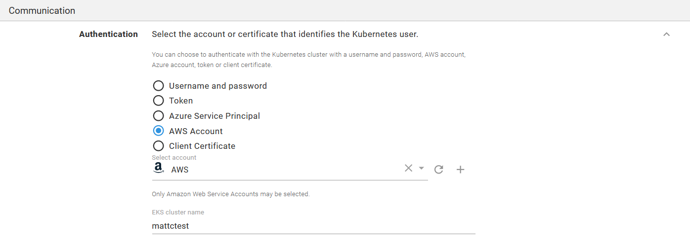
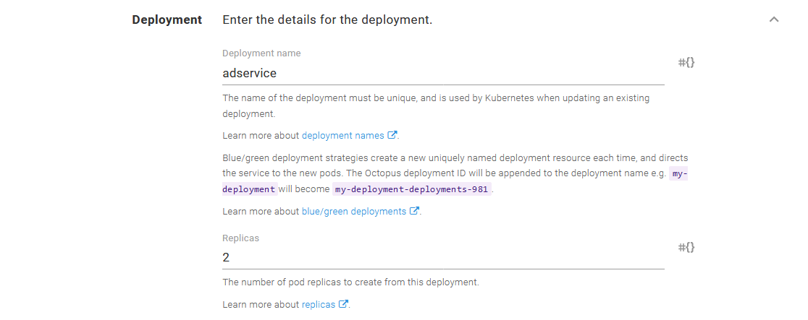
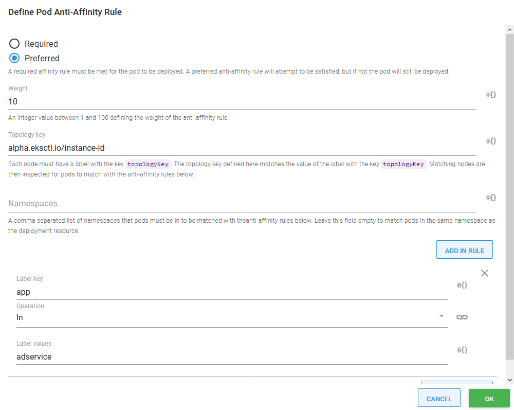
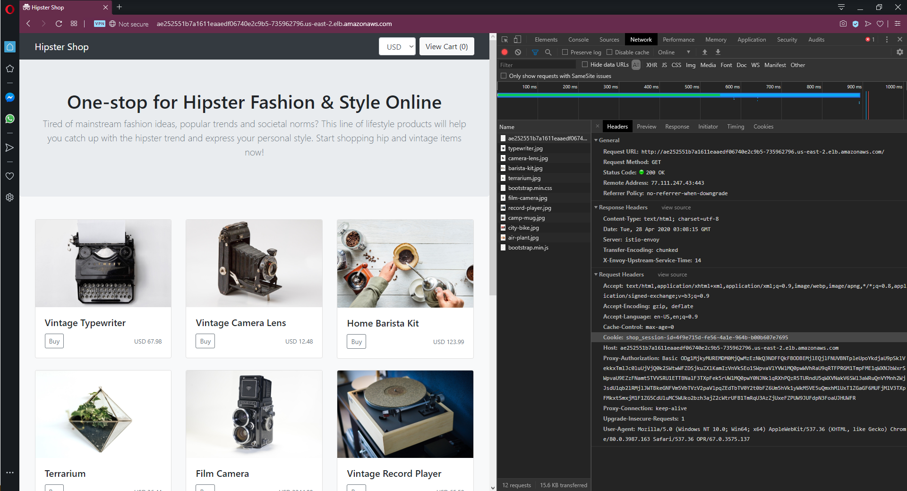

Microservices have emerged as a popular development practice for teams looking to release complex systems quickly and reliably. Kubernetes provides a natural platform for microservices as it handles much of the orchestration requirements imposed by deploying many instances of many individual microservices. On top we have service mesh technologies which lift common networking concerns from the application layer into the infrastrucutre, making it easy to route, secure, log and test network traffic.

Combining these development practices with Kubernetes to create a Continuous integration and delivery (CI/CD) pipeline does require some work however, as a robust CI/CD pipeline must address a number of concerns such as:

* High availability (HA)
* Multiple environments
* Zero downtime deployments
* HTTPS and certificate management
* Feature branch deployments
* Smoke testing
* Rollback strategies

In this blog post I look at how to create the continuous delivery (or deployment) half of the CI/CD pipeline by deploying a sample microservice application created by Google called [Hipster Shop](https://github.com/GoogleCloudPlatform/microservices-demo) to an Amazon EKS Kubernetes cluster, configure the Istio service mesh to handle network routing, and dive into HTTP and gRPC networking to route tenanted network traffic through the cluster to test feature branches.

## Create an EKS cluster

For this blog post we'll be deploying our microservice to a Kubernetes cluster hosted by Amazon EKS. However, we don't rely on any special functionality provided by EKS, so any Kubernetes cluster can be used to follow this post.

The easiest way to get started with EKS is with the [ekscli tool](https://eksctl.io/). This CLI tool abstracts away most of the details associated with creating and managing an EKS cluster, providing sensible defaults to get you up and running quickly.

TODO: Use the community library step to build the cluster.

## Creating the AWS account

Octopus has native support for autheticating to EKS clusters via an AWS account. This account is defined under {{ Infrastructure, Accounts }}.


## Create the Kubernetes target

Kubernetes targets are created under  {{ Infrastructure, Deployment Targets }}. Select the **AWS Account** option in the **Authentication** section, and add the name of the EKS cluster.



Under the **Kubernetes Details** section add the URL to the EKS cluster, and either select the cluster certificate or check the **Skip TLS verification** option.

The default namespace that this target operates in is defined in the **Kubernetes namespace** field.

:::hint
Each step in a deployment process can override the namespace, so it is possible to leave this field blank and reuse one target across multiple namespaces.
:::


:::hint
The Octopus server or workers that execute the steps must have `kubectl` and the AWS `aws-iam-authenticator` executable available on the path. See the [documentation](https://octopus.com/docs/infrastructure/deployment-targets/kubernetes-target#add-a-kubernetes-target) for more details.
:::

## Installing Istio

Istio provides many installation options, but I find the `istioctl` tool to be the easiest.

Download a copy of `istioctl` from [GitHub](https://github.com/istio/istio/releases). The filename will be something like `istioctl-1.5.2-win.zip`, which we rename to `istioctl.1.5.2.zip` and then upload into Octopus. Placing the executable in the Octopus built in feed means we can use it from a script step.

Add a **Run a kubectl CLI Script** step to a runbook, and reference the `istioctl` package:


In the script body, execute `istioctl` as shown below to install Istio into the EKS cluster. You can find more information on these commands from the [Istio documentation](https://istio.io/docs/setup/install/istioctl/). Then add the `istio-injection` label to the namespace that holds our application to enable [automatic Istio sidecar injection](https://istio.io/docs/setup/additional-setup/sidecar-injection/#automatic-sidecar-injection):

```
istioctl/istioctl manifest apply --skip-confirmation
kubectl label namespace dev istio-injection=enabled
```

:::hint
You must use the `--skip-confirmation` argument to prevent `istioctl` waiting forever for input that can not be provided when the tool is run through Octopus.
:::


## Creating a Docker feed

The Docker images that make up our microservice application will be hosted in DockerHub. While Google provides images from their own Google Container Registry, the images do not have SemVer compatible tags, which Octopus requires to sort images during release creation time. We'll also be creating some feature branch images to deploy to the cluster, and so need a public repository we can publish to. A new Docker feed is created under {{Library, External Feeds}}:


## Deploying the microservices

The Hipster Shop sample application provides a [Kubernetes YAML file](https://github.com/GoogleCloudPlatform/microservices-demo/blob/master/release/kubernetes-manifests.yaml) with all the deployments and services needed to run the application.

Each of the individual services will be deployed as a seperate project in Octopus. One of the advantages of microservices is that each service has an independant lifecycle allowing it to be tested and deployed independant of any other service. Creating individual Octopus projects for each microservice allows us to create and deploy releases for just that service.

The first microservice mentioned in the YAML file is called `emailservice`, which we'll deploy in a project called `01. Hipster Shop - Email service`. This microservice has two Kubernetes resources: the deployment, and a service. The YAML for these two resources is shown below:

```YAML
apiVersion: apps/v1
kind: Deployment
metadata:
  name: emailservice
spec:
  selector:
    matchLabels:
      app: emailservice
  template:
    metadata:
      labels:
        app: emailservice
    spec:
      terminationGracePeriodSeconds: 5
      containers:
      - name: server
        image: gcr.io/google-samples/microservices-demo/emailservice:v0.2.0
        ports:
        - containerPort: 8080
        env:
        - name: PORT
          value: "8080"
        # - name: DISABLE_TRACING
        #   value: "1"
        - name: DISABLE_PROFILER
          value: "1"
        readinessProbe:
          periodSeconds: 5
          exec:
            command: ["/bin/grpc_health_probe", "-addr=:8080"]
        livenessProbe:
          periodSeconds: 5
          exec:
            command: ["/bin/grpc_health_probe", "-addr=:8080"]
        resources:
          requests:
            cpu: 100m
            memory: 64Mi
          limits:
            cpu: 200m
            memory: 128Mi
---
apiVersion: v1
kind: Service
metadata:
  name: emailservice
spec:
  type: ClusterIP
  selector:
    app: emailservice
  ports:
  - name: grpc
    port: 5000
    targetPort: 8080
```

This pairing of a deployment and a service resource is a pattern we'll find over and over in the YAML file. The deployments are used to deploy and manage the containers that implement the microservices, while the service resource exposes these containers to the other microservices, and for the front end application also exposing the microservice to end users.

The pattern of combining common Kubernetes resources is exposed in Octopus via the **Deploy Kubernetes containers** step. This opinionated step provides a rich user interface around Kubernetes deployments, services, ingresses, secrets and configmaps, making this step a natural choice to deploy our Hipster Shop microservices.

One of the downside to using the **Deploy Kubernetes containers** step has been how much time it took to translate the properties in an existing YAML file into the user interface. Each setting had to be copyed in manually, which was a significant undertaking.

A recent feature added in Octopus 2020.2.4 is the ability to edit the YAML that is generated by this step directly. Clicking the **EDIT YAML** button for each Kubernetes resource allowed YAML to be copied into the step directly in one go:


In the screenshot below you can see that I have pasted in the YAML that makes up the `emailservice` deployment resource:


Any property from the supplied YAML that matches a field exposed by the form is imported. In the screenshot below you can see the `server` container has been imported complete with environment settings, health checks, resource limits and ports:


:::hint
Not every possible deployment property is recognized by the **Deploy Kubernetes containers** step, and unrecognized properties are ignored during import. The `Deploy raw Kubernetes YAML` step provides a way to deploy generic YAML to a Kubernetes cluster. However, all properties used by the microservices that make up the Hipster Shop sample application are exposed by the **Deploy Kubernetes containers** step.
:::

We'll then import the service YAML for into the **Service** section of the step:


Our microservices won't be deploying ingress, secret or configmap resources, so we can remove these feature from the step by clicking the **CONFIGURE FEATURES** button:


The final step is to reference the containers we have built and uploaded to Docker Hub. The import process referenced the container `microservices-demo/emailservice` that was defined in the deployment YAML. We need to change this to `octopussamples/microservicedemo-emailservice` to reference the container that has been uploaded to by the [OctopusSamples](https://hub.docker.com/u/octopussamples) Docker Hub user:


And with that we have created an Octopus project to deploy `emailservice`, one of the eleven microservices that make up the Hipster Shop sample application. The other microservices are called:

* `checkoutservice`
* `recommendationservice`
* `frontend`
* `paymentservice`
* `productcatalogservice`
* `cartservice`
* `loadgenerator`
* `currencyservice`
* `shippingservice`
* `redis-cart`
* `adservice`

Most of these microservices are deployed with the same deployment and service pairing that we have seen for the `emailservice`. The exceptions are `loadgenerator`, which has no service, and `frontend`, which includes an additional load balancer service that exposes the microservice to public traffic. 

The additional load balancer service can be deployed with the **Deploy Kubernetes service resource** step. This stand alone step has the same **EDIT YAML** button found in the **Deploy Kubernetes containers** step, and so the `frontend-external` service YAML can be imported directly:


## High Availability

Since Kubernetes takes care of provisioning pods in the cluster and has built in support for tracking the health of pods and nodes, we gain a reasonable degree of high availability out of the box. In addition we can often lean on cloud providers to monitor node health, recreate failed nodes, and physically provision nodes across availability zones to reduce the impact of an outage.

However the default settings for the deployments we imported need some tweaking to make them more resilient.

First, we need to increase the deployment replica count, which determines how many pods a deployment will create. The default value is 1, meaning a failure of any single pod will result in a microservice being unavailable. Increasing this value means our application can survive the loss of a single pod. In the screenshot below you can see I have increase the replica count to 2 for the ad service:



Having two pods is a good start, but if both those pods have been created on a single node we still have a single point of failure. To address this we'll use a feature in Kubernetes called pod anti-affinity. This allows us to instruct Kubernetes to prefer that certain pods be deployed on seperate nodes.

In the screenshot below you can see that I have created an preffered anti-affinity rule that instructs Kubernetes to attempt to place pods with the label `app` and value `adservice` (this is one label this deployment assigns to pods) on separate nodes. 

The topology key is the name of a label assigned to nodes that defines the topological group that the node belongs to. In more complex deployments the topology key would be used to indicate details like physical regions nodes were placed in or networking considerations. However in this example we select a label that uniquly idenfities each node called `alpha.eksctl.io/instance-id`, effectivly creating topologies that contain only one node.

The end result is that Kubernetes will try to place pods belonging to the same deployment on different nodes, meaning our cluster is more likely to survive the loss of a single node:



## Zero downtime deployments

Deployment resources in Kubernetes offer two built in strategies for deploying updates.

The first the recreate strategies. This strategy first deletes any existing pods before deploying new ones. The recreate strategy removes the need for two pod versions to coexist, which can be important in situations like when incompatible database changes have been incorporated into the new version. However it does introduce downtime from when the old pods are shut down to when the new pods are fully operational.

The second, and default, strategy is the rolling update stragey. This strategy incrementally replaces old pods with new ones, and can be configured in such as way as to ensure there are always healthy pods available during the update to serve traffic. The rolling update strategy means that both old and new pods run side by side for a short period, so careful attention must be made to ensure clients and datastores can also support both pod versions. The beenfit of this approach is that there is no downtime as some pods are availble to process any requests.

Octopus introduces a third deployment strategy called blue/green. The blue/green strategy is implemented by creating a distinct new deployment resource, which is to say a new deployment resource with a unique name, with each deployment. If a configmap or secret was defined as part of the **Deploy Kubernetes containers** step, distinct new instances of those resources are created as well. Once the new deployment has succeeded and all health checks have passed, the service is updated to switch traffic from the old deployment to the new one. This allows for a complete cutover from the old deployment to the new one with no downtime, and ensures that traffic is only sent to the old or new pods, but not both at the same time.

Selecting either the rolling or blue/green deployment strategies means we can deploy microservices with zero downtime:


:::hint
True zero downtime deployments that result in no requests being lost during an update require some additional work. The blog post (Zero-Downtime Rolling Updates With Kubernetes)[https://blog.sebastian-daschner.com/entries/zero-downtime-updates-kubernetes] provides some tips on how to minimize network distruption during updates.
:::

## HTTPS and certificate management

https://istio.io/docs/tasks/traffic-management/ingress/secure-ingress-sds/

## Feature branch deployments

With a monolithic application, feature branch deployments are usualy straight forward; the entire application is built, bundled and deployed as a single artifact, and maybe backed by a database.

It is a much different scenario with microservices. An individual microservice may only function in a meaningful way when all of it's upstream and downstream dependencies are available to process a request.

The blog post [Why We Leverage Multi-tenancy in Uber’s Microservice Architecture](https://eng.uber.com/multitenancy-microservice-architecture/) discusses two methods for performing integration testing for a microservice architecure: parallel testing, and testing in production.

The blog post goes into some detail about the implementation of these two strategies, but in summary:

* Parallel testing involves testing microservices in a shared staging environment configured like, but isolated from, the production environment.
* Testing in production involves deploying the microservice under test into production, isolating it with security policies, and directing a distinct subset of traffic to it.

The blog post goes on to advocate for testing in production, citing these limitations of parallel testing:

* Additional hardware cost
* Synchronization issues (or drift between the staging and production environments)
* Unreliable testing
* Inaccurate capacity testing

Few development teams will have embraced microservices to quite the extent that Uber has, and so I suspect for most deploying microservice feature branches will involve a solution somewhere between Uber's descriptions of parallel testing and testing in production. Specifically, here we'll look at how a microservice feature branch can be deployed alongside an existing version in a staging environment and have a subset of traffic directed to it.

Before we being, we need to briefly recap what a service mesh is, and how we can leverage the Istio service mesh to direct traffic independantly of the microservices.

### What is a service mesh?

Before the days of service meshes, networking functionality was much like an old telephone switchboard. Applications were like individuals placing a telephone call; they knew who they needed to communicate with, and reverse proxies like NGINX would function as the switchboard operator to connect the two parties. This infrastructure works so long as all parties in this transaction are well know and the ways in which they communiate are relatively unchanging.

Microservices then represent the rise of mobile phones. There are signifnantly more devices to be connected together, roaming across the network in unpredictable ways, with each individual device often requiring its own unique configuration.

Service meshes were designed to accomodate the increasingly intricate and dynamic requirements of large numbers of services communicating with each other. In a service mesh, each service takes responsibility for defining how it will accept requests; what common networking functionality like retries, circut breaking, redirects and rewrites it needs; avoids a central "switchboard" that all traffic must pass through; and mostly does this without the individual applications needing to be aware of how their network requests are being processed.

Service meshes are rich platforms that offer a great deal of functionality, but for the purposes of deploying a microservice feature branch, we are most interesting in the ability to inspect and route network traffic.

### What traffic are we routing?

Below is the architecture diagram showing the various microservices that make up the Hipster Shop, and how they communicate:


What you will notice from this diagram is that public traffic from the Internet enters the application via the frontend. This traffic is plain HTTP.

The communicate between the microservices is then performed with [gRPC](https://grpc.io/), which is:  

> A high-performance, open source universal RPC framework

Importantly, under the hood gRPC uses HTTP2. So to route traffic to a microservice feature branch deployment, we will need to inspect and route HTTP traffic.

### Routing HTTP traffic

The Istio [HTTPMatchRequest](https://istio.io/docs/reference/config/networking/virtual-service/#HTTPMatchRequest) defines the properties of a request that can be used to match HTTP traffic. The properties are reasonably comprehensive including URI, scheme, method, headers, query parameters, port and more.

In order to route a subset of traffic to a feature branch deployment, we need to be able to propogate additional information as part of the HTTP request in a way that does not interfeer with the data contained in the request. The scheme (i.e. HTTP or HTTPS), method (GET, PUT, POST etc), port, query params (the part of the URI after a question mark) and the URI itself all contain information that is very specfic to the request being made, and modifying these is not an option. This leaves the headers, which are key value pairs often modified to support request tracing, proxying and other metadata.

Looking at the network traffic submitted by the browser when interacting with the Hipster Shop frontend, we can see that the `Cookie` header likely contains a useful value we can inspect to make routing decisions. The application has persisted a cookie with a GUID identifying the browser session, which as it turns out is the process this sample application implements to identify users. Obviously a real world example would have an authentication process to identify users, but for our purposes a randomly generated GUID will do just fine.



Armed with a HTTP header we can inspect and route, the next step is to deploy a feature branch.

### Creating a feature branch Docker image

Hipster Shop has been written in a variety of languages, and the frontend component is written in Go. We'll make a small change to the [header template](https://github.com/GoogleCloudPlatform/microservices-demo/blob/master/src/frontend/templates/header.html) to include the text **MyFeature**, making it clear that this code represents our feature branch.

We'll build a Docker image from this branch and publish it as `octopussamples/microservicedemo-frontend:0.1.4-myfeature`. Note that the tag of `0.1.4-myfeature` is a SemVer string, which allows this image to be used as part of an Octopus deployment.

### Deploying the feature branch

In the Octopus project that deploys the frontend application, we define two channels. 

The **Default** channel has a version rule that requires SemVer prerelease tags to be empty with a regular expression of `^$`. This rule ensures this channel only matches versions (or Docker tags in our case) like `0.1.4`.

The **Feature Branch** channel has a version rule that requires SemVer prerelease tags to *not* be empty with a regular expression of `.+`. This channel will match versions like `0.1.4-myfeature`.

We then add a variable to the deployment called `FeatureBranch` with the value of `#{Octopus.Action.Package[server].PackageVersion | Replace "^([0-9\.]+)((?:-[A-Za-z0-9]+)?)(.*)$" "$2"}`. This variables takes the version of the Docker image called `server`, captures the prerelease and leading dash in a regular expression as group 2, and then prints only group 2. If there is no prerelease, the variable resolves to an empty string.


This variable is then appended to the deployment name, the deployment labels, and the service name. Changing the name of the deployment and service ensure we are creating new resources with the name of `frontend-MyFeature` alongside the existing resources called `frontend`:


*The summary text shows the name of the deployment and the labels*


*The summary text shows the name of the service*

### Eposing the frontend via Istio

To this point we have not deployed any Istio resources. The 


## Smoke testing

HTTP test community step library

## Rollback strategies

Deployment rollback or deploy previous Octopus version

## Multiple environments

Different namespaces or different clusters