In my previous article, [Re-thinking feature branch deployments]( blog/2020-06/rethinking-feature-branch-deployments/index.md), I shared how I’ve adjusted my thinking about feature branch deployments.  It’s one thing to write thought experiments like that article, but it’s another to put that into practice.  In this article, I describe how I set up a database deployment process for feature branches.

!toc

## Quick recap

The TL;DR; of [Re-thinking feature branch deployments]( blog/2020-06/rethinking-feature-branch-deployments/index.md) is:

The static workflow of **{{Dev, Test, Staging, Production}}** does not work when using git.  Git makes it incredibly easy to create feature branches.  That static workflow essentially required everyone to check in their code to a trunk (master or development) to be appropriately tested.  That resulted in three problems:

1. Unfinished code makes its way into `master` and needs to be tested.
2. There is no clear path to **Production** for bug fixes, requiring a workaround, such as setting up a bug fix branch consisting of just {{staging, production}}.
3. It is common for developers to be working work on 2 to N features at the same time.  That means multiple merges of unfinished code into a trunk.  That increases the chance of an incorrect merge conflict resolution, which, in turn, slows down testing and development.

The following changes should be made to solve those issues:

1. Combine **Dev** and **Test** into one environment: **Test**.
2. Each feature branch should be given a separate sandbox in **Test**.
3. After a feature branch has been tested and verified by QA, it should be merged into master.
4. The deployments for master start in **Staging** and never goes through **Test**.
5. ** Test** becomes a dynamic environment, with resources being added and removed as needed.  **Staging** and **Production** are static and are stable.

The underlying goal is code shouldn’t be merged to `master` until it is ready to go to **Production**.  

## Feature branch database deployments business rules

Naturally, there are a lot of questions when looking at those changes.    

- When will the feature branch sandbox be created?  
- Should it be a fresh database, or should a backup be restored?  
- If it is a restored backup, what should it be a back up of?  Production or staging?  
- How often should that backup be made?  
- Finally, when does that sandbox get torn down?

Those questions are only around the creation of the feature branch sandboxes in **Test**! There are a few other questions I typically encounter.  A lot of these questions are focused on building trust in the database deployment process.  

- When should the DBAs get involved?  **Production** is too late, and when the feature branch is created in ** Test** is too early.
- Who should trigger the deployment to **Production**?
- Can the **Production** deployment be scheduled, and only page the DBAs when something goes wrong?
- Can we see what is going to **Production** without doing a **Production** deployment?

For my process, I made the following decisions:

1. Each deployment will check for the feature branch database, if it doesn’t see it, create a new one.
2. When creating a feature branch database, restore a copy of **Staging**.
3. The **Staging** backup will be created on each deployment to **Staging**.
4. Backup and then delete the feature branch database when it is merged into master.
5. The **Staging** deployment will also generate a delta report for **Production**.  This way, the DBAs approve a release once.
6. The DBAs will approve all deployments to **Staging**.  
7. Logic will be in place to ensure DBAs only _have_ to approve certain schema changes; create table, drop table, create view, drop view, alter table, etc., to keep the signal to noise ratio low.
8. The DBAs will trigger the **Production** deployment.  They can either schedule it or start it right away.

It is critical to involve the DBAs earlier than the **Production** deployment in the development lifecycle.  They are responsible for keeping **Production** running, and asking them to quickly review a change during a **Production** deployment sets them up for failure. That’s how bugs slip through.  DBAs are busy individuals, they can be consulted on potential database changes, but they shouldn’t be asked to approve a database change while a feature is being developed.  The table structure could look vastly different between when a feature starts development and when the feature is finally signed off on by QA.  

Another option is to include DBAs as reviewers on pull requests.  This way, code isn’t merged into `master` that isn’t ready to go to **Production**.  All of this depends on the number of DBAs, the number of teams they have to support, and the number of changes being merged to `master` on a given day.  Asking a team of two DBAs to review all pull requests for twenty teams who merge to `master` an average of once or twice a day is setting the DBAs for failure.  

## Octopus Deploy configuration

For this article, I deploy to SQL Server hosted in [AWS RDS](https://docs.aws.amazon.com/AmazonRDS/latest/UserGuide/Welcome.html).  I chose AWS RDS for no other reason than I was asked to set up an example using AWS RDS.  About 95% of what I do in this example project can be done in Azure SQL or self-hosted SQL Server.  I leverage a few features specific to AWS RDS, but not many.

You can find this sample project/space located on our public [samples instance](https://samples.octopus.app/app#/Spaces-106).  You can log in as a guest and poke around.

### Lifecycles

I created two lifecycles in Octopus Deploy, `AWS Default Lifecycle` and `AWS Feature Branch Lifecycle`.  I used the prefix `AWS` to keep them separate from my other projects as I built out this example:

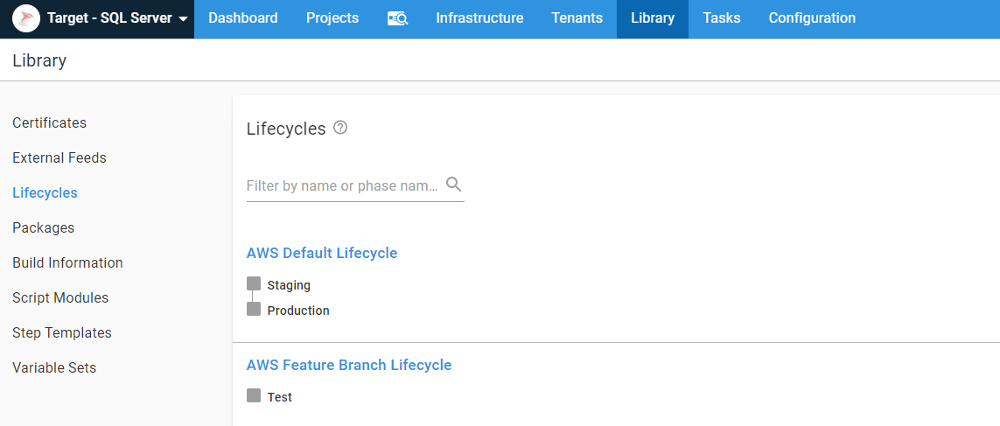

### AWS Accounts

I am using IaC to spin up and down AWS RDS instances.  The IaC technology I chose was [AWS CloudFormation](https://aws.amazon.com/cloudformation/) because my co-worker Shawn already had an RDS example for PostgreSQL I could copy and manipulate for SQL Server.  In order to invoke CloudFormation from Octopus, I needed to register some AWS accounts in Octopus:

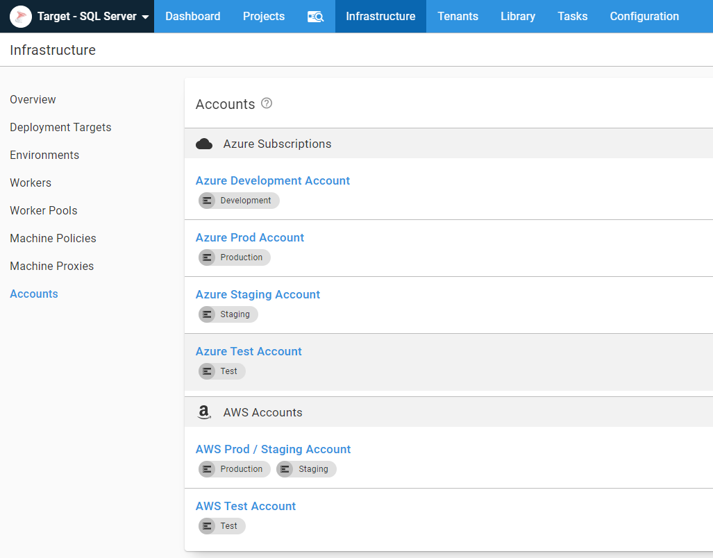

### Static AWS infrastructure and library variable sets

For my example, I used IaC, or Infrastructure as Code, to spin up and down AWS RDS instances.  In the real world, I don’t think this is realistic, especially for **Production** and **Staging** databases.  Even when I am using the IaC functionality in AWS, I like to have some static infrastructure, namely [VPCs](https://aws.amazon.com/vpc/), [security groups](https://docs.aws.amazon.com/vpc/latest/userguide/VPC_SecurityGroups.html), and [subnets](https://docs.aws.amazon.com/vpc/latest/userguide/VPC_Subnets.html).  While it’s possible to spin them up and down using IaC, it isn’t practical in a real-world scenario.  A lot of companies like to create P2P VPN connections between their data center and AWS.  You’d have to spin that up using IaC, which if you can get that to work, awesome.  I found it was a bit finicky.  

I know I’ll share VPCs, security groups, subnets, etc. across projects, so I like to create multiple variable sets to store different groups of variables.  I never recommend having one massive **Global** variable set.  After a bit of time, it becomes a [junk drawer](https://www.npr.org/sections/theprotojournalist/2014/08/15/337759135/what-your-junk-drawer-reveals-about-you) of variables.  

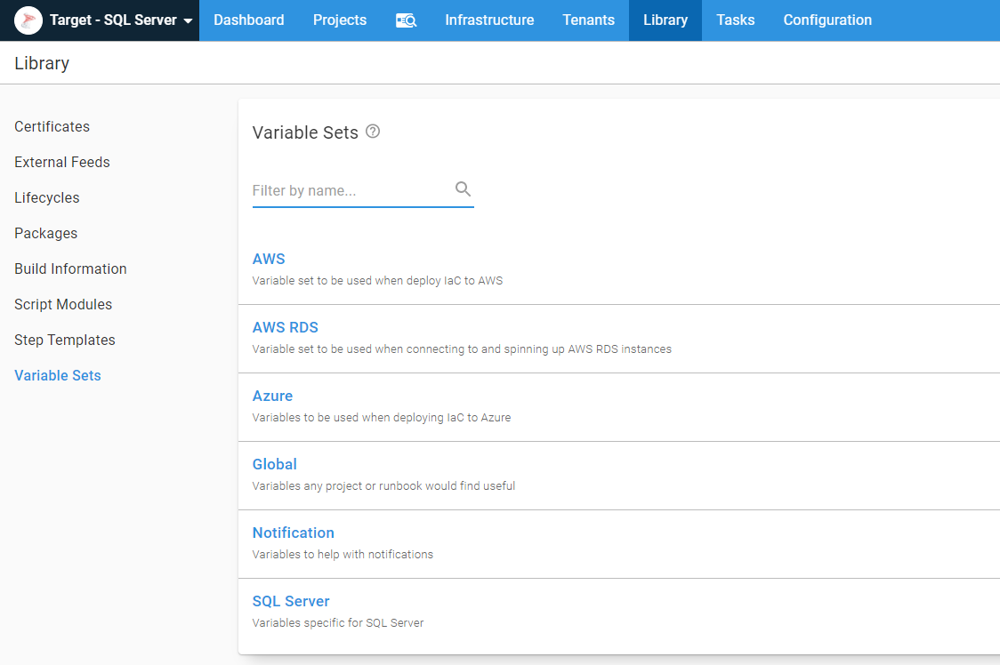

The variable sets themselves have the pertinent variables in them.  I typically wouldn’t make security groups and subnets sensitive variables.  However, this instance is public, and I didn’t want to share that information with the world:

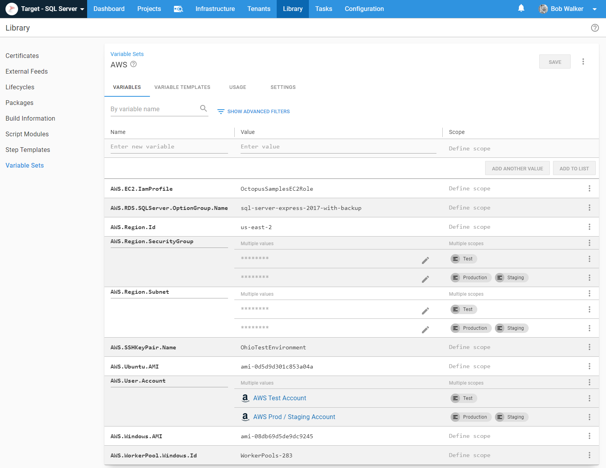

You’ll notice my variables follow a namespacing format of `[variablesetname].[group].[variablename]`.  I do this to make it easier to find variables later.  Variables that start with `Project` I know are stored in the project variables, whereas variables starting with `AWS` I know are in the `AWS` variable set.  It also helps prevent variable name collision.

### Workers and security

It is not wise to expose AWS RDS servers to the Internet, even sample ones I am spinning up and down.  I am going to use S3 to store backups of my database.  It is not wise to expose that either.  Not even to Octopus Cloud.  I configured my security group to only accept requests from port 80, port 443, and port 10933.  I created an EC2 instance in AWS and registered it as a [worker](https://octopus.com/workers).  That EC2 instance has permissions to upload to S3 as well as connect to AWS RDS instance over port 1433:

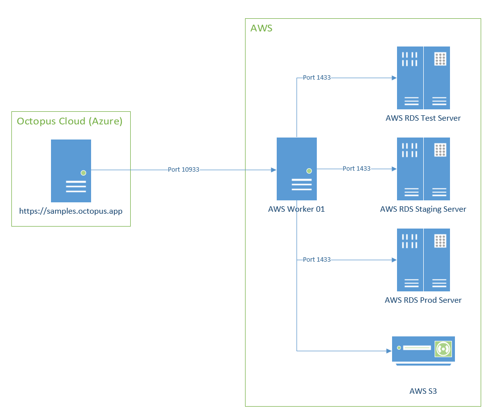

In a real-world, **Production** configuration, I would use more than one worker.  I’d have multiple worker pools, one for different environments, and use variable scoping to pick the appropriate worker pool on the fly.  But this example is complex enough, no need to add to the complexity.

## Octopus Deploy project

Now that all the scaffolding is out of the way, it is time to focus on the project.  

### Community step templates
I use a number of step templates from the community library.  Below is the list so you can install them yourself:

- [Run Octopus Deploy Runbook](https://library.octopus.com/step-templates/0444b0b3-088e-4689-b755-112d1360ffe3/actiontemplate-run-octopus-deploy-runbook)
- [Redgate - create database release (worker friendly)](https://library.octopus.com/step-templates/47d29b57-5bca-4205-ac62-ce10cdf8bab9/actiontemplate-redgate-create-database-release-(worker-friendly))
- [Redgate - deploy from database release (worker friendly)](https://library.octopus.com/step-templates/adf9a009-8bbb-4b82-8f3b-6fb12ef4ba18/actiontemplate-redgate-deploy-from-database-release-(worker-friendly))
- [Slack - send simple notification](https://library.octopus.com/step-templates/99e6f203-3061-4018-9e34-4a3a9c3c3179/actiontemplate-slack-send-simple-notification)
- [SQL - add database user to role](https://library.octopus.com/step-templates/1b6b07e5-aa4a-4fc2-b057-afcffada279c/actiontemplate-sql-add-database-user-to-role)
- [SQL - create database user if not exists](https://library.octopus.com/step-templates/9ce258b6-d75d-4fb5-884b-7cd5d7311300/actiontemplate-sql-create-database-user-if-not-exists)
- [SQL - delete database](https://library.octopus.com/step-templates/236ee295-056e-44c1-84ab-da4ae6bd8283/actiontemplate-sql-delete-database)

### Runbooks

I have five [runbooks](https://octopus.com/runbooks) in my project to handle the various maintenance tasks for feature branch deployments.  I put all of them in the same project to make it easier for you, the reader, to find them when looking at our [samples instance](https://samples.octopus.app/app#/Spaces-106/projects/redgate-feature-branch-example/operations/runbooks).  With the Run Octopus Deploy Runbook step template I created, the runbooks can exist in any project.  If I were setting this up in the real world, all of these runbooks would be in a separate _feature branch_ project for any process to leverage.

- [Create AWS Redgate Masked Database Backup](https://samples.octopus.app/app#/Spaces-106/projects/redgate-feature-branch-example/operations/runbooks/Runbooks-365), this creates a masked database backup which will be restored when creating feature branches.
- [Delete AWS Redgate Feature Branch Database](https://samples.octopus.app/app#/Spaces-106/projects/redgate-feature-branch-example/operations/runbooks/Runbooks-367), this does what it says on the tin, deletes a feature branch database.
- [Restore AWS Redgate Masked Backup for Feature Branches](https://samples.octopus.app/app#/Spaces-106/projects/redgate-feature-branch-example/operations/runbooks/Runbooks-366), this creates a new database from the masked database backup.
- [Spin Up AWS Redgate SQL Server RDS Server](https://samples.octopus.app/app#/Spaces-106/projects/redgate-feature-branch-example/operations/runbooks/Runbooks-354), this creates a new AWS RDS SQL Server.
- [Tear Down AWS Redgate SQL Server RDS Server](https://samples.octopus.app/app#/Spaces-106/projects/redgate-feature-branch-example/operations/runbooks/Runbooks-355), this deletes the AWS RDS SQL Server.

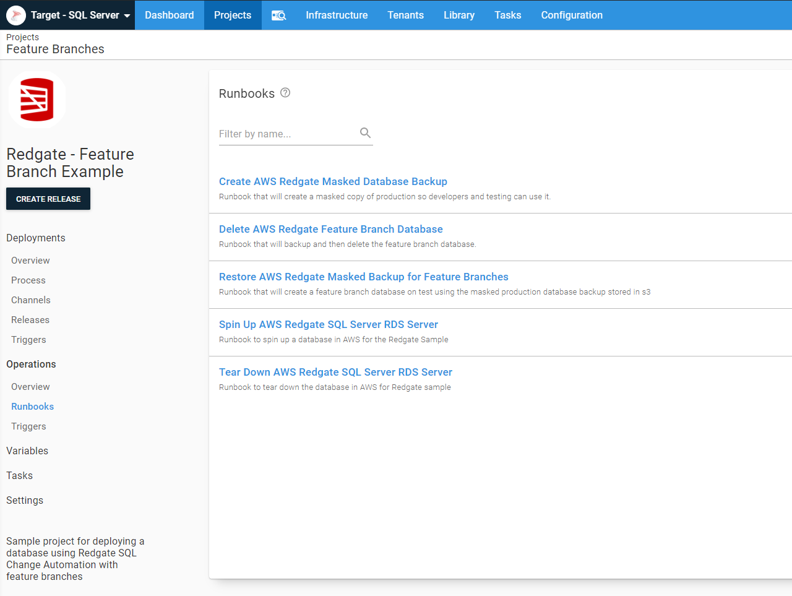

In your use case, you are probably not spinning up and down SQL Servers.  The three runbooks to focus on are the create a masked database backup, delete feature branch database, and restore the masked backup for feature branches.

#### Create a masked database backup

One of the features in AWS RDS I discovered during all of this was the ability to [backup a database to S3](https://aws.amazon.com/rds/details/backup/).  That is so cool; I don’t have to worry about setting up a file share and getting all the drives mapped.  I run the stored procedure `msdb.dbo.rds_backup_database` to back up the database to S3 or `msdb.dbo.rds_restore_database` to restore the database.  I discovered invoking those stored procedures kick off the job.  You have to run `msdb.dbo.rds_task_status` to check on the status of the backup or restore.  I created a couple of custom step templates on our samples instance if you’re interested in trying them out:

- [AWS RDS SQL Server - Restore from S3 Bucket](https://samples.octopus.app/app#/Spaces-106/library/steptemplates/ActionTemplates-385?activeTab=step)
- [AWS RDS SQL Server - Backup to S3 Bucket](https://samples.octopus.app/app#/Spaces-106/library/steptemplates/ActionTemplates-384?activeTab=step)

In this [particular runbook](https://samples.octopus.app/app#/Spaces-106/projects/redgate-feature-branch-example/operations/runbooks/Runbooks-365/steps/RunbookProcess-Runbooks-365), the process is to back up the existing `Staging` database to S3, restore a copy of that database called [Database Name]-Masked.  Then the process will run a cleanup script to sanitize `Staging`.  After that, the process creates a fresh backup in an S3 bucket for feature branches to use:

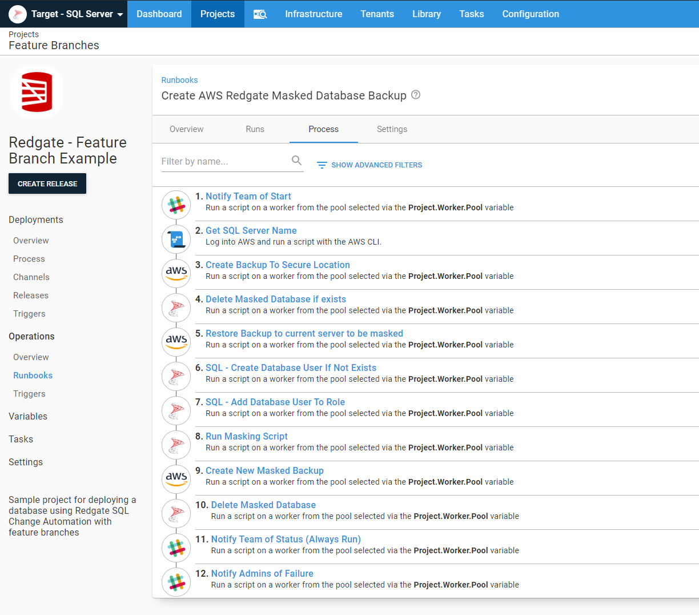

There are a few techniques for masking data, and there are tools you can purchase, such as [Redgate’s Data Masker for SQL Server](https://www.red-gate.com/products/dba/data-masker/) or you can roll your own masking script.  For the purposes of this example, I opted to roll my own, as I am only concerned with one table.  

#### Delete feature branch database

The delete feature branch runbook required a bit more work than I originally thought.  At first, I was going to just delete the database.  But as I thought about it more, it made more sense to the first backup the database then delete it.  If I ever needed to spin up the database again to fix a bug, I could use that backup.  Adding the backup step made things a bit trickier as I needed to first check to see if the database existed.  The stored procedures provided by AWS to backup a database fail if the database doesn’t exist:

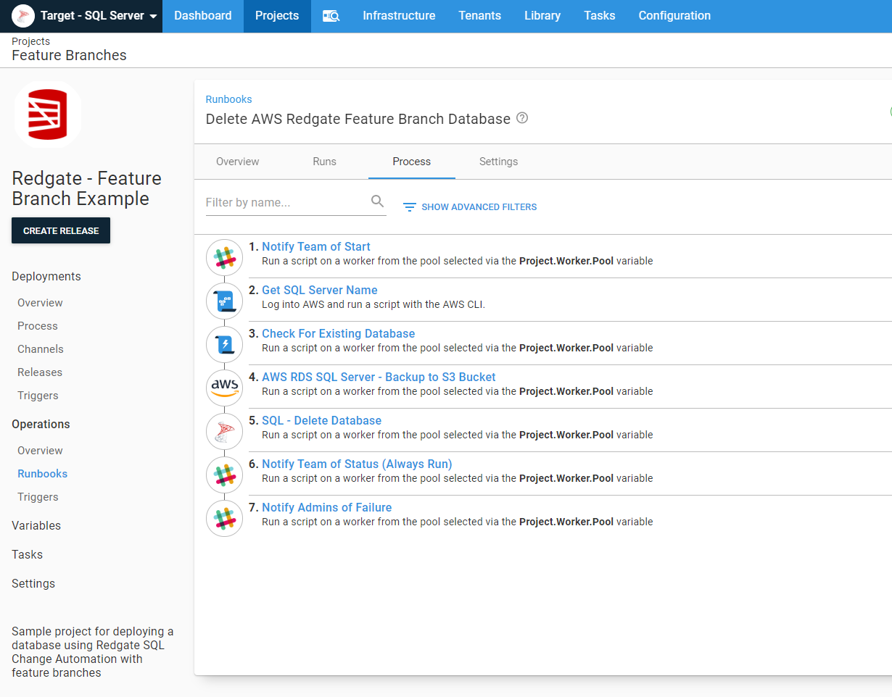

The `Check for Existing Database` step sets an [output variable](https://octopus.com/docs/projects/variables/output-variables) set to `True` or `False`.  The run conditions on the backup and delete steps use that value in a [run condition](https://octopus.com/docs/deployment-process/conditions#variable-expressions):

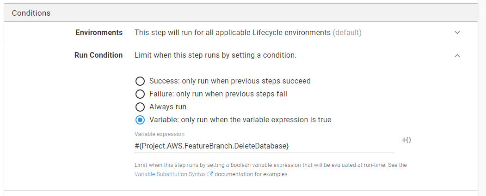

#### Restore masked database backup for feature branches

The restore masked database backup runbook has a similar `Check for Existing Database` check as the delete step:

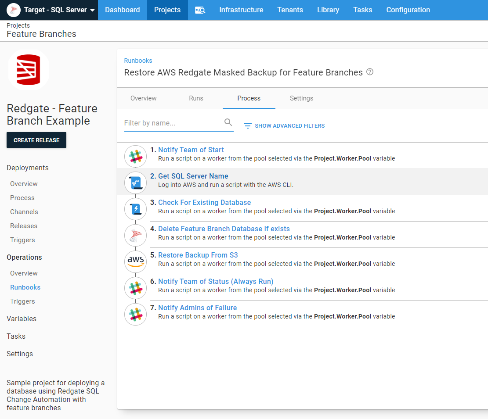

Except in this runbook, it has a bit more logic included.  The vast majority of the time, the process should only create a new feature branch database if that database doesn’t yet exist.  However, there are a few use cases where they need to start all over with a fresh database copy.  To help with that, I created a [prompted variable](https://octopus.com/docs/projects/variables/prompted-variables) with a default value of `False`.  When that is set to `True`, a fresh copy of the database will be created:


### Channels

Outside of the various variables I need to set, the final piece of project scaffolding is the [project channels](https://samples.octopus.app/app#/Spaces-106/projects/redgate-feature-branch-example/deployments/channels).  Every project has a `Default` channel which is created when the project is created.  I added another channel for `Feature Branches`:

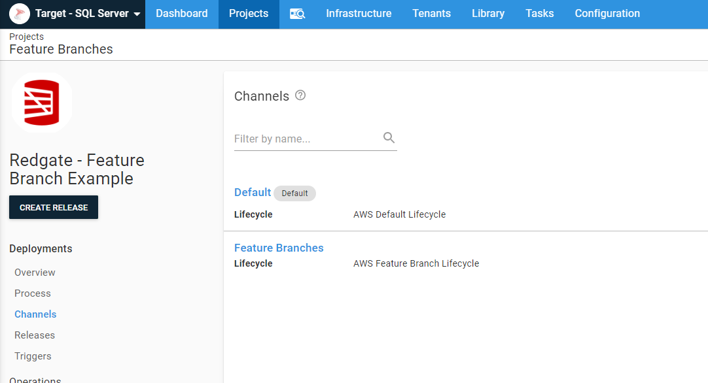

### Deployment process

I’m not going to sugar-coat it, in order to meet all the business rules from earlier, the deployment process is complex:

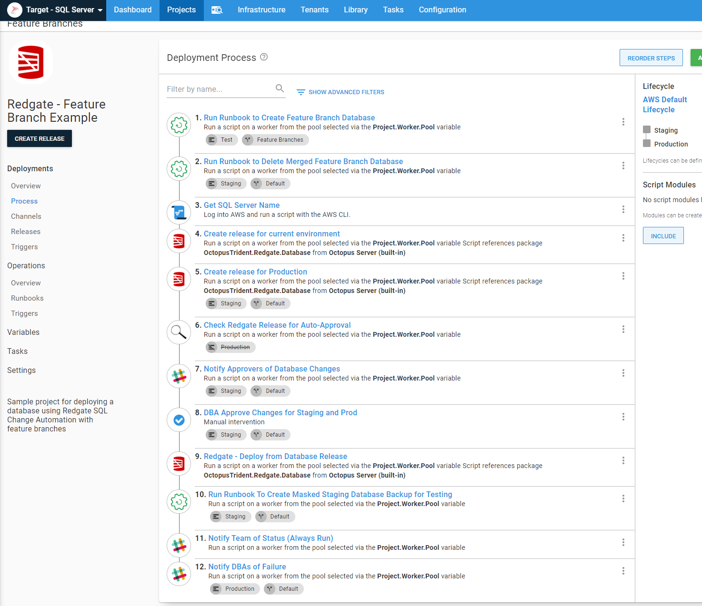

The first two steps create or tear down the feature branch scaffolding.  I _don’t_ have to specify the channels, as **Test** and **Staging** are in different channels anyway, but I did that to make it easier for others to read:


You might be wondering, how would Octopus know the name of the feature branch to manipulate the appropriate infrastructure?  It doesn’t.  The build server passes in that information via prompted variables.  When the merged branch value is empty, it will skip the delete feature branch database step:


You’ve probably seen the next step in every screenshot of the runbooks’ processes:


That is necessary because the process is spinning up and down AWS RDS Servers.  It runs a quick CLI script to pull the full instance name to be used in connection strings:


The next six steps in the deployment process do the actual deployment.  It generates delta scripts, looks at those delta scripts for specific SQL statements, gets approval, and finally deploys the changes:

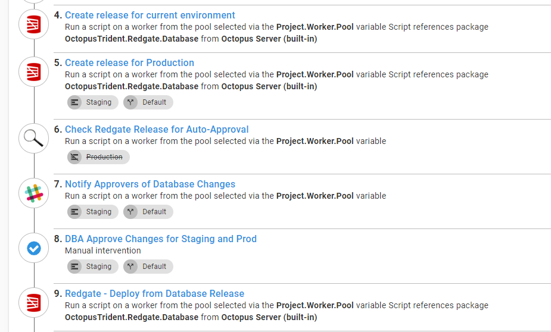

The `Check SQL Artifacts for Schema Change Commands` is a [custom step template](https://samples.octopus.app/app#/Spaces-106/library/steptemplates/ActionTemplates-341?activeTab=step) I wrote.  You can read more about that step in a [previous article](https://octopus.com/blog/autoapprove-database-deployments).

You will notice the delta script for **Production** is getting generated in **Staging**.  This is not the delta script used in the **Production** deployment.  This is to give the DBA an idea of what will be deployed to **Production** later.  99% of the time, it works perfectly fine for approvals.  There is a risk of drift between when that delta script is generated and when they actually ran.  But, on the whole, that risk is small, and the amount of drift is typically tiny.  By approving everything in **Staging**, the DBA can then schedule the deployment to **Production** rather than having to be online.  

The final steps in the deployment process handle cleanup and notification. After each **Staging** deployment, a fresh masked copy of the database is created.  This ensures feature branches always have the latest schema changes:

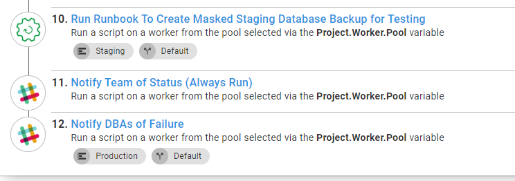

## Build Server

With static environments, the build server process was straight forward:

1. Build
2. Test
3. Push to Octopus Deploy
4. Create a release in Octopus Deploy
5. Deploy release

Now the build server needs to make a few decisions prior to calling Octopus Deploy.  It must know if it is on a feature branch, on the master branch, or if a merge just happened.  The event that triggered the build will alter what information the build server sends to Octopus.  The key differences are:

- Check into `Master`
    - If merged pull request, get feature branch name, send that to Octopus Deploy as the _merged branch_ value.
    - Set the destination environment to **Staging**.
    - Set the package version number to a standard version number, such as `2020.2.1.{Build Number}`.
    - Set channel name to "Default".
- Check into a feature branch
    - Pull the feature branch name and send that to Octopus Deploy as the _feature branch_ value.
    - Set the destination environment to **Test**.
    - Set the package version number to 2020.99.99.{Build Number}-{Feature Branch Name}.
    - Set channel name to "Feature Branches".

This is the PowerShell script from my [GitHub Action](https://github.com/OctopusSamples/OctopusTrident/blob/master/.github/workflows/packageredgate.yml) for this example:

```PowerShell
$branchName = ((${env:GITHUB_REF} -replace "refs/heads/", "") -replace "feature/", "") -replace "hotfix/", ""
Write-Host "$branchName"  

$versionFromFile = Get-Content versionprefix.md
Write-Host "Found $versionFromFile in versionprefix.md"
$versionNumber = "$versionfromFile.${env:GITHUB_RUN_NUMBER}"

$channelName = "Default"
$deployEnvironment = "Staging"
$mergedBranch = ""

$commitMessage = git log -1 --pretty=oneline
Write-Host "The commit message is: $commitMessage"

if ($branchName -ne "master")
{
    $versionNumber = "2020.99.99.${env:GITHUB_RUN_NUMBER}-$branchName"    
    $channelName = "Feature Branches"
    $deployEnvironment = "Test"           
}
elseif ($branchName -eq "master" -and $commitMessage -like "*Merge pull request*")
{          
    $indexOfSlash = $commitMessage.ToString().IndexOf('/')
    Write-Host "The index of the slash is $indexOfSlash"
    $mergedBranch = $commitMessage.SubString($commitMessage.IndexOf("/") + 1)
    Write-Host "The merged branch before replacement is $mergedBranch"
    $mergedBranch = ($mergedBranch -replace "feature/", "") -replace "bugfix/", ""          
    Write-Host "The merged branch is now $mergedBranch"
}

Write-Host "Setting environment variable PACKAGE_VERSION to: $versionNumber"
Write-Host "Setting environment variable BRANCH_NAME to: $branchName"
Write-Host "Setting environment variable CHANNEL_NAME to: $channelName"
Write-Host "Setting environment variable ENVIRONMENT_NAME to: $deployEnvironment"
Write-Host "Setting environment variable MERGED_BRANCH to: $mergedBranch"

echo "::set-env name=BRANCH_NAME::$branchName"
echo "::set-env name=PACKAGE_VERSION::$versionNumber"
echo "::set-env name=CHANNEL_NAME::$channelName"
echo "::set-env name=ENVIRONMENT_NAME::$deployEnvironment"
echo "::set-env name=MERGED_BRANCH::$mergedBranch"
```

## Conclusion

The concept of standing up sandboxes for feature branches is a passion of mine.  I have worked at a lot of places where we didn’t do that, and it was quite a headache.  It is not an easy task, but it is made easier by leveraging multiple features in Octopus Deploy.  I used a number of newer features in Octopus Deploy.  Runbooks made a huge difference and made things so much easier.  But thinking back, I wish I knew about this approach because I know I could’ve gotten something working, even on versions 3.x of Octopus Deploy.  It would’ve involved a lot more API scripts, but I know I could get it working.

It is hard to believe this is actually a simple example.  In this article, I only covered the database; I didn’t cover the web server or application server.  Along with that, I didn’t cover big projects involving multiple applications.  For this article, I wanted to focus on one thing, the database.  My thinking was if I could solve for the database, the rest should be fairly straight-forward.   

Until next time, Happy Deployments!
