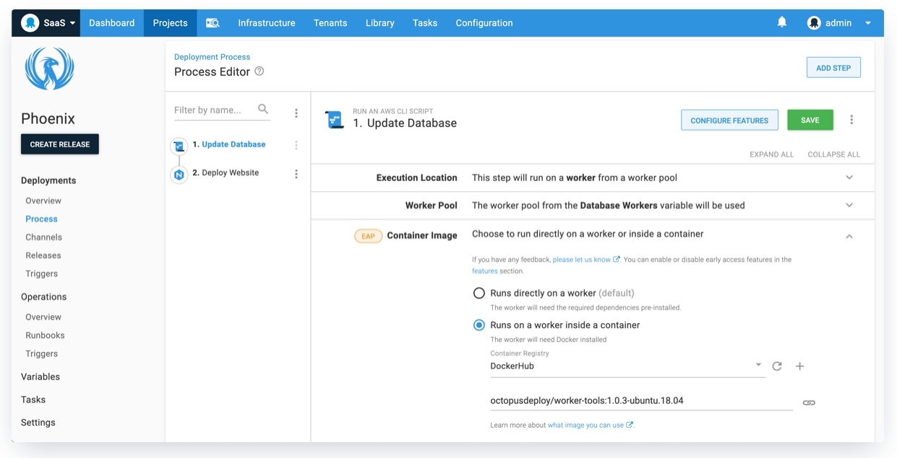
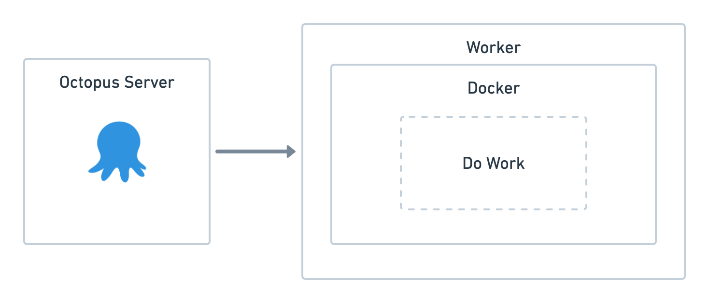
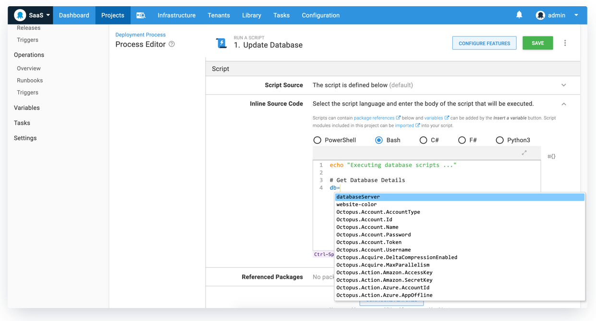

We’re pleased to ship Octopus 2020.2, our second release of the year. These are the helpful updates and benefits included in this release:

* [Execution containers for workers (Early Access)](blog/2020-06/octopus-release-2020-2/index.md#execution-containers-for-workers) let you execute deployment work in isolation without the need to manage dependencies and containers.
* [Integrated change management with Jira Service Desk](blog/2020-06/octopus-release-2020-2/index.md#integrated-change-management-with-jira-service-desk) lets teams create change requests during their deployment automatically.
* [Better run conditions](blog/2020-06/octopus-release-2020-2/index.md#better-run-conditions) adds deployment process improvements, including rolling deployment and machine level variable conditions.
* [Fast variable lookups with our improved code editor](blog/2020-06/octopus-release-2020-2/index.md#fast-variable-lookups-in-our-updated-code-editor) unlocks the ability to quickly add Octopus variables into your custom scripts without touching the mouse.

This release is the [second of six in 2020](/blog/2020-03/releases-and-lts/index.md), and it includes six months of long term support. The following table shows our current releases with long term support.

| Release               | Long term support           |
| --------------------- | --------------------------- |
| Octopus 2020.2        | Yes                         |
| Octopus 2020.1        | Yes                         |
| Octopus 2019.12       | Yes                         |
| Octopus 2019.9        | Expired                     |
| Octopus 2019.6        | Expired                     |

Keep reading to learn more about the updates.

## Execution containers for workers



Workers were introduced in Octopus 2018.7, and they help teams move deployment work off the Octopus Server and onto other machines running in worker pools. Common scenarios for workers include database deployments and cloud deployments, where you can create a pool of workers for that specific purpose. Worker pools can also be scoped to environments to suit your needs.

In this release, we added support to execute deployment work in isolated containers on workers, and we shipped a collection of official container images bootstrapped with standard deployment tooling.

Previously, you needed to ensure the machines in your worker pools (including the built-in worker pool) have the necessary tools required for your deployments, and you needed to maintain their OS and tool versions. This approach could also be problematic if different teams required different versions of specific tools that don’t install side by side. Also, Octopus bundled some tools, but it was still a challenge to keep them up to date.



**Execution containers for workers** resolves this issue and more.

* **Isolated and fast execution of deployment work.** Octopus is using [Docker](https://docker.com) to execute your scripts or other deployment work in the context of a container. This method provides fast and efficient execution in complete isolation.
* **Simplified dependency management with pre-built [Octopus tooling container images](https://hub.docker.com/r/octopusdeploy/worker-tools)**. There is now far less friction required to ensure you’re using the right versions of the tooling that you need for your deployments.

Our pre-built images include cross-platform support for Windows 2019 and Ubuntu 18.04, and you can select the `latest` image tag or a specific version based on major, minor, or specific patch versions. We are launching images with the following tools pre-installed.

* Powershell Core
* .NET Core SDK (3.1 LTS)
* Java SDK
* Azure CLI
* Az Powershell Core Modules
* AWS CLI
* Node.js
* kubectl
* Helm 3
* Terraform
* Python
* Azure Function Core Tools
* Google Cloud CLI
* ScriptCS (Window-only)
* F# (Windows-only)

It’s also possible to build container images with your team’s exact requirements. For example, you can build a customized image with a specific version of kubectl with the following command:

```
docker build -t my-company/worker-tools --build-arg Kubectl_Version=X.Y.Z MyDockerFile
```

[Learn more](https://octopus.com/docs/deployment-process/execution-containers-for-workers)

## Integrated change management with Jira Service Desk


With Octopus 2020.2, we shipped our initial support for integrated change management with Jira Service Desk Cloud. It is now possible to automatically create change requests during a deployment with our new Jira Service Desk Change Request step.

This integration works with our [Octopus Deploy for Jira plugin](https://marketplace.atlassian.com/apps/1220376/octopus-deploy-for-jira) and requires the [ITSM early access](https://support.atlassian.com/jira-service-desk-cloud/docs/set-up-an-itsm-project/). See [Atlassian’s documentation](https://support.atlassian.com/jira-service-desk-cloud/docs/set-up-change-management-for-your-service-desk/) for more information on configuring the Octopus Deploy integration within your ITSM project.

This feature is the first part of a more significant change management feature-set, so I recommend registering for updates on our [public roadmap](https://octopus.com/roadmap#change-management) for more information about this feature.

Note: The Octopus Deploy plugin is only compatible with Jira Cloud and Jira Service Desk Cloud, as the APIs we depend on are only available in Jira Cloud. When those APIs become available in Jira Server, this extension will work there too.

[Learn more](https://octopus.com/jira)

## Better run conditions


Run conditions allow you to customize each step in your deployment process to provide greater control over the step’s execution. This release adds support for rolling deployment and machine level run conditions.

### Rolling deployment variable run conditions

It is now possible to add variable run conditions to child steps in rolling deployments. This update adds greater flexibility to rolling deployments and allows you to customize the deployment process based on your specific needs.

For example, if you are deploying a web service update to a web farm in a rolling deployment, you could sanity test the service after the update step and set the service status to an output variable. In a follow-up step, you can add it back to the web farm if the service status is positive with a variable run condition. Previously, this was not possible.

[Learn more](https://octopus.com/docs/deployment-process/conditions)

### Machine-level variable run conditions

Another new addition to variable run conditions is support for machine-level variables. The rolling deployment example above highlights this improvement as well. In this example, the service status output variable is a machine-level variable as it is specific to a single machine. Machine level variables can be set and resolved in standard (linear) or rolling deployments.

[Learn more](https://octopus.com/docs/deployment-process/conditions#machine-level-variable-expressions)

## Fast variable lookups in our updated code editor



We also added a handy shortcut to insert variables quickly without needing to click the variable lookup button.

Type `Control` + `Space` to get a quick variable lookup menu with fuzzy search support. Select the appropriate variable using the arrow keys and then press `Enter`. This simple update is quite useful once you get used to it.

Try it today!

## Breaking changes

Octopus 2020.1 introduced [updated minimum requirements](https://octopus.com/blog/raising-minimum-requirements-for-octopus-server) for running Octopus Server to Windows Server 2012 R2 and SQL Server 2017. This release is now enforcing the SQL Server minimum requirements.

## Upgrading

Octopus Cloud users are already running this release, and self-hosted Octopus customers can [download](https://octopus.com/downloads/2020.2.0) the latest release now.  

As usual, the [steps for upgrading Octopus Deploy](https://octopus.com/docs/administration/upgrading) apply. Please see the [release notes](https://octopus.com/downloads/compare?to=2020.2.0) for further information.

## What’s coming in Octopus 2020.3?

Check out our [public roadmap](https://octopus.com/roadmap) to see what’s coming next and register for updates. We’re already working on our configuration as code feature set, and it’s looking good.

## Conclusion

Octopus 2020.2 is here, and it brings some nice improvements. Execution containers for workers and integrated change management with Jira Service Desk are the first steps of these feature sets that simplify deployments and release management.

Feel free to leave us a comment, and let us know what you think! Happy deployments!

## Related posts

- [Execution Containers for Workers](/blog/2020-06/execution-containers/index.md)
- [Refactoring Octopus: Modularity, Calamari and Sashimi](/blog/2020-06/refactoring-octopus-modularity/index.md)
- [Refactoring Octopus: Strict null checks](/blog/2020-06/refactoring-octopus-strict-null-checks/index.md)
